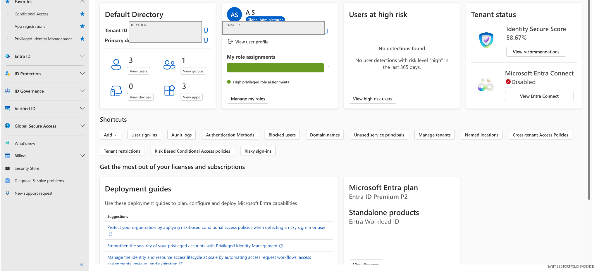

# 01 — Microsoft Entra ID Identity Foundation

## Overview

This lab establishes the identity foundation used by the rest of the SC-500 portfolio. The tenant is treated as a controlled lab environment for testing identity, authentication, Conditional Access, privileged access, workload identities, and governance.

The goal was not simply to create objects in Entra ID. The goal was to understand the relationship between the **tenant, identities, groups, applications, roles, and security controls** that later modules depend on.

## Detailed exercise retained

The original hands-on RBAC exercise remains part of this module and should **not** be replaced by this overview:

- [Lab 1 — Azure RBAC](lab1-rbac.md)
- `notes.md` — original study notes / supporting context

The module README adds the broader identity-foundation context while the original lab preserves the step-by-step technical evidence.

## Security objective

Build a safe Microsoft Entra ID lab foundation that supports:

- identity and group administration
- application and service-principal testing
- Conditional Access
- Microsoft Entra ID Protection
- Privileged Identity Management (PIM)
- workload-identity governance
- audit logging and review evidence

## Environment

The tenant used Microsoft Entra ID Premium capabilities during the lab period. The environment contained a small number of lab users, groups, and applications so changes could be traced and validated without production impact.

> **Evidence note:** The screenshot below is a later current-state capture of the same training tenant. Tenant identifiers and account-specific values were redacted for public portfolio use.

## Evidence — tenant security overview

The Entra home view provides a consolidated picture of the identity plane, including identity inventory, licensing/security capabilities, Identity Secure Score, and shortcuts into audit and authentication controls.

## Identity-first security model

The remaining labs build on four identity principles:

1. **Authenticate strongly** — prefer strong MFA and phishing-resistant methods.
2. **Authorize minimally** — grant only the access required.
3. **Evaluate context** — use risk, device, location, workload, and agent signals.
4. **Review and prove** — maintain audit evidence and periodically attest access.

## Validation

The tenant was successfully used throughout this portfolio to create and validate:

- Conditional Access policies
- risk-based access controls
- PIM assignments
- application registrations and service principals
- access reviews
- workload-identity controls
- Defender for Cloud integrations
- audit-log evidence

## GRC relevance

This foundation maps directly to common governance expectations:

| Governance objective | Practical implementation |
|---|---|
| Identity inventory | Users, groups, apps, service principals |
| Access control | Entra roles, Conditional Access, PIM |
| Least privilege | Scoped roles and time-bound assignments |
| Monitoring | Entra audit logs and sign-in telemetry |
| Access certification | Access reviews |
| Change evidence | Screenshots, audit events, validation notes |

## Skills demonstrated

Microsoft Entra ID · identity inventory · tenant administration · identity governance · auditability · least privilege · security documentation
