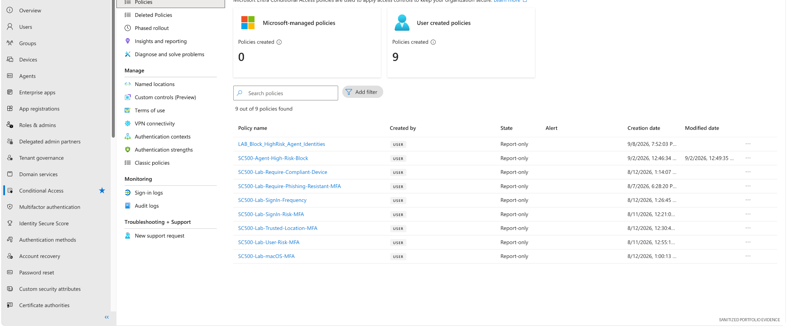

# 02 — Authentication Security & Risk-Based MFA

## Overview

This lab focuses on authentication controls that reduce dependence on passwords and adapt authentication requirements to risk and context.

The practical work is represented by a set of Microsoft Entra Conditional Access policies covering **sign-in risk, user risk, phishing-resistant MFA, trusted locations, device requirements, platform conditions, and session controls**.


## Detailed labs retained

The original authentication exercises remain the technical record for this module:

1. [Lab 2 — Conditional Access and Authentication Strength](lab2-conditional-access.md)
2. [Lab 3 — Temporary Access Pass](lab3-temporary-access-pass.md)
3. [Lab 4 — Sign-in Risk Conditional Access](lab4-signin-risk-conditional-access.md)
4. [Lab 5 — User Risk Conditional Access](lab5-user-risk-conditional-access.md)
5. [Lab 6 — Trusted Location](lab6-trusted-location.md)
6. [Lab 7 — Device Platform](lab7-device-platform.md)
7. [Lab 8 — Compliant Device](lab8-compliant-device.md)
8. [Lab 9 — Sign-in Frequency](lab9-signin-frequency.md)

This README is the module-level overview; it complements rather than replaces Labs 2–9 or their screenshots.

## Security objective

Require stronger authentication when the sign-in context indicates elevated risk while keeping policy rollout safe and auditable.

## Controls implemented

The lab policy set includes controls for:

- **Sign-in risk MFA**
- **User risk MFA**
- **Phishing-resistant MFA**
- **Trusted-location MFA**
- **macOS MFA**
- **Compliant-device requirements**
- **Sign-in frequency / session control**

These controls were kept in **Report-only** mode during validation to reduce lockout risk while proving policy logic.

## Evidence — authentication control set


The policy inventory shows the authentication and risk controls maintained in the lab tenant.



## Control logic

A typical risk-based authentication decision can be described as:

```text
Identity attempts sign-in
        |
        v
Entra evaluates risk + device + location + application context
        |
        +---- low/expected context ----> normal access path
        |
        +---- elevated context --------> stronger authentication / block
```

## Why phishing-resistant MFA matters

Traditional MFA reduces password-only compromise, but some methods remain susceptible to real-time phishing or MFA fatigue. Authentication-strength policies allow administrators to require stronger methods for higher-value scenarios.

## Safe deployment method

Potentially disruptive authentication policies were validated in **Report-only** mode first. This mirrors an enterprise control rollout:

1. define the policy scope
2. exclude emergency/break-glass access where appropriate
3. configure authentication requirements
4. validate expected impact
5. review sign-in evidence
6. enforce only after testing

## Validation summary

The tenant contains the intended risk and MFA policy set, and the controls remain visible as documented security configuration.

## GRC relevance

Authentication controls support:

- access-control policy enforcement
- identity assurance
- risk-based control selection
- secure configuration management
- staged change management
- audit evidence for control testing

## Skills demonstrated

Microsoft Entra authentication · MFA · authentication strength · Identity Protection concepts · sign-in risk · user risk · session controls · policy testing
