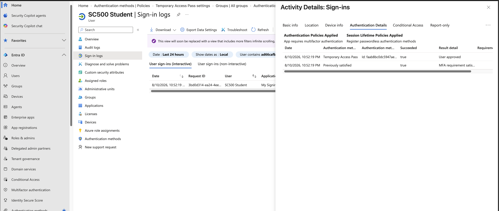
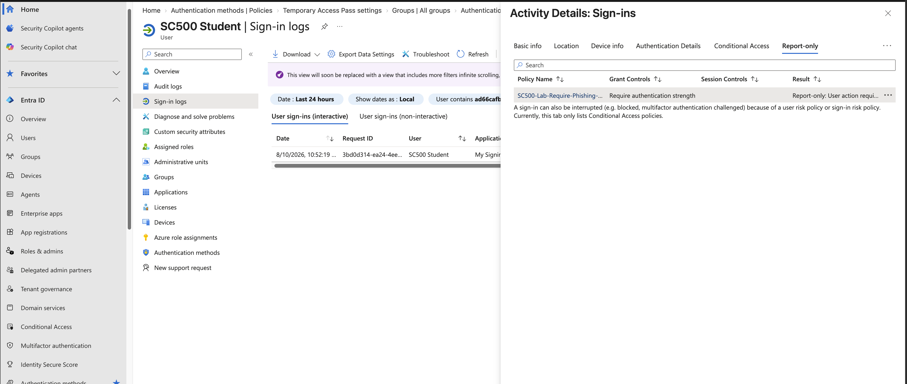

# Lab 3 - Temporary Access Pass

## Objective

Configure Microsoft Entra Temporary Access Pass (TAP), issue a one-time TAP to a test user, authenticate with it, and compare its behavior with a phishing-resistant authentication method.

## Technologies Used

- Microsoft Entra ID P2
- Authentication Methods Policy
- Temporary Access Pass
- Conditional Access
- Sign-in Logs

## TAP Policy Configuration

Temporary Access Pass was enabled only for a dedicated lab group:

`SC500-TAP-Lab`

The group contained:

`SC500 Student`

### TAP Settings

- Minimum lifetime: 10 minutes
- Maximum lifetime: 1 hour
- Default lifetime: 1 hour
- One-time use: Yes
- Pass length: 8 characters

## TAP Creation

A one-time Temporary Access Pass was created for the SC500 Student account.

The TAP was valid for 60 minutes.

The actual TAP code was not documented or stored in the repository.

## Authentication Test

SC500 Student signed in using the Temporary Access Pass.

The Microsoft Entra sign-in logs showed:

`Authentication method: Temporary Access Pass`

`Succeeded: true`

The authentication flow also showed that the MFA requirement was satisfied.

### TAP Authentication Result

## Conditional Access Evaluation

The existing Conditional Access policy required:

`Phishing-resistant MFA strength`

The TAP sign-in was evaluated by the policy.

Result:

`Report-only: User action required`

This showed that although TAP is treated as a strong authentication method and can satisfy an MFA requirement, it did not satisfy the phishing-resistant MFA authentication strength required by the Conditional Access policy.

### Conditional Access Result

## Comparison

### Temporary Access Pass

- Temporary credential
- Used for onboarding, bootstrap, or recovery
- Can satisfy MFA requirements
- Did not satisfy the phishing-resistant MFA strength in this lab

### Synced Passkey

- Long-term passwordless credential
- Phishing-resistant
- Satisfied the phishing-resistant MFA authentication strength

## Key SC-500 Concept

**TAP = bootstrap strong authentication**

**Passkey/FIDO2 = phishing-resistant authentication**

A strong authentication method is not automatically equivalent to phishing-resistant authentication.

## Security Best Practice

Temporary Access Passes should be:

- short-lived
- scoped to appropriate users
- used only when necessary
- configured for one-time use when possible
- treated like sensitive credentials

TAP values should never be committed to source control.