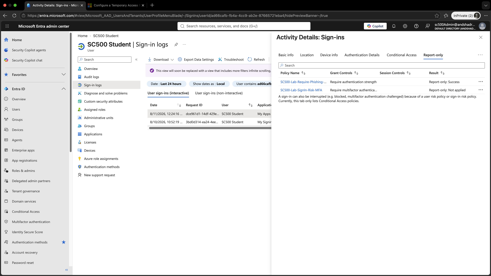

# Lab 4 - Sign-in Risk Conditional Access

## Objective

Create a Microsoft Entra Conditional Access policy that requires MFA when a sign-in is assessed as Medium or High risk, then validate the policy in Report-only mode.

## Technologies Used

- Microsoft Entra ID P2
- Conditional Access
- Identity Protection
- Sign-in Risk
- Microsoft Entra Sign-in Logs

## Conditional Access Policy

**Policy name:**

`SC500-Lab-SignIn-Risk-MFA`

### Assignments

- User: SC500 Student
- Target resources: All resources

### Conditions

Sign-in risk was configured for:

- Medium
- High

Low risk and No risk were not selected.

### Grant Control

The policy was configured to:

`Require multifactor authentication`

### Policy State

`Report-only`

Report-only mode allowed the policy to be evaluated without enforcing the MFA requirement.

## Testing

SC500 Student performed a normal sign-in from the usual device and location.

The sign-in was then reviewed in Microsoft Entra sign-in logs.

## Result

The policy returned:

`Report-only: Not applied`

This occurred because the sign-in did not meet the configured Medium or High sign-in risk condition.

The user and resource were in scope, but the risk condition was not satisfied.

### Sign-in Risk Evaluation

## Key SC-500 Concept

A Conditional Access policy does not apply simply because the user and resource are targeted.

All configured conditions must also match.

In this lab:

- User matched: Yes
- Resource matched: Yes
- Sign-in risk Medium or High: No
- Policy result: Not applied

## User Risk vs Sign-in Risk

**User risk** represents the likelihood that the user account itself is compromised.

**Sign-in risk** represents the likelihood that a specific authentication attempt is suspicious or unauthorized.

## Security Best Practice

Risk-based Conditional Access policies should be tested in Report-only mode before enforcement.

User risk and sign-in risk should generally be handled with separate policies so that each scenario can be evaluated and remediated appropriately.