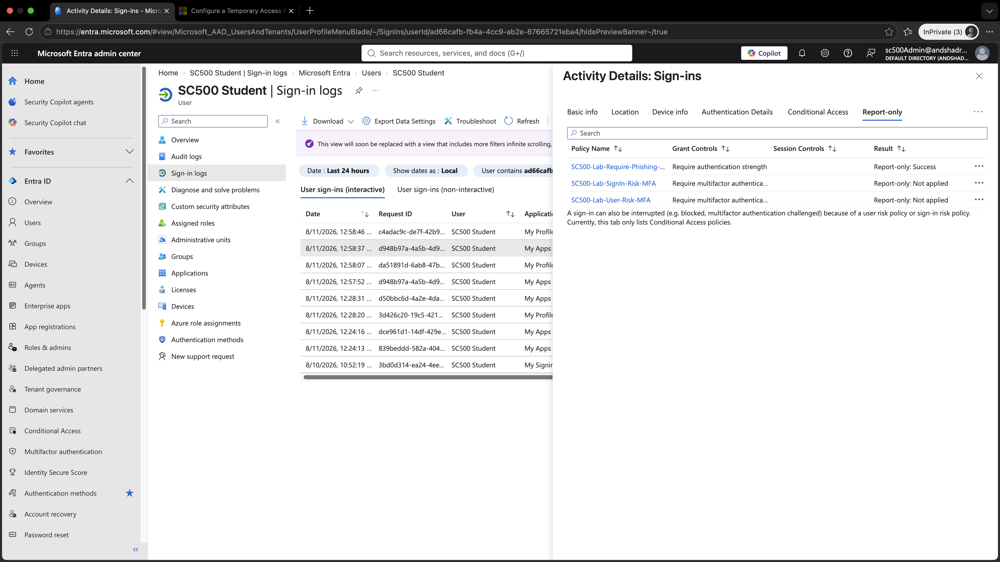

# Lab 5 - User Risk Conditional Access

## Objective

Create a Microsoft Entra Conditional Access policy that requires MFA when a user account is assessed as Medium or High risk, then validate the policy in Report-only mode.

## Technologies Used

- Microsoft Entra ID P2
- Conditional Access
- Identity Protection
- User Risk
- Microsoft Entra Sign-in Logs

## Conditional Access Policy

**Policy name:**

`SC500-Lab-User-Risk-MFA`

### Assignments

- User: SC500 Student
- Target resources: All resources

### Conditions

User risk was configured for:

- Medium
- High

Low risk was not selected.

Sign-in risk was left unconfigured.

### Grant Control

The policy was configured to:

`Require multifactor authentication`

### Policy State

`Report-only`

Report-only mode allowed the policy to be evaluated without enforcing the MFA requirement.

## Testing

SC500 Student performed a normal sign-in.

The sign-in was then reviewed in Microsoft Entra sign-in logs.

## Result

The policy returned:

`Report-only: Not applied`

This occurred because the user account did not meet the configured Medium or High user risk condition.

The user and target resource were in scope, but the user-risk condition did not match.

## Comparison with Sign-in Risk

The same sign-in was evaluated by multiple Conditional Access policies:

- Phishing-resistant MFA policy → `Report-only: Success`
- Sign-in risk policy → `Report-only: Not applied`
- User risk policy → `Report-only: Not applied`

This demonstrates that Conditional Access policies evaluate independently based on their own assignments, conditions, and controls.

### Policy Evaluation Comparison

## Key SC-500 Concept

**User risk** represents the likelihood that the user account itself is compromised.

**Sign-in risk** represents the likelihood that a specific sign-in attempt is suspicious or unauthorized.

A user can have:

- no user risk
- no sign-in risk
- or different risk levels for each

## Security Best Practice

User risk and sign-in risk should generally be handled in separate Conditional Access policies.

Keeping them separate makes policy logic easier to understand, test, troubleshoot, and remediate.