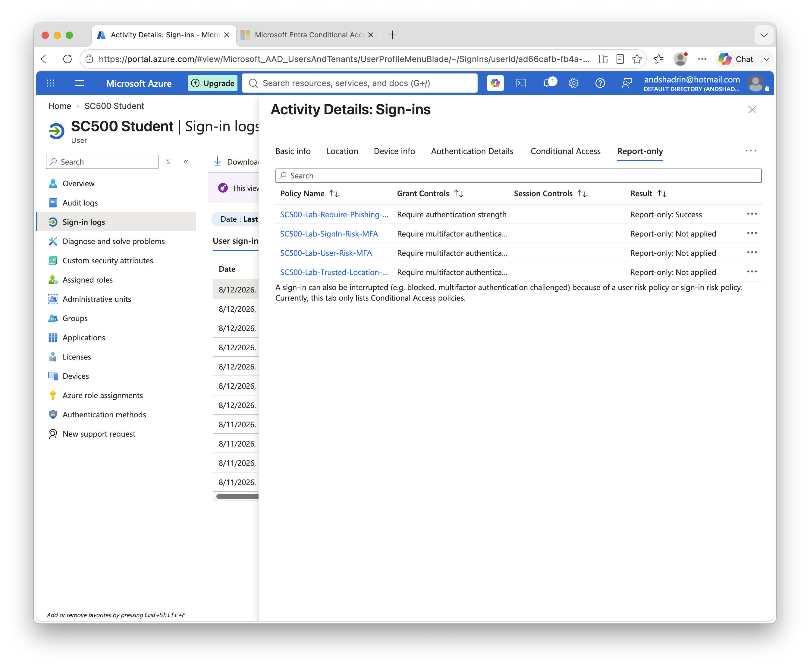

# Lab 6 - Trusted Location Conditional Access

## Objective

Create a named trusted network location and exclude it from a Conditional Access MFA policy.

## Configuration

**Named location:** `SC500-Trusted-Home`

The initial IPv6 `/128` host entry did not match later sign-ins because the host portion of the IPv6 address changed.

The named location was updated to use the home `/64` IPv6 prefix.

**Conditional Access policy:** `SC500-Lab-Trusted-Location-MFA`

* User: SC500 Student
* Target resources: All resources
* Network: Any network or location
* Exclude: SC500-Trusted-Home
* Grant: Require multifactor authentication
* State: Report-only

## Result

Before correcting the IPv6 range:

`Report-only: Success`

The named location exclusion did not match.

After updating the named location to the `/64` prefix:

`Report-only: Not applied`

This confirmed that the sign-in matched the excluded trusted location.

### Result Screenshot

## Key SC-500 Concept

Named locations allow Conditional Access policies to make decisions based on network context.

A trusted location can be excluded from a policy, causing the policy not to apply when the sign-in originates from that location.

## Lesson Learned

IPv6 privacy addressing can cause individual `/128` host addresses to change.

A properly identified network prefix is more appropriate when representing a trusted IPv6 network.
