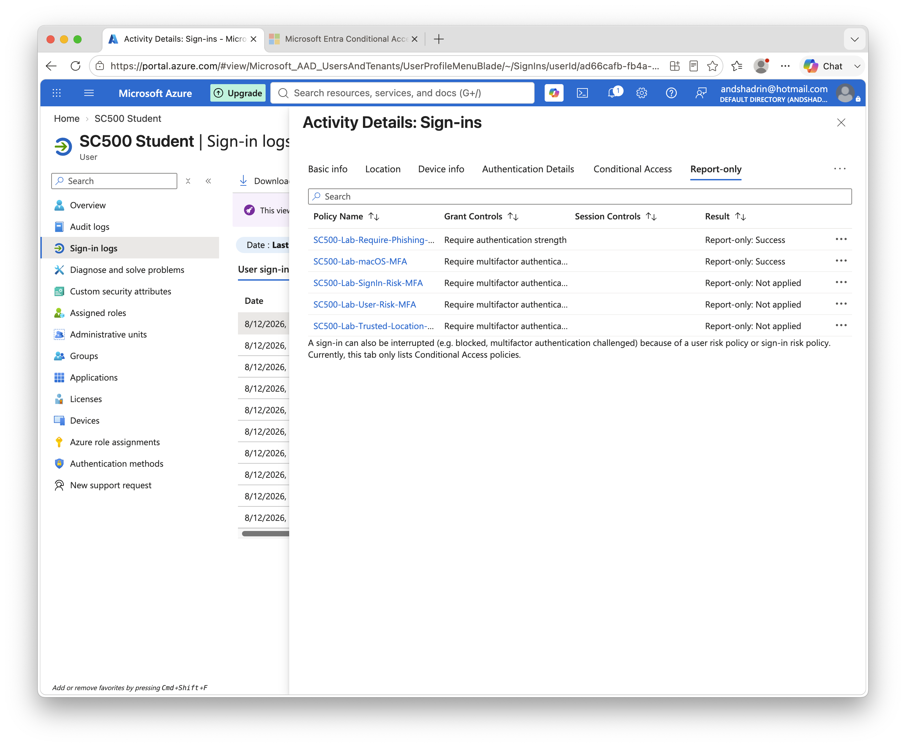

# Lab 7 - Device Platform Conditional Access

## Objective

Create a Conditional Access policy that targets users signing in from macOS.

## Policy

**Policy name:** `SC500-Lab-macOS-MFA`

* User: SC500 Student
* Target resources: All resources
* Condition: Device platform = macOS
* Grant: Require multifactor authentication
* State: Report-only

## Result

The Conditional Access policy returned:

`Report-only: Success`

This confirmed that Microsoft Entra detected the sign-in as originating from a macOS device and the configured MFA grant requirement was satisfied.

### Result Screenshot

## Key SC-500 Concept

Device platform identifies the operating system or device type involved in a sign-in.

It does not indicate whether the device meets organizational security requirements.

**Device platform = what the device is**

**Device compliance = whether the device meets policy**
