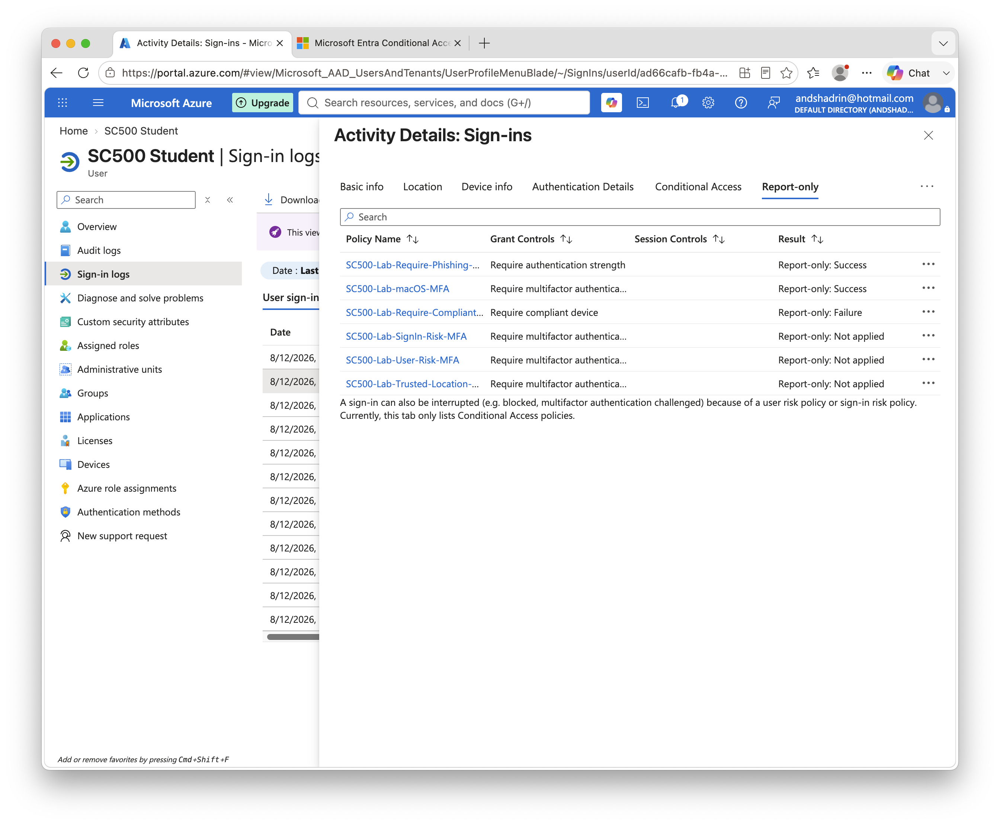

# Lab 8 - Require Compliant Device

## Objective

Evaluate a Conditional Access policy that requires the device to be marked as compliant.

## Policy

**Policy name:** `SC500-Lab-Require-Compliant-Device`

* User: SC500 Student
* Target resources: All resources
* Conditions: None
* Grant: Require device to be marked as compliant
* State: Report-only

## Testing

The test sign-in was performed from a macOS device that was not enrolled and marked compliant through device management.

## Result

The Conditional Access evaluation returned:

`Report-only: Failure`

The device did not satisfy the compliant-device grant requirement.

### Result Screenshot

## Comparison

The same Mac successfully matched the macOS device-platform policy but failed the compliant-device requirement.

Therefore:

`macOS = Yes`

does not mean:

`Compliant = Yes`

## Key SC-500 Concept

Device compliance is a security state, typically supplied through device-management controls such as Microsoft Intune.

A recognized device platform alone does not establish compliance.
