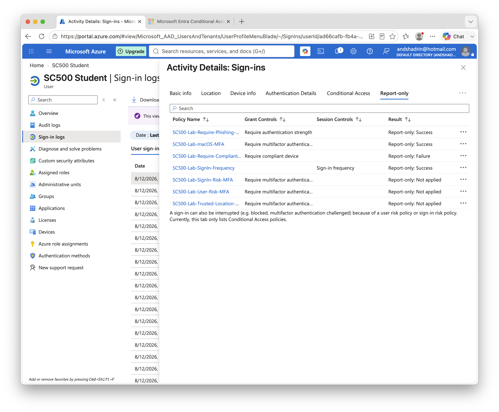

# Lab 9 - Sign-in Frequency Session Control

## Objective

Configure and validate a Conditional Access session control that requires periodic reauthentication.

## Policy

**Policy name:** `SC500-Lab-SignIn-Frequency`

* User: SC500 Student
* Target resources: All resources
* Grant controls: None
* Session control: Sign-in frequency
* Reauthentication: Periodic
* Frequency: 8 hours
* State: Report-only

## Result

The Conditional Access policy returned:

`Report-only: Success`

The policy matched the sign-in and the configured sign-in frequency session control was evaluated successfully.

Because the session was new and the configured reauthentication interval was 8 hours, no immediate reauthentication was required.

### Result Screenshot

## Key SC-500 Concept

Grant controls determine whether access can be granted.

Session controls govern what happens after access has been granted.

**Grant = Can you enter?**

**Session = What happens after you enter?**
