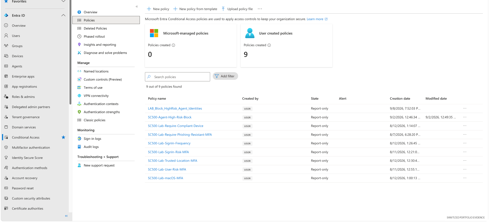
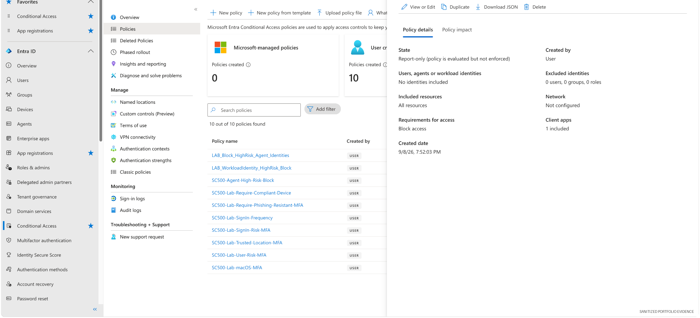

# 03 — Microsoft Entra Conditional Access

## Overview

This project documents a practical Conditional Access policy set designed around **risk, authentication strength, device state, location, platform, and session controls**.

Conditional Access is treated as the policy decision layer between authentication and resource access.


## Relationship to the detailed authentication labs

This folder is a **module-level Conditional Access design summary**, not a replacement for the numbered authentication exercises. The detailed risk, MFA, device, location, and session-control implementations remain in [`02-Authentication`](../02-Authentication/).

## Security objective

Translate identity risk and business requirements into enforceable access policies without creating unnecessary lockout or operational disruption.

## Policy design pattern

```text
Assignments
  ├─ users / groups / agents / workload identities
  └─ target resources

Signals / conditions
  ├─ risk
  ├─ device state
  ├─ platform
  ├─ location
  └─ session context

Access decision
  ├─ allow with controls
  └─ block
```

## Evidence — policy inventory



The tenant contains multiple user-created policies, including risk-based MFA, phishing-resistant authentication, compliant-device enforcement, trusted locations, sign-in frequency, and newer agent-identity controls.

## Evidence — safe report-only deployment



The policy details demonstrate an important operational practice: **evaluate first, enforce second**. Report-only mode allows policy impact to be observed before a blocking control is enabled.

## Control-management workflow

1. Define the business/security requirement.
2. Identify the intended identities and target resources.
3. Choose the relevant access signal or condition.
4. Configure the grant/block control.
5. Keep the policy in Report-only during initial testing.
6. Review policy impact and sign-in evidence.
7. Document exceptions.
8. Enforce only after validation.

## Preventive, detective, and corrective perspective

| Control type | Example |
|---|---|
| Preventive | Block high-risk access |
| Preventive | Require phishing-resistant MFA |
| Preventive | Require compliant device |
| Detective | Report-only evaluation and sign-in telemetry |
| Corrective | Adjust policy scope/exclusions after impact review |

## GRC relevance

The lab demonstrates how policy intent becomes technical evidence. This is useful for IAM/GRC work involving:

- control design
- access-policy testing
- exception management
- policy review
- change control
- audit evidence
- least privilege and zero-trust principles

## Skills demonstrated

Conditional Access · risk-based access · report-only testing · access policy design · authentication controls · device controls · governance documentation
