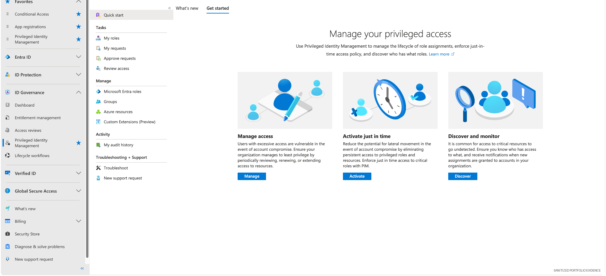

# 04 — Privileged Identity Management (PIM) & Access Reviews

## Overview

This lab demonstrates governance of privileged directory access using Microsoft Entra Privileged Identity Management (PIM).

The focus is on replacing unnecessary standing privilege with **time-bound access, justification, review, and auditable evidence**.


## Detailed labs retained

The original privileged-access exercises remain intact and are linked here:

1. [Lab 10 — Entra PIM Eligible Role](lab10-entra-pim-eligible-role.md)
2. [Lab 11 — PIM Activation Requirements](lab11-pim-activation-requirements.md)
3. [Lab 12 — PIM Approval Workflow](lab12-pim-approval-workflow.md)
4. [Lab 13 — Azure Resource PIM](lab13-azure-resource-pim.md)
5. [Lab 14 — Azure RBAC PIM Approval](lab14-azure-rbac-pim-approval.md)

The newer evidence in this README extends those exercises with a **time-bound Directory Readers assignment to a service principal plus an access review and reviewer attestation**. It does not replace Labs 10–14.

## Security objective

Reduce privileged-access exposure by granting only the role required, for only the period required, and subjecting that access to review.

## Evidence — PIM control plane



PIM provides the control plane for privileged-role assignment, activation, approval, access review, and audit history.

## Evidence — time-bound role assignment


A lab service principal was assigned **Directory Readers** as an active, time-bound assignment rather than permanent standing privilege.

## Evidence — access review


An access review was created for the role assignment, scoped to service principals.

## Evidence — reviewer attestation


The reviewer was required to make an explicit approve/deny decision and record a reason.

## Governance workflow

```text
Access need identified
        |
        v
Least-privilege role selected
        |
        v
Time-bound PIM assignment + justification
        |
        v
Access review / attestation
        |
        v
Approve, deny, or remove access
        |
        v
Audit evidence retained
```

## Control principles demonstrated

- least privilege
- just-in-time / time-bound access
- documented business justification
- explicit access certification
- reviewer accountability
- separation between assignment and review processes
- auditability

## GRC relevance

PIM and access reviews are highly relevant to controls around privileged-access governance, access recertification, evidence collection, and periodic review.

A GRC or IAM analyst can use the resulting evidence to answer questions such as:

- Who has privileged access?
- Why was the access granted?
- Is the access permanent or temporary?
- Who reviewed the access?
- What decision was made?
- Can the decision be proved from audit evidence?

## Skills demonstrated

Microsoft Entra PIM · privileged-role governance · access reviews · time-bound assignment · reviewer attestation · least privilege · audit evidence
