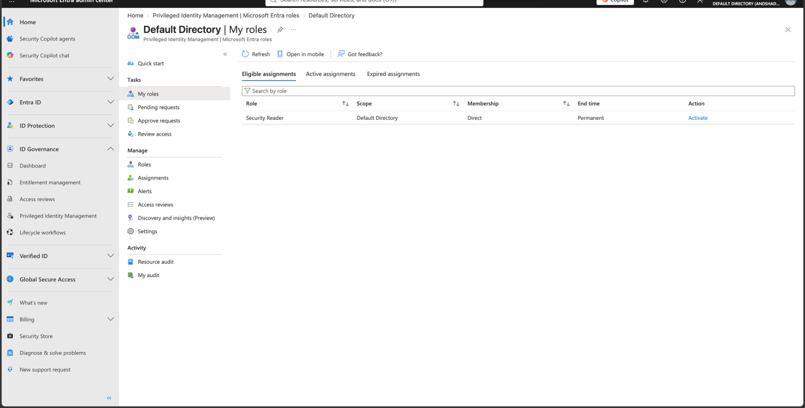

# Lab 10 - Entra PIM Eligible Role

## Objective

Assign a Microsoft Entra role as eligible through Privileged Identity Management (PIM) and activate it only when needed.

## Configuration

**Role:** Security Reader  
**Member:** SC500 Student  
**Assignment type:** Eligible  
**Scope:** Default Directory  
**Eligibility:** Permanent

## Result

The Security Reader role was assigned as an eligible Microsoft Entra role through PIM.

The user could see the role under **Eligible assignments** and manually activate it.

After activation, the role appeared under **Active assignments** with:

- State: Activated
- Scope: Default Directory
- Membership: Direct
- Temporary expiration time
- Deactivate option available

## Key SC-500 Concept

An eligible role is not active all the time.

The user is allowed to activate the role when needed, which reduces standing privilege.

**Eligible = can become privileged**

**Active = privileged right now**

## Result Screenshots

