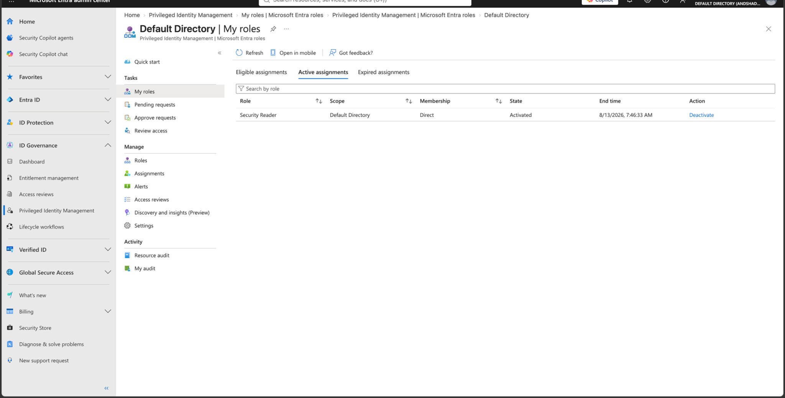

# Lab 11 - PIM Activation Requirements

## Objective

Harden the activation requirements for the Microsoft Entra Security Reader role.

## Configuration

The Security Reader PIM role settings were changed to:

- Maximum activation duration: 2 hours
- Require Azure MFA on activation
- Require justification on activation
- Approval: Not required for this lab

## Result

After updating the role settings, the user activated Security Reader again.

The activation duration was limited to 2 hours instead of the original 8-hour maximum.

A justification was required before activation.

The role successfully became active with a temporary expiration time.

## Key SC-500 Concept

PIM separates eligibility from activation requirements.

A user can remain eligible for a role while additional controls determine whether the role can become active.

**Eligibility = who may request privilege**

**Activation controls = what must happen before privilege is granted**

Examples include:

- MFA
- Justification
- Approval
- Time limits

## Result Screenshot

