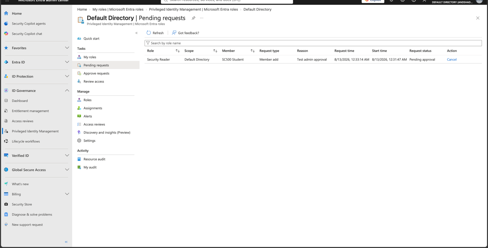
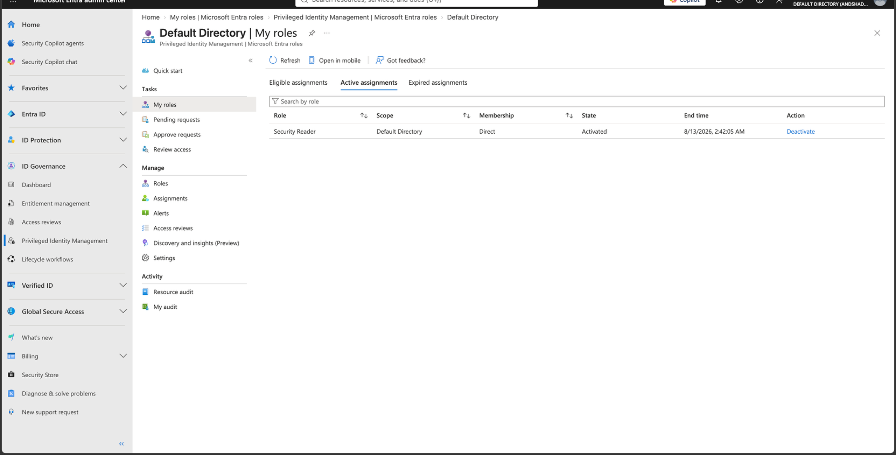

# Lab 12 - PIM Approval Workflow

## Objective

Require administrative approval before an eligible Microsoft Entra role can be activated.

## Configuration

The Security Reader activation policy was configured with:

- Maximum activation duration: 2 hours
- Azure MFA required
- Justification required
- Approval required
- Admin account configured as approver

## Result

The SC500 Student user requested activation of the Security Reader role and entered a justification.

The request did not immediately activate the role.

Instead, the request entered:

`Pending approval`

The designated approver reviewed and approved the request.

After approval, Security Reader appeared under **Active assignments** with a temporary expiration time.

## Key SC-500 Concept

Approval adds separation of duties to privileged-role activation.

The requester cannot grant themselves immediate privileged access when approval is required.

The workflow becomes:

`Eligible → MFA → justification → pending approval → approval → active`

## Result Screenshots

