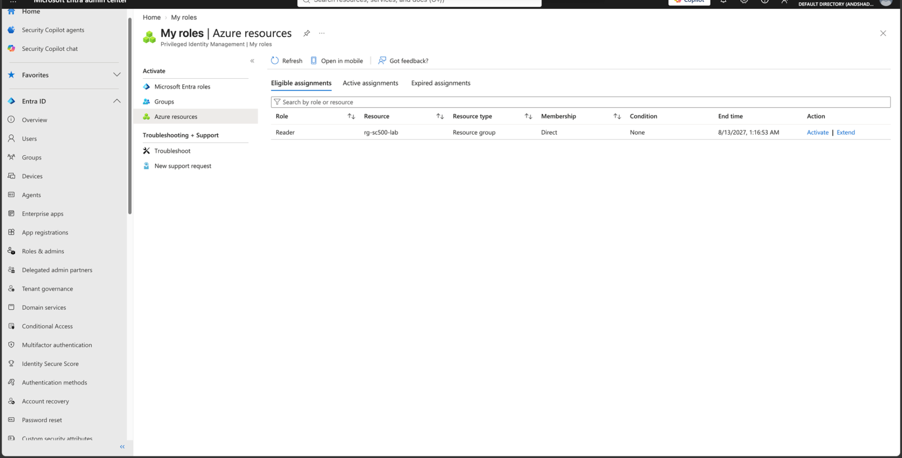
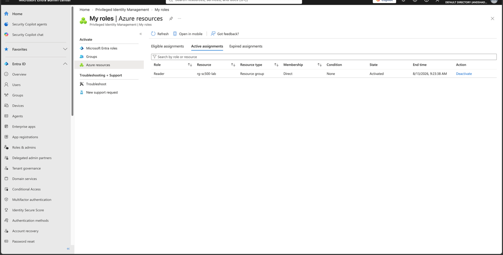

# Lab 13 - Azure Resource PIM

## Objective

Assign an Azure RBAC role as eligible through PIM at resource-group scope.

## Configuration

**Resource:** rg-sc500-lab  
**Resource type:** Resource group  
**Azure RBAC role:** Reader  
**Member:** SC500 Student  
**Assignment type:** Eligible  
**Eligibility duration:** Time bound for 1 year

The previous permanent Reader assignment was removed before this lab so the user would not have standing Reader access.

## Result

The Reader role appeared under:

`PIM → My roles → Azure resources → Eligible assignments`

The user could activate Reader when needed.

After activation, Reader appeared under **Active assignments** with:

- Resource: rg-sc500-lab
- Resource type: Resource group
- Membership: Direct
- State: Activated
- Temporary expiration time
- Deactivate option

## Key SC-500 Concept

Microsoft Entra PIM can govern both directory roles and Azure RBAC roles.

**Microsoft Entra roles** control directory administration.

**Azure resource roles** control access to Azure resources.

Azure RBAC roles can be governed at scopes such as:

- Management group
- Subscription
- Resource group
- Resource

## Result Screenshots

