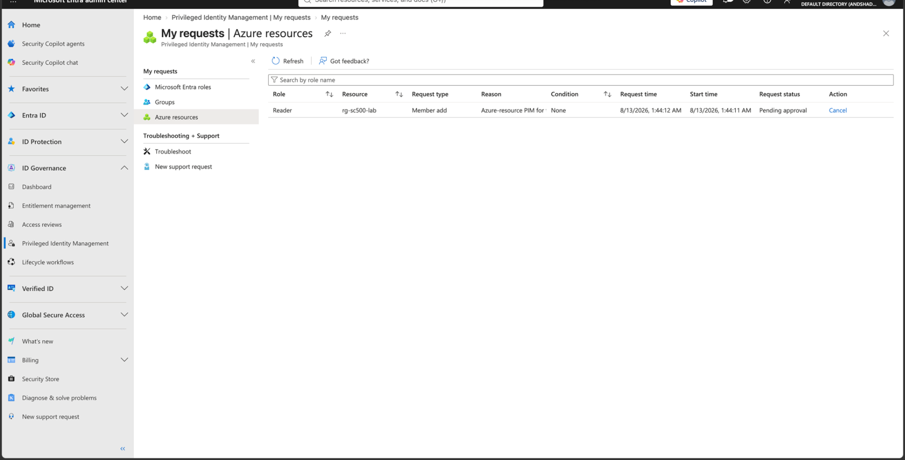
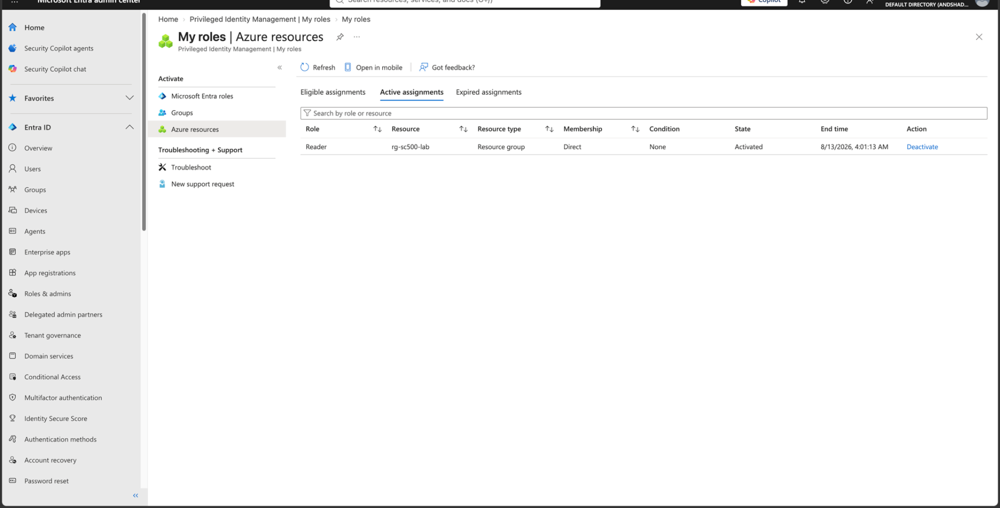

# Lab 14 - Azure RBAC PIM Approval

## Objective

Harden Azure-resource PIM activation requirements for the Reader role.

## Configuration

The Reader role at the `rg-sc500-lab` resource-group scope was configured with:

- Maximum activation duration: 2 hours
- Azure MFA required
- Justification required
- Approval required
- Admin account configured as approver

## Result

The SC500 Student user requested activation of the eligible Reader role.

The request entered:

`Pending approval`

The administrator approved the request.

After approval, Reader appeared under Azure resource **Active assignments** with:

- Resource: rg-sc500-lab
- Resource type: Resource group
- State: Activated
- Temporary 2-hour expiration
- Deactivate option

## Key SC-500 Concept

PIM can apply Just-In-Time controls to Azure RBAC roles in the same way it governs Microsoft Entra roles.

The hardened Azure RBAC activation workflow was:

`Eligible Reader → MFA → justification → pending approval → admin approval → temporary Reader access`

This reduces standing access to Azure resources and supports least privilege.

## Result Screenshots

