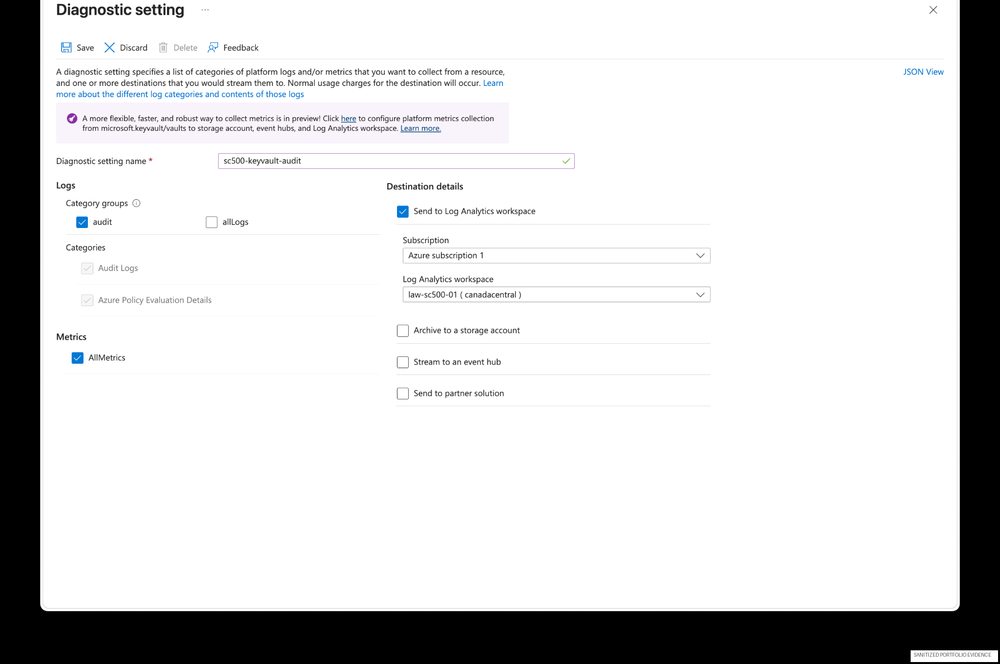
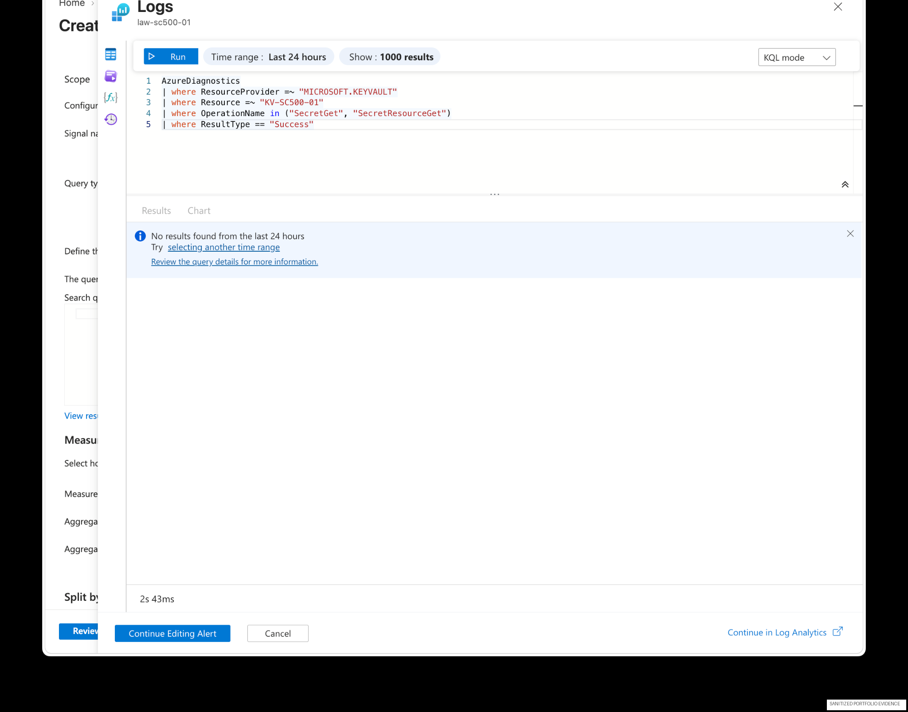
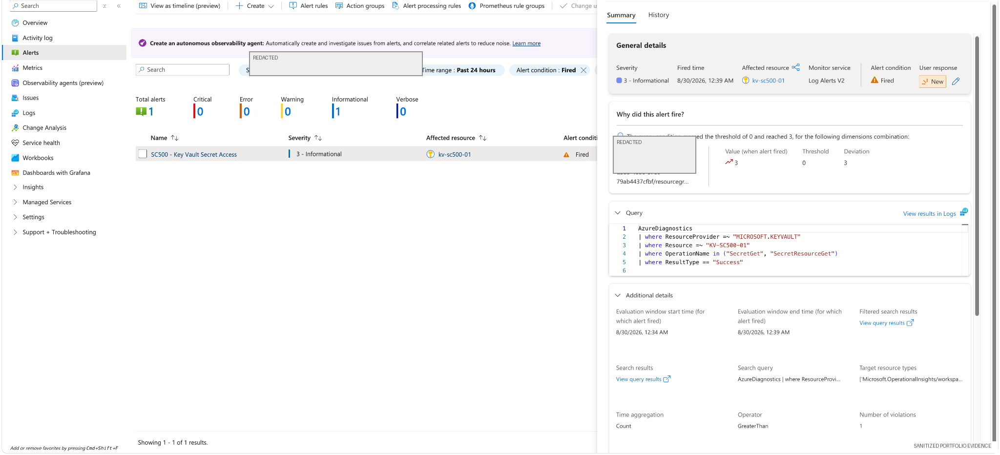

# 04B — Azure Key Vault Monitoring & Alerting

> **Portfolio note:** This is a standalone project/module. Its numbering is canonical and is not part of the historical Lab 1–29 sequence.
## Overview

This supplemental lab turns Key Vault activity into **detective control evidence** by sending diagnostic logs to Log Analytics, querying sensitive operations with KQL, and validating an Azure Monitor alert.

## Security objective

Detect and investigate access to sensitive Key Vault operations rather than relying only on preventive access controls.

## Architecture

```text
Azure Key Vault
     |
     | Diagnostic settings
     v
Log Analytics Workspace
     |
     | KQL query / scheduled evaluation
     v
Azure Monitor Alert
     |
     v
Investigation / response evidence
```

## Evidence — diagnostic settings



The vault was configured to send audit-related telemetry and metrics to a Log Analytics workspace.

## Evidence — KQL validation



KQL was used to isolate successful secret-read operations and provide a repeatable investigation query.

## Evidence — alert firing



The monitoring rule was validated by observing an alert condition in Azure Monitor.

## Detection logic

The lab query focuses on successful secret read operations:

```kusto
AzureDiagnostics
| where ResourceProvider =~ "MICROSOFT.KEYVAULT"
| where OperationName in ("SecretGet", "SecretResourceGet")
| where ResultType == "Success"
```

See [`queries.kql`](queries.kql) for the sanitized reusable query set.

## Control mapping

| Control type | Implementation |
|---|---|
| Preventive | Key Vault access controls / private networking in related labs |
| Detective | Diagnostic settings + Log Analytics |
| Detective | KQL query for secret access |
| Responsive | Azure Monitor alert |
| Evidence | Alert state and query results |

## GRC relevance

This lab shows how a policy requirement such as *“sensitive secret access must be monitored”* can be turned into measurable technical evidence.

## Skills demonstrated

Azure Key Vault · diagnostic settings · Log Analytics · KQL · Azure Monitor alerts · detective controls · security evidence
