# 05 — Microsoft Entra Workload Identity Governance

## Overview

This is an end-to-end governance lab for a **non-human identity**. It follows one Microsoft Entra application/service principal through registration, API authorization, risk-based Conditional Access, privileged role assignment, access review, credential lifecycle, and cleanup.

This module is especially relevant to IAM, GRC, cloud governance, and identity-security roles because it connects technical configuration with **least privilege, access certification, time-bound privilege, and audit evidence**.


## Detailed labs retained

The original workload-identity exercises are preserved:

1. [Lab 15 — Managed Identity and Azure RBAC](lab15-managed-identity-rbac.md)
2. [Lab 16 — App Registration and Service Principal](lab16-app-registration-service-principal.md)
3. [Lab 17 — Client Secret vs Managed Identity](lab17-client-secret-vs-managed-identity.md)
4. [Lab 18 — API Permissions and Admin Consent](lab18-api-permissions-admin-consent.md)

The newer project evidence extends this foundation into an end-to-end governance lifecycle: workload-identity Conditional Access, service-principal risk, PIM, access review, temporary credential creation, audit evidence, and cleanup.

## Security objective

Govern a workload identity with the same rigor expected for a human identity:

- know what the identity is
- control what it can access
- limit privileged rights
- review continued access
- use short-lived credentials
- maintain evidence of change and cleanup

## Architecture / control flow

```text
Application registration
        |
        v
Service principal / workload identity
        |
        +---- Microsoft Graph application permission
        |
        +---- Workload Identity Conditional Access
        |        └─ high service-principal risk -> block
        |
        +---- PIM time-bound Directory Readers
        |
        +---- Access review + attestation
        |
        +---- Temporary client secret
        |
        └---- Audit evidence + credential removal
```

## 1. Register the application

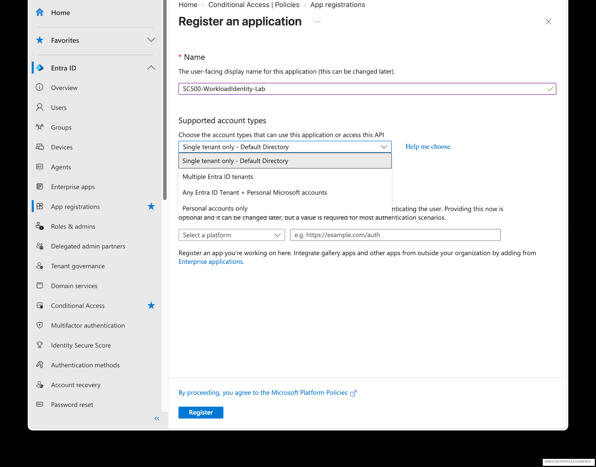

A single-tenant lab application named `SC500-WorkloadIdentity-Lab` was registered.

## 2. Configure application permissions

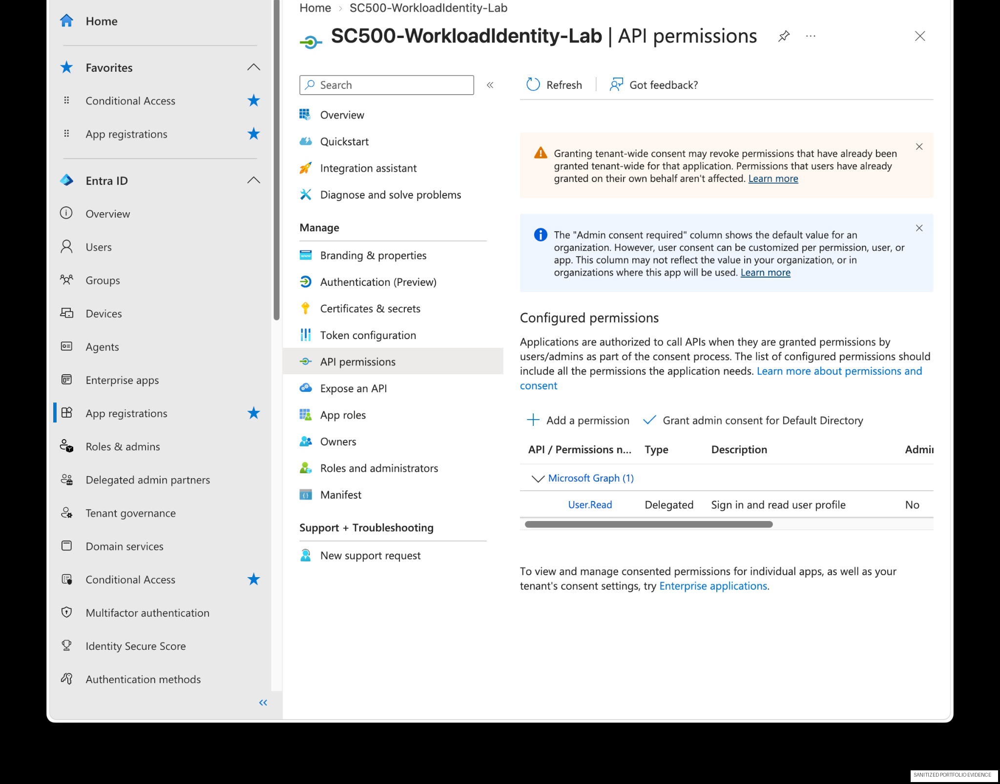

The application was configured with Microsoft Graph permissions including an **application permission** for reading user profiles.

Application permissions are important because the workload can operate **without a signed-in user**.

## 3. Review workload-identity inventory

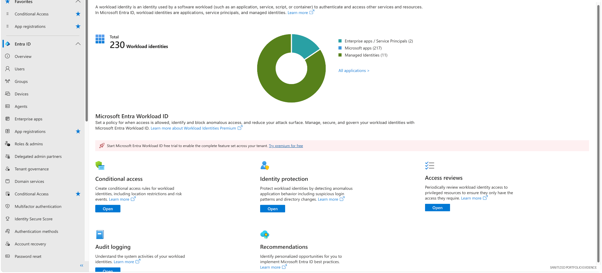

The Entra Workload Identities experience provides visibility into service principals and managed identities.

## 4. Target the service principal with Conditional Access

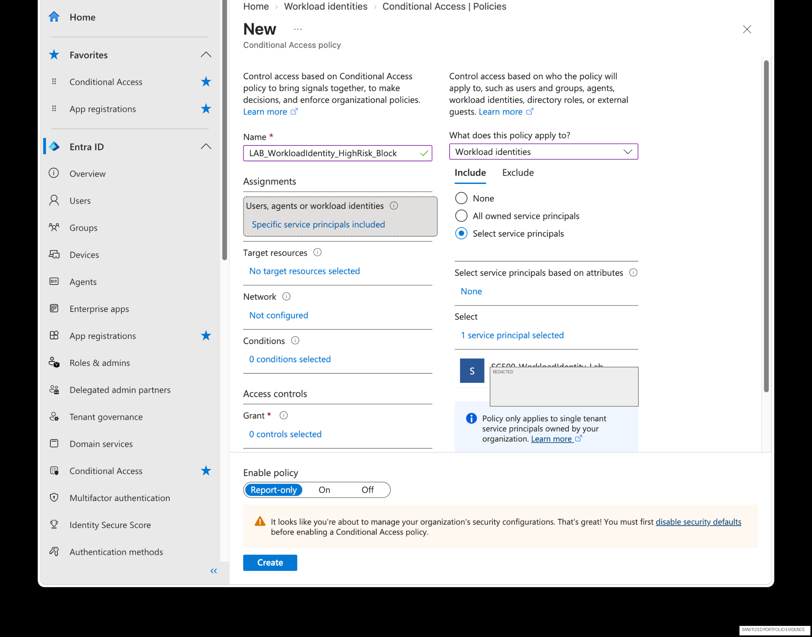

The Conditional Access policy was scoped to the selected service principal rather than indiscriminately targeting every workload.

## 5. Configure service-principal risk

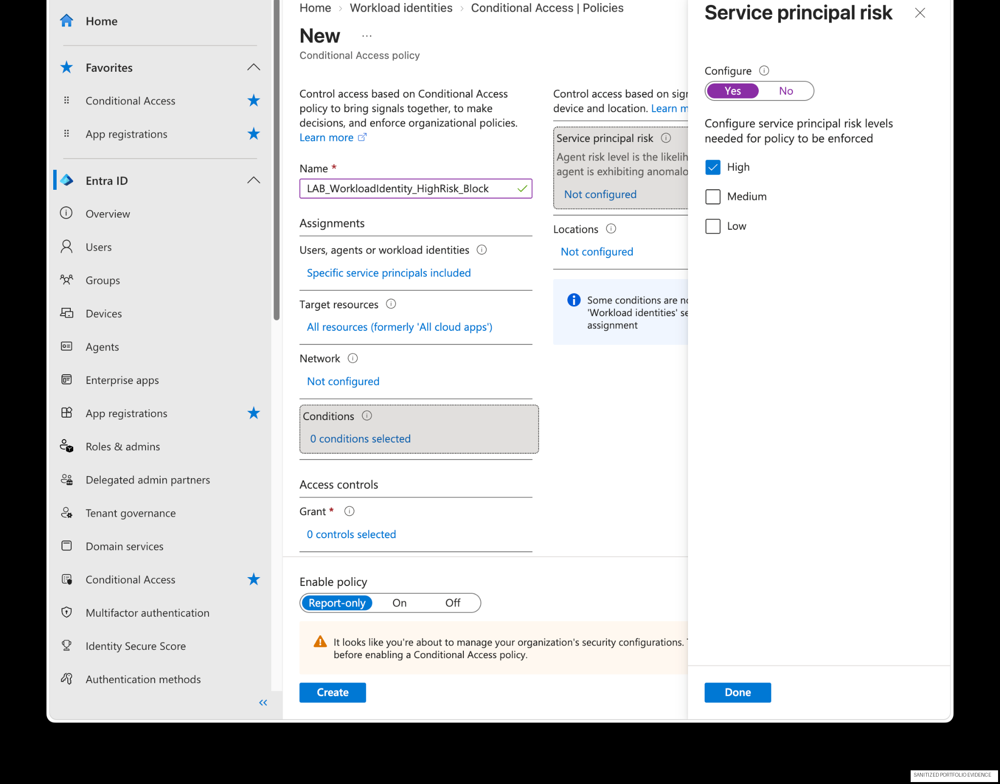

The risk condition was set to **High**.

## 6. Configure the access decision

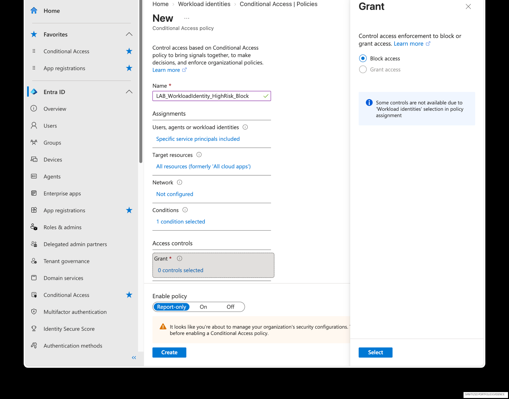

The high-risk workload identity control was configured to **Block access**.

## 7. Validate policy creation

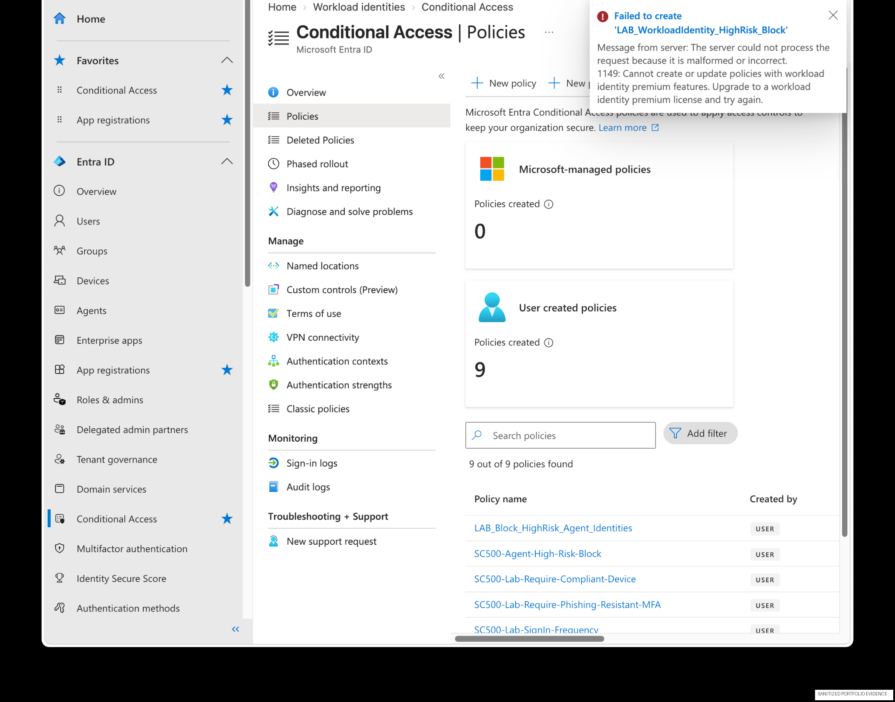

The policy was created in the lab tenant and maintained in a safe test state.

## 8. Apply time-bound privilege with PIM

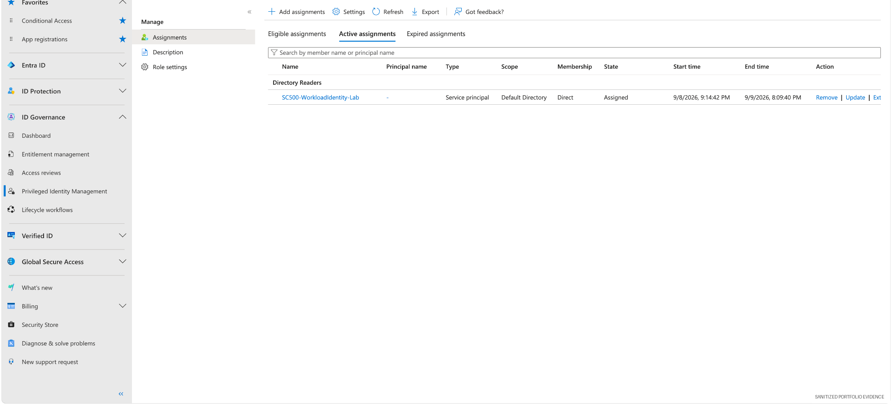

The service principal received a temporary **Directory Readers** assignment through PIM.

## 9. Create an access review

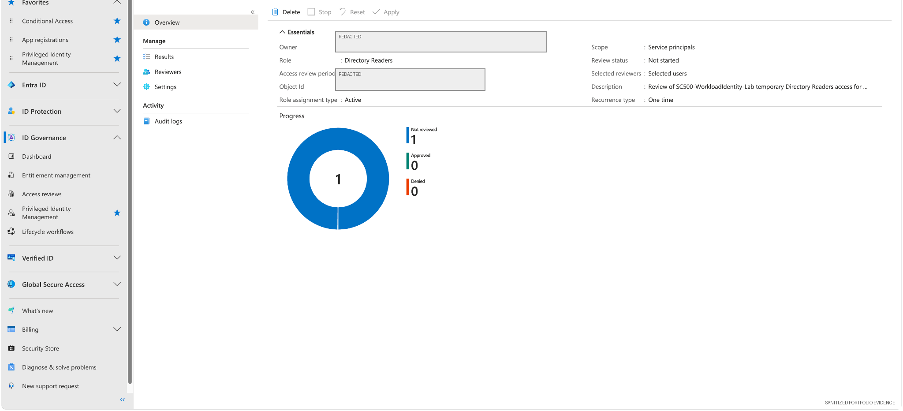

An access review was created to attest whether the service principal still required the role.

## 10. Record reviewer decision and reason

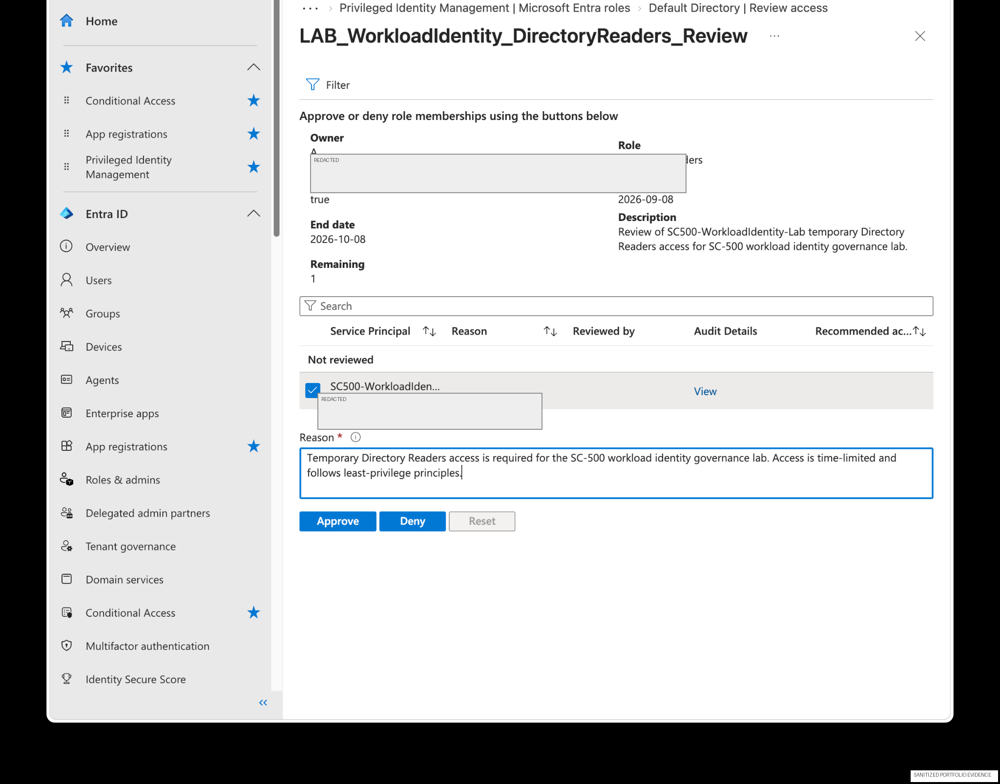

The reviewer provided a reason before approving continued access for the lab period.

## 11. Create a short-lived credential

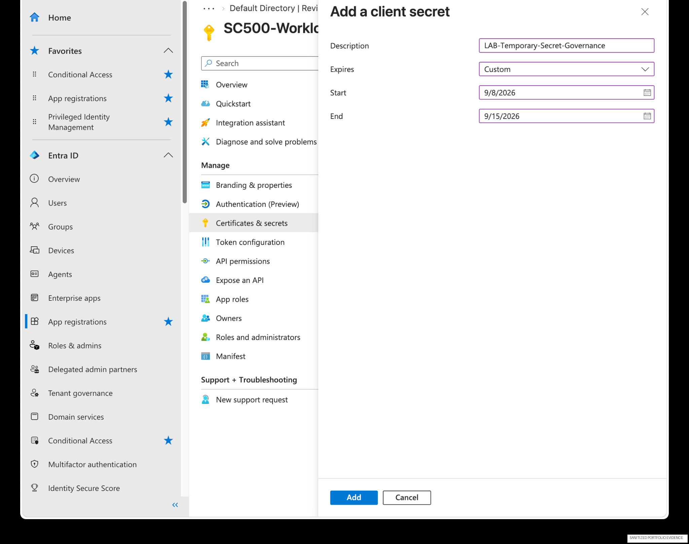

A temporary client secret was configured with a short custom lifetime for the credential-governance exercise.

> **Security note:** The secret value is intentionally not included anywhere in this portfolio.

## 12. Remove the credential

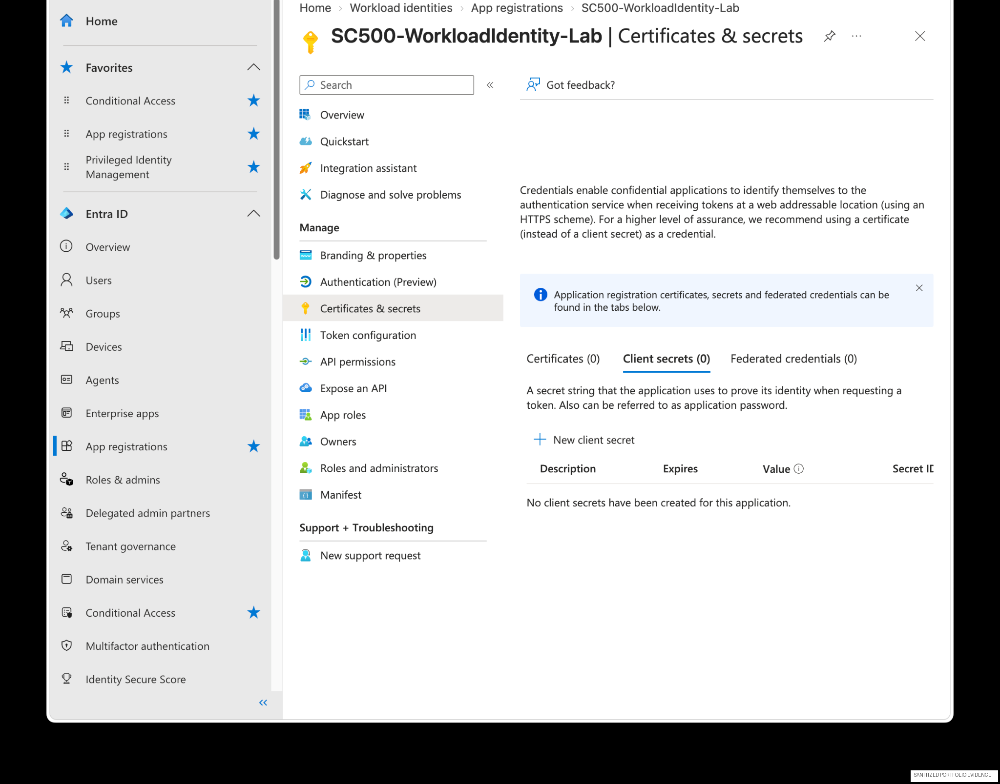

The credential was removed after validation, completing the credential-lifecycle control.

## Control mapping

| Risk | Control |
|---|---|
| Excessive API privilege | Explicit Microsoft Graph application permission |
| Compromised workload identity | Service-principal risk + Conditional Access |
| Standing privileged directory access | Time-bound PIM assignment |
| Stale privileged access | Access review / attestation |
| Long-lived credential exposure | Short-lived secret and prompt removal |
| Weak change evidence | Entra audit-log review and screenshots |

## GRC relevance

This module demonstrates evidence for:

- non-human identity inventory
- least privilege
- privileged-access management
- access recertification
- credential lifecycle
- risk-based access policy
- reviewer accountability
- control testing and audit evidence

## Skills demonstrated

Microsoft Entra workload identities · service principals · app registrations · Microsoft Graph permissions · Conditional Access · service-principal risk · PIM · access reviews · client-secret governance · audit evidence
