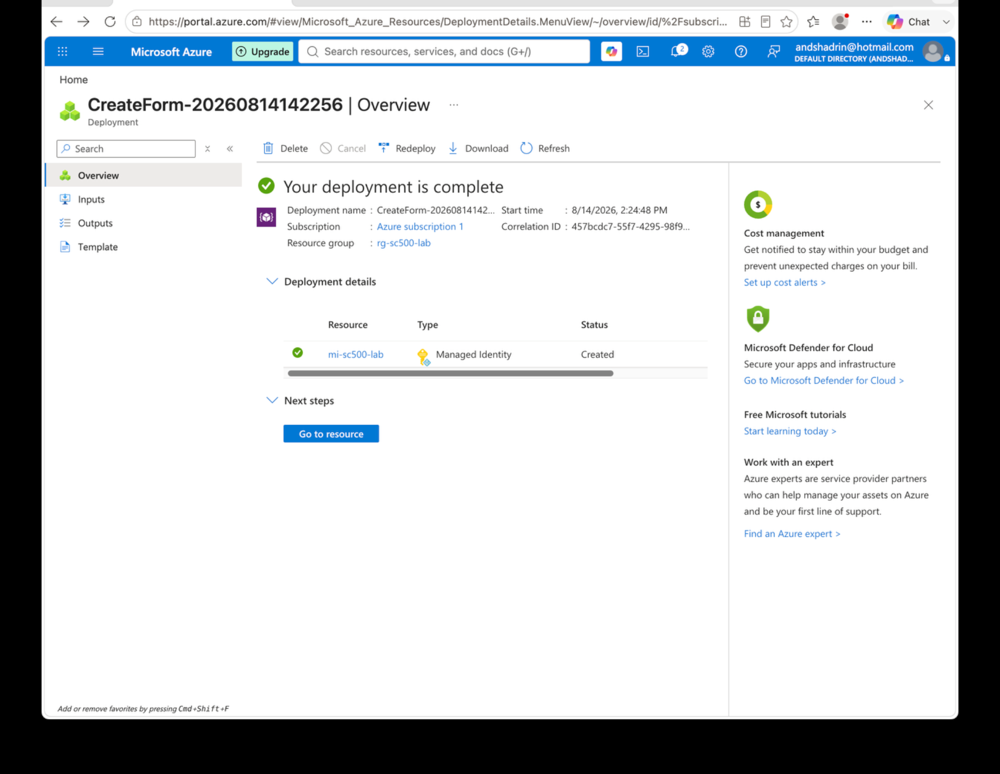
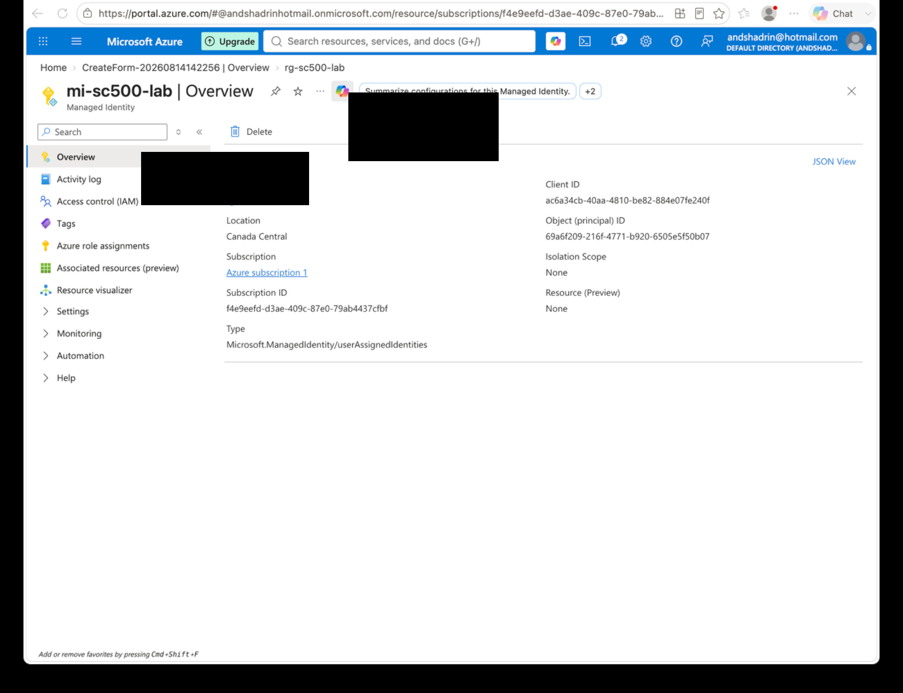
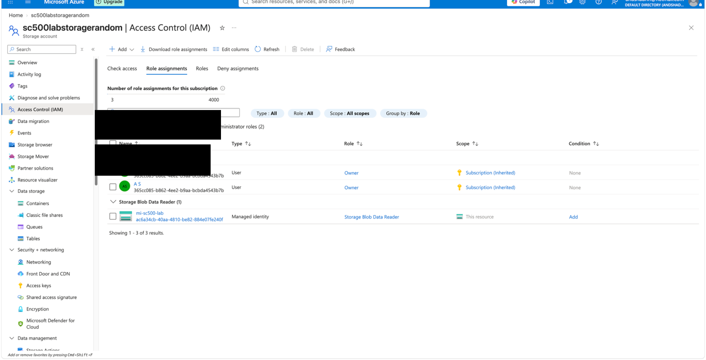

# Lab 15 - Managed Identity and Azure RBAC

## Objective
Create a user-assigned managed identity and grant it least-privilege access to Azure Blob Storage without storing a password or client secret.

## Configuration
- **Managed identity:** `mi-sc500-lab`
- **Identity type:** User-assigned managed identity
- **Resource group:** `rg-sc500-lab`
- **Region:** Canada Central
- **Azure RBAC role:** `Storage Blob Data Reader`
- **Scope:** Lab storage account

## Result
The managed identity was created successfully and received a client ID and object (principal) ID. It was then granted `Storage Blob Data Reader` on the storage account.

## Key SC-500 Concept
`Managed identity = WHO`

`Azure RBAC role = WHAT`

`Scope = WHERE`

The managed identity authenticates the workload, while Azure RBAC authorizes what it can do.

## Result Screenshots

