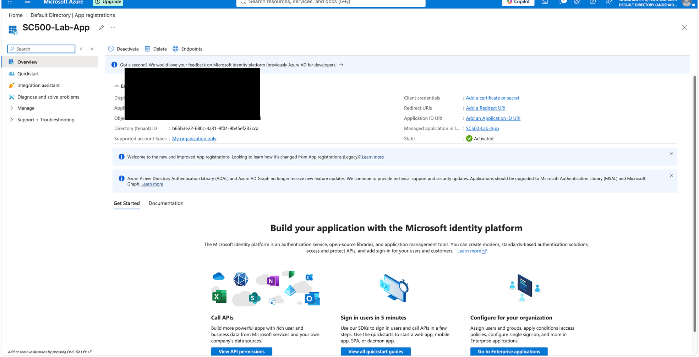
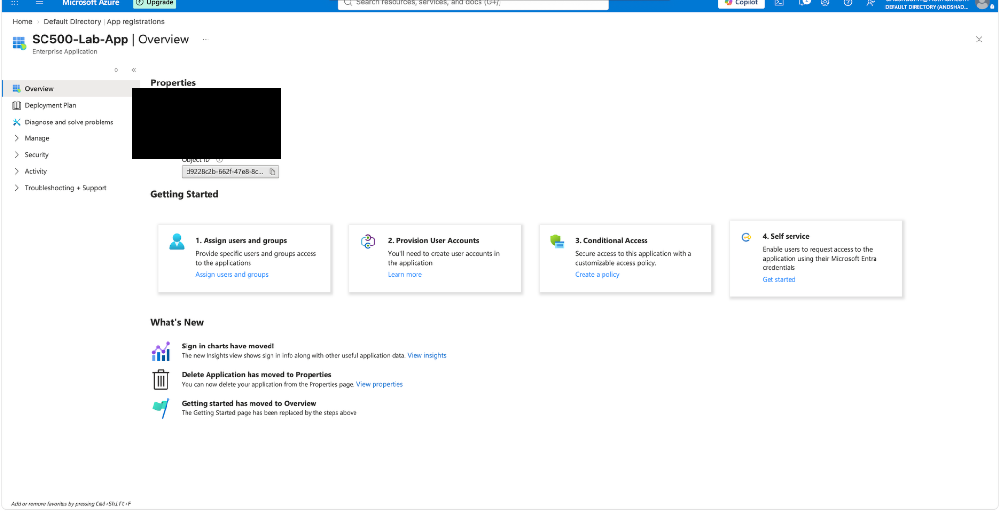
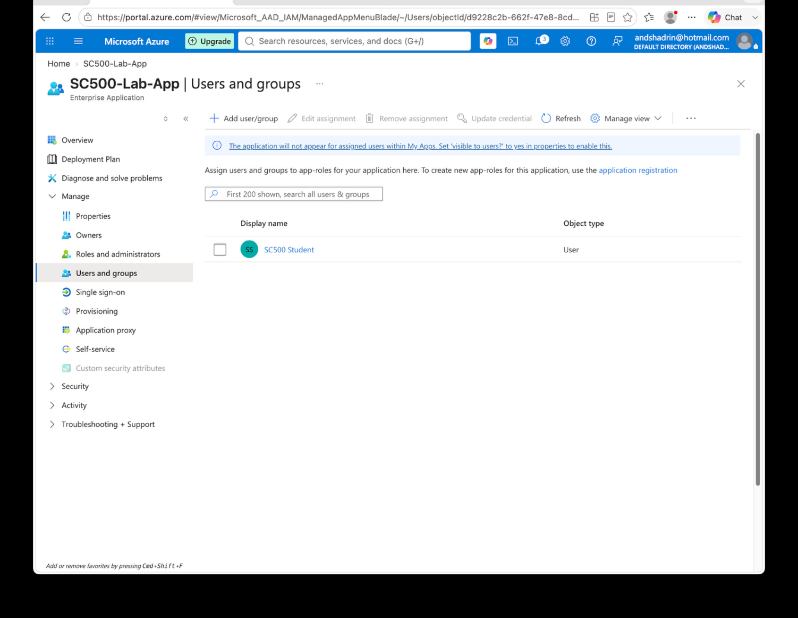

# Lab 16 - App Registration and Service Principal

## Objective
Create an application registration and inspect the corresponding Enterprise Application/service principal.

## Configuration
- **App registration:** `SC500-Lab-App`
- **Supported accounts:** Single tenant
- **Redirect URI:** None for this lab
- **Assigned user:** `SC500 Student`

## Result
Creating the app registration produced a corresponding Enterprise Application/service principal in the tenant. The application object and service principal shared the same application/client identity but had different Object IDs. User assignment was configured on the Enterprise Application.

## Key SC-500 Concept
**App Registration** = application definition / blueprint.

**Enterprise Application (service principal)** = tenant-local identity and access-control representation.

Memory rule:

`Same Application/Client ID → different Object IDs`

## Result Screenshots

