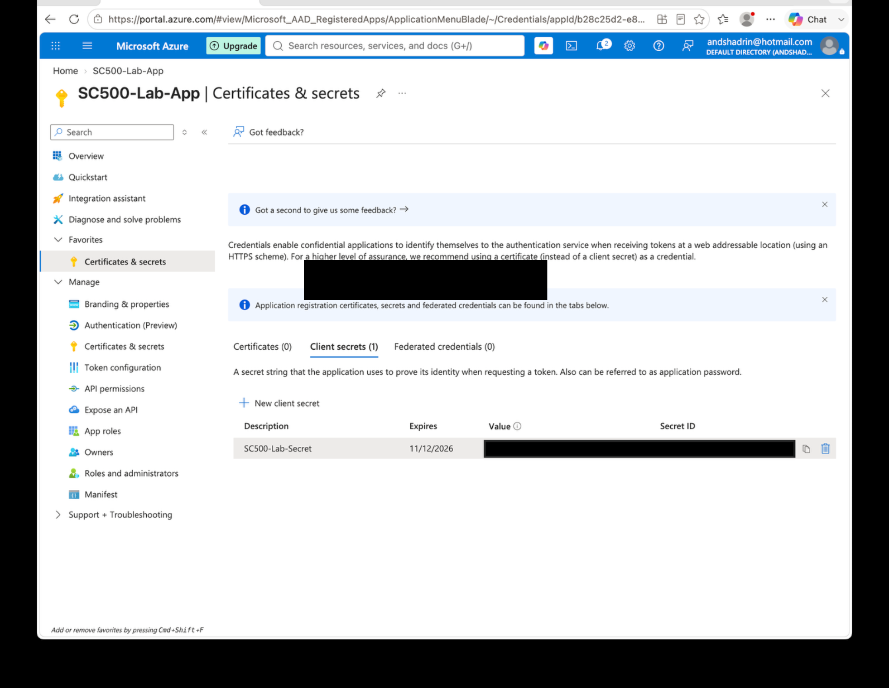

# Lab 17 - Client Secret vs Managed Identity

## Objective
Create a temporary client secret to understand traditional application credentials and compare that model with managed identity.

## Configuration
A temporary client secret was created for `SC500-Lab-App` and deleted after the lab.

## Result
The portal showed:
- **Secret Value** - the sensitive application credential.
- **Secret ID** - an identifier for the credential object, not the credential itself.

The secret Value was not saved to GitHub or documentation, and the temporary secret was deleted after the exercise.

## Key SC-500 Concept
A client secret functions like an application password and introduces storage, rotation, expiration, and disclosure risk.

When supported for Azure workloads, managed identity avoids storing an application secret because Azure manages the underlying credential lifecycle.

Memory rule:

`Client secret = application-managed credential`

`Managed identity = Azure-managed credential lifecycle`

## Result Screenshot

