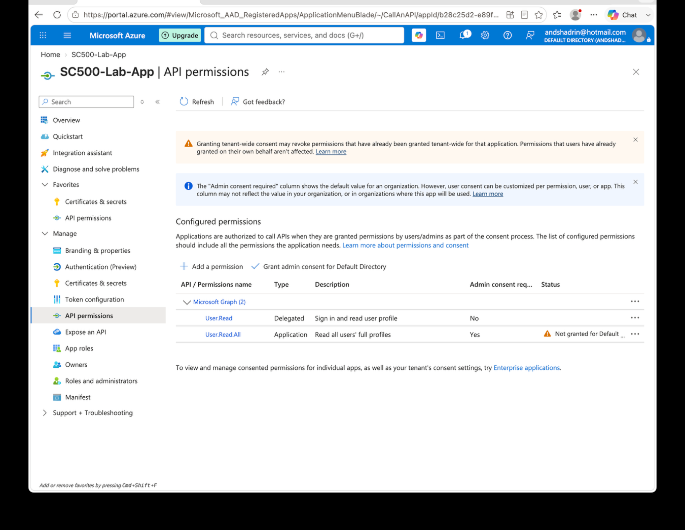
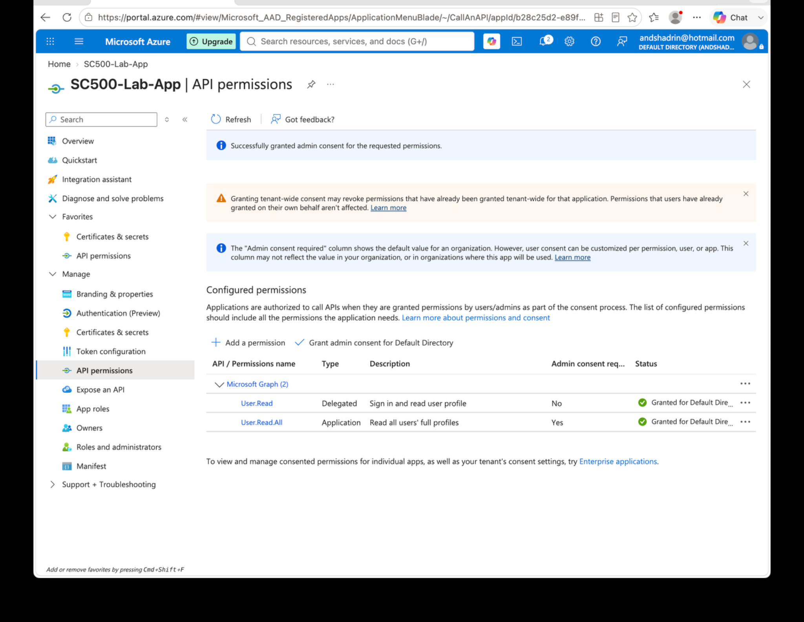

# Lab 18 - API Permissions and Admin Consent

## Objective
Compare delegated and application Microsoft Graph permissions and demonstrate administrator consent.

## Configuration
The application was configured with:

### Delegated permission
`User.Read`
- Type: Delegated
- Used with a signed-in user
- Reads the signed-in user's profile

### Application permission
`User.Read.All`
- Type: Application
- Used by the application itself
- Does not require a signed-in user
- Requires administrator consent

## Result
`User.Read.All` first appeared as configured but not granted. Tenant-wide admin consent was then granted, after which both permissions showed a granted status.

## Key SC-500 Concept
**Configured permission** = what the application requests.

**Consent** = authorization for the requested permission.

**Delegated permission** = app acts on behalf of a signed-in user.

**Application permission** = app acts as itself with no user present.

Memory rule:

`Signed-in user → Delegated`

`Background service / no user → Application`

## Result Screenshots

