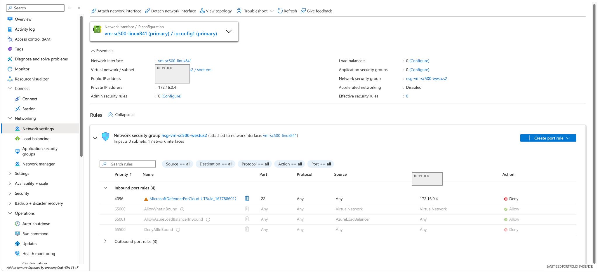
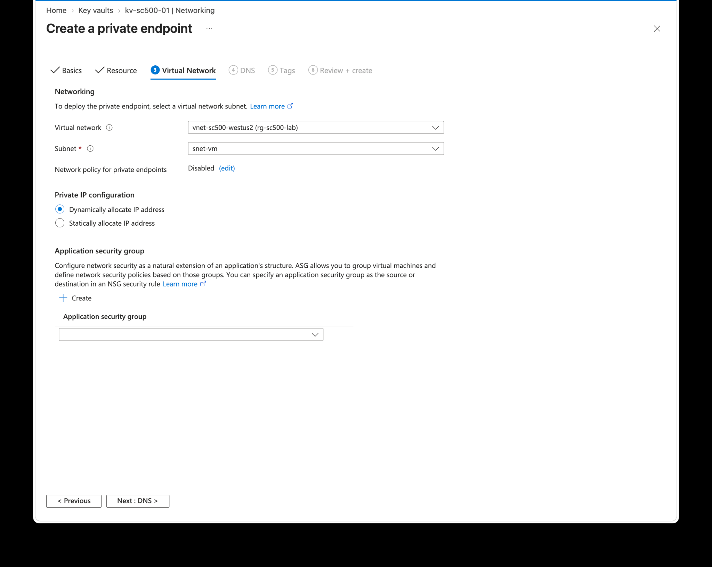

# 06 — Azure Network Security Baseline & Private Access Validation

## Overview

This lab documents the network-security controls supporting the Azure VM and later Key Vault private-access exercise.

It focuses on the relationship between:

- virtual network and subnet
- network interface
- Network Security Group (NSG)
- inbound access
- Microsoft Defender for Cloud Just-in-Time (JIT) behavior
- Private Endpoint connectivity
- Private DNS resolution


## Detailed labs retained

The original network-security exercises remain the detailed build record:

1. [Lab 19 — Azure VNet and Subnet Segmentation](lab19-vnet-subnets.md)
2. [Lab 20 — Network Security Groups](lab20-network-security-groups.md)
3. [Lab 21 — Storage Private Endpoint](lab21-private-endpoint-storage.md)
4. [Lab 22 — Route Tables and User-Defined Routes](lab22-route-table-udr.md)
5. [Lab 23 — Network Troubleshooting](lab23-network-troubleshooting.md)

This module overview adds newer validation evidence for NSG/JIT and private networking while preserving Labs 19–23 and their original screenshots.

## Security objective

Reduce unnecessary public exposure while preserving only the network paths required for administration and private service access.

## Evidence — VM networking and NSG



The VM network configuration shows the attached NIC, VNet/subnet, NSG, and inbound rule set. The Defender for Cloud JIT rule demonstrates how administrative SSH access can be restricted rather than left broadly open.

## Evidence — Private Endpoint VNet integration



A Private Endpoint was integrated into the lab virtual network to provide private service access.

## Evidence — private DNS resolution


Private DNS resolution was validated to ensure the service hostname resolved to the private path.

## Evidence — connectivity after public lockdown


Connectivity remained functional over the intended private path after public access was restricted in the related Key Vault hardening project.

## Network control model

```text
Internet / admin path
        |
        v
NSG + Defender JIT
        |
        v
Azure VM / subnet
        |
        +---- private DNS
        |
        +---- Private Endpoint
                    |
                    v
             Azure service
```

## Control principles

- minimize exposed management ports
- constrain inbound traffic with NSGs
- use JIT for administrative access where appropriate
- prefer Private Endpoint connectivity for sensitive PaaS services
- validate DNS as part of private networking
- test connectivity after lockdown

## Related project

For the complete end-to-end Key Vault isolation workflow, see:

[08 — Key Vault Private Endpoint](../08-Key-Vault-Private-Endpoint/)

## GRC relevance

Network configuration becomes stronger audit evidence when the security objective, implementation, and validation are documented together.

## Skills demonstrated

Azure VNets · subnets · NICs · NSGs · Defender JIT · Private Endpoints · Private DNS · connectivity validation · network hardening
