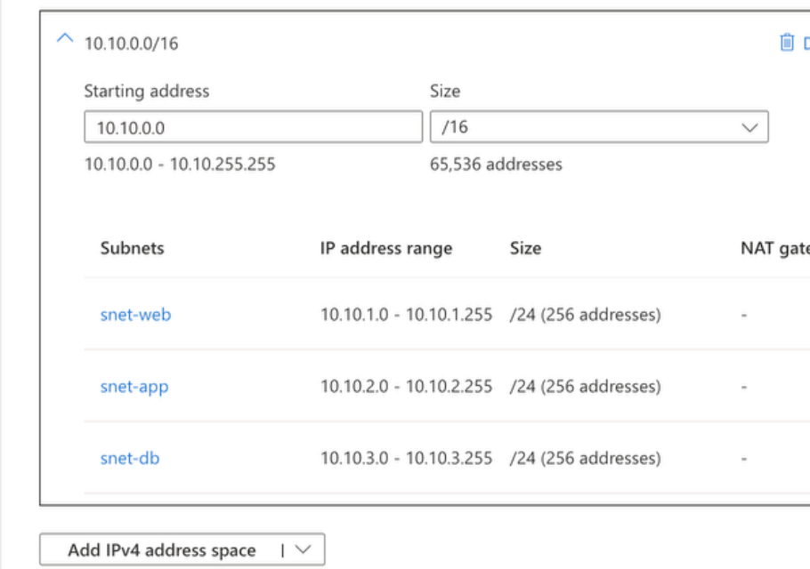

# Lab 19 - Azure VNet and Subnet Segmentation

## Objective

Create an Azure Virtual Network and divide it into separate web, application, and database subnets to support network segmentation and least-privilege security.

## Configuration

Virtual network:

- Name: `vnet-sc500-lab`
- Address space: `10.10.0.0/16`

Subnets:

- `snet-web` — `10.10.1.0/24`
- `snet-app` — `10.10.2.0/24`
- `snet-db` — `10.10.3.0/24`

## What I Learned

- A VNet provides a private network boundary in Azure.
- Subnets divide a VNet into smaller security and routing zones.
- Different workload tiers can be isolated into separate subnets.
- CIDR notation determines the size of the network range.
- Subnet ranges must fit inside the VNet address space and cannot overlap.
- Segmentation makes it possible to apply different NSGs and route tables to different workloads.

## Memory Aid

- VNet = private Azure network
- Subnet = segment inside the VNet
- CIDR = size of the address range
- Segmentation = separate workloads by function

## Screenshots

## Interview Takeaway

A common Azure design separates web, application, and database workloads into different subnets.

This allows security and routing controls to be applied independently to each tier and reduces unnecessary communication between workloads.

## Exam Notes

- VNet = private Azure network
- Subnets exist inside a VNet
- Subnet ranges cannot overlap
- Subnets must fit inside the VNet address space
- NSGs and route tables can be applied at the subnet level
- Network segmentation supports least privilege
