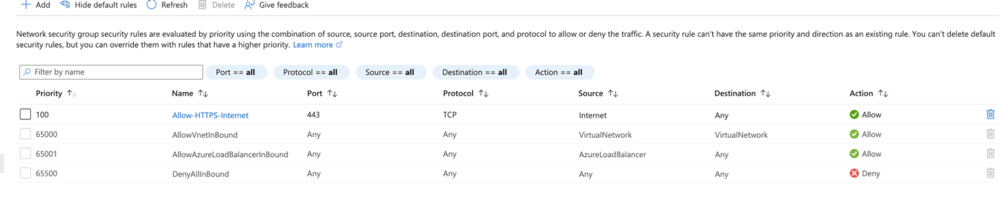
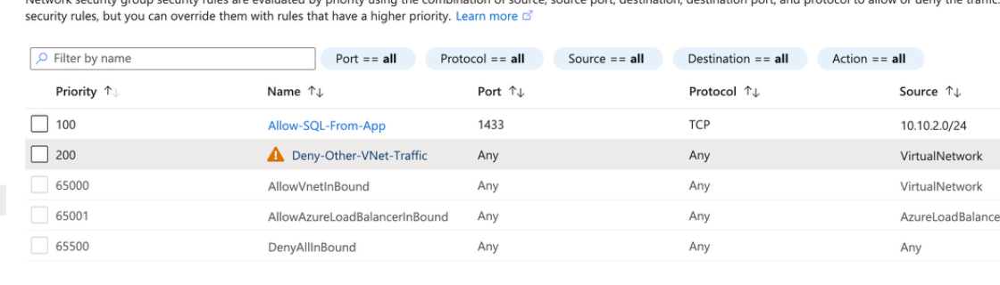

# Lab 20 - Network Security Groups and Three-Tier Segmentation

## Objective

Use Network Security Groups to enforce least-privilege traffic between the web, application, and database subnets.

## Configuration

Web tier NSG:

- Name: `nsg-web`
- Priority: `100`
- Rule: `Allow-HTTPS-Internet`
- Source: `Internet`
- Protocol: `TCP`
- Destination port: `443`
- Action: `Allow`

Application tier NSG:

- Name: `nsg-app`
- Priority: `100`
- Rule: `Allow-App-From-Web`
- Source: `10.10.1.0/24`
- Protocol: `TCP`
- Destination port: `8080`
- Action: `Allow`

- Priority: `200`
- Rule: `Deny-Other-VNet-Traffic`
- Source: `VirtualNetwork`
- Protocol: `Any`
- Destination port: `Any`
- Action: `Deny`

Database tier NSG:

- Name: `nsg-db`
- Priority: `100`
- Rule: `Allow-SQL-From-App`
- Source: `10.10.2.0/24`
- Protocol: `TCP`
- Destination port: `1433`
- Action: `Allow`

- Priority: `200`
- Rule: `Deny-Other-VNet-Traffic`
- Source: `VirtualNetwork`
- Protocol: `Any`
- Destination port: `Any`
- Action: `Deny`

## What I Learned

- NSGs provide stateful Layer 3 and Layer 4 filtering.
- Lower priority numbers are evaluated first.
- A specific allow rule can be evaluated before a broader deny rule.
- NSGs can enforce least-privilege communication between application tiers.
- Azure default NSG rules remain present but can be overridden by higher-priority custom rules.

## Memory Aid

- NSG = can traffic pass?
- Lower number = checked first
- Specific allow before broad deny
- Stateful = return traffic is automatically allowed for established flows

## Screenshots

## Interview Takeaway

For a three-tier application, each tier should communicate only with the tier it needs.

A common pattern is:

- Internet → Web: TCP 443
- Web → App: TCP 8080
- App → DB: TCP 1433

This reduces unnecessary east-west traffic and limits lateral movement.

## Exam Notes

- NSGs are stateful
- NSGs can be associated with subnets or NICs
- Lower priority number is evaluated first
- Service tags simplify rule definitions
- Default inbound rule `DenyAllInBound` uses priority `65500`
- Custom rules with lower numbers are evaluated first
