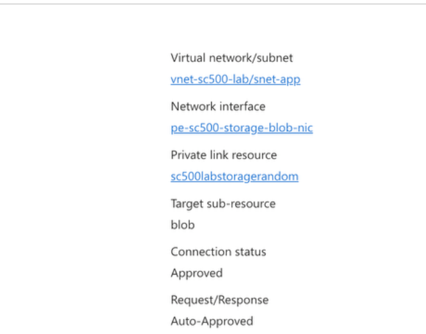
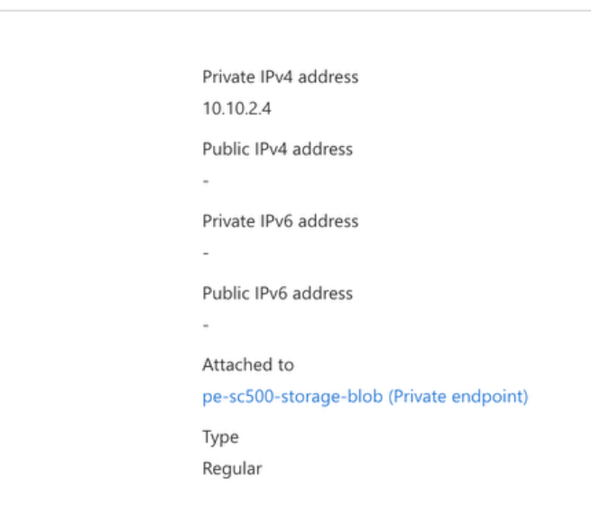
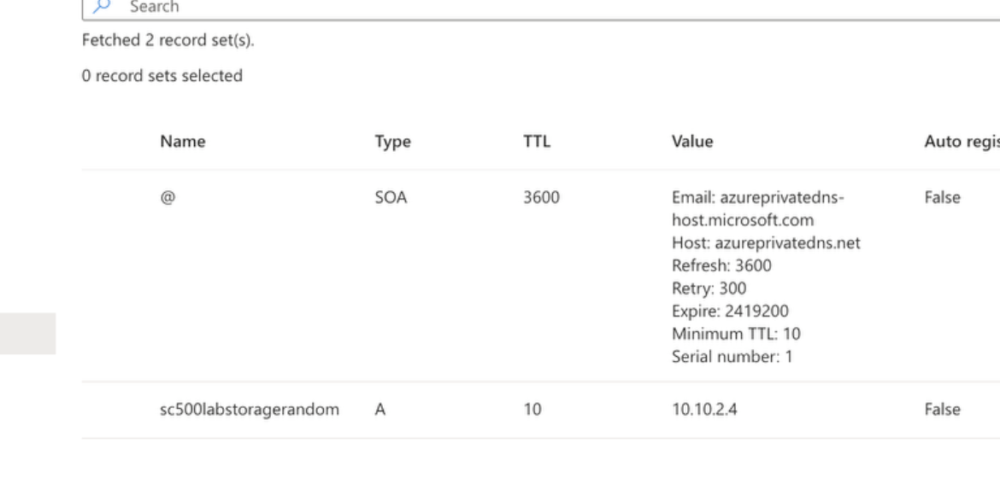
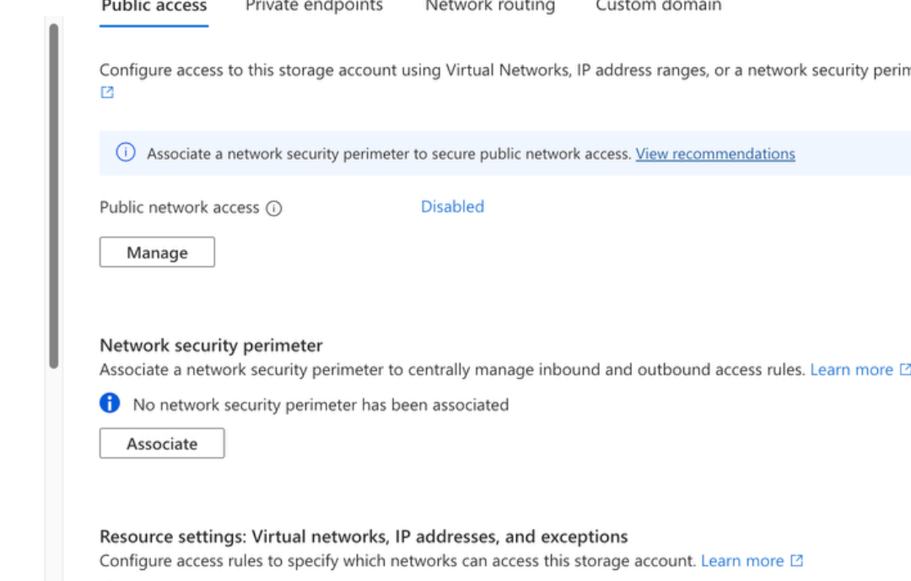

# Lab 21 - Azure Storage Private Endpoint

## Objective

Secure an Azure Storage blob service by exposing it through a private IP address using Azure Private Link.

## Configuration

Private endpoint:

- Name: `pe-sc500-storage-blob`
- Target resource: Azure Storage
- Target sub-resource: `blob`
- VNet: `vnet-sc500-lab`
- Subnet: `snet-app`
- Private IP: `10.10.2.4`

Private DNS:

- Zone: `privatelink.blob.core.windows.net`
- A record points the storage resource to `10.10.2.4`

Public network access:

- Disabled after the Private Endpoint and DNS configuration were verified

## What I Learned

- A Private Endpoint gives a specific Azure PaaS resource a private IP inside the VNet.
- Private DNS is critical so workloads resolve the service to the private endpoint.
- Private Endpoint and Service Endpoint are different technologies.
- Public network access can be disabled after private connectivity is verified.
- Azure Private Link reduces public exposure of PaaS services.

## Memory Aid

- Private Endpoint = private IP for the service
- Private DNS = resolve service name to private IP
- Service Endpoint = secure subnet access to the service's public endpoint
- Private Endpoint + Private DNS + public access disabled = private-only design

## Screenshots

## Interview Takeaway

Private Endpoint is commonly used when an organization wants Azure PaaS services to be reachable privately without relying on public network access.

Private DNS is an important part of the design because applications can continue using the normal service hostname while resolving it to a private IP.

## Exam Notes

- Private Endpoint creates a private IP in the VNet
- Private Endpoint uses Azure Private Link
- Private DNS commonly supports name resolution
- Service Endpoint does not create a private IP for the service
- Public network access can be disabled for private-only access
