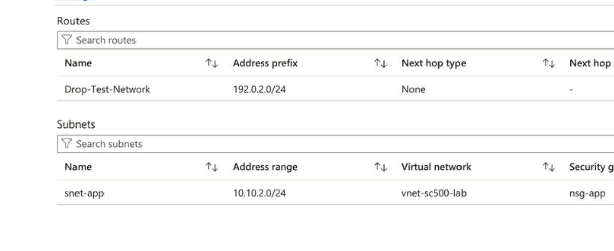
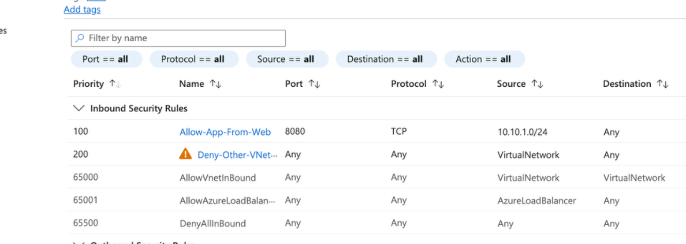

# Lab 23 - Azure Network Troubleshooting

## Objective

Build a repeatable troubleshooting process for Azure network connectivity problems.

## Configuration

Troubleshooting workflow:

1. DNS
2. Routing
3. NSG
4. Destination / endpoint configuration

DNS evidence:

- Private DNS resolves the storage resource to `10.10.2.4`

Routing evidence:

- Route table: `rt-app`
- Associated subnet: `snet-app`
- Route: `192.0.2.0/24 -> None`

NSG evidence:

- Priority `100`: `Allow-App-From-Web`
- Source: `10.10.1.0/24`
- Protocol: `TCP`
- Destination port: `8080`
- Action: `Allow`

- Priority `200`: `Deny-Other-VNet-Traffic`
- Source: `VirtualNetwork`
- Protocol: `Any`
- Destination port: `Any`
- Action: `Deny`

## What I Learned

- Connectivity troubleshooting should be systematic rather than changing firewall rules immediately.
- DNS problems can look like routing or firewall problems.
- A valid route does not guarantee that an NSG will allow the traffic.
- An allowing NSG rule does not help if the route sends the traffic somewhere incorrect.
- Private Endpoint problems can involve DNS, routing, network controls, or resource configuration.

## Memory Aid

- DNS = What address?
- Route = Where next?
- NSG = Allowed?
- Target = Is the service reachable?

## Screenshots

## Interview Takeaway

When troubleshooting Azure connectivity, avoid immediately weakening security controls.

First determine whether the failure is caused by incorrect name resolution, incorrect routing, an NSG rule, or destination/endpoint configuration.

This creates a repeatable troubleshooting process and reduces unnecessary configuration changes.

## Exam Notes

- Effective networking depends on both routing and security rules
- NSGs answer whether traffic is permitted
- Route tables answer where traffic is sent
- Private DNS is critical for Private Endpoint name resolution
- Always check the most specific route and the highest-priority matching NSG rule
