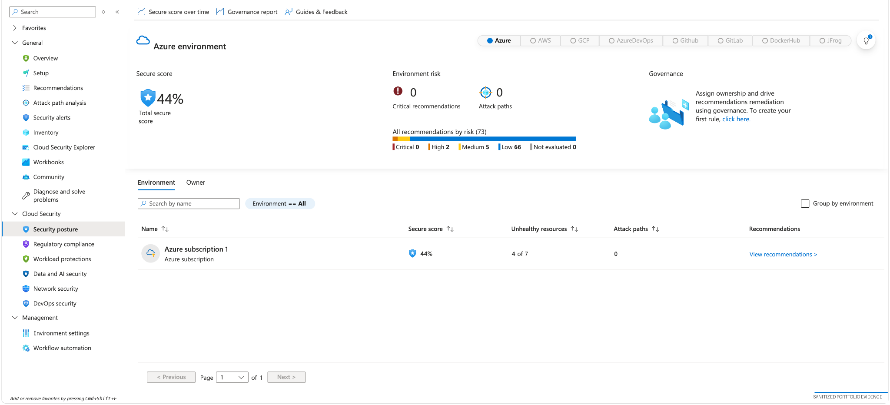
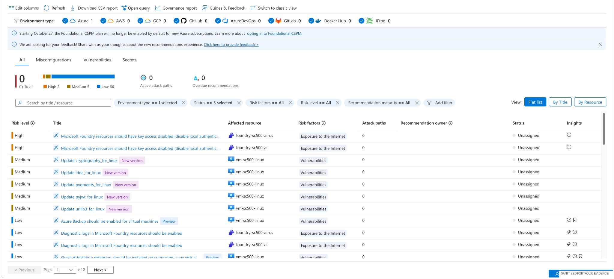
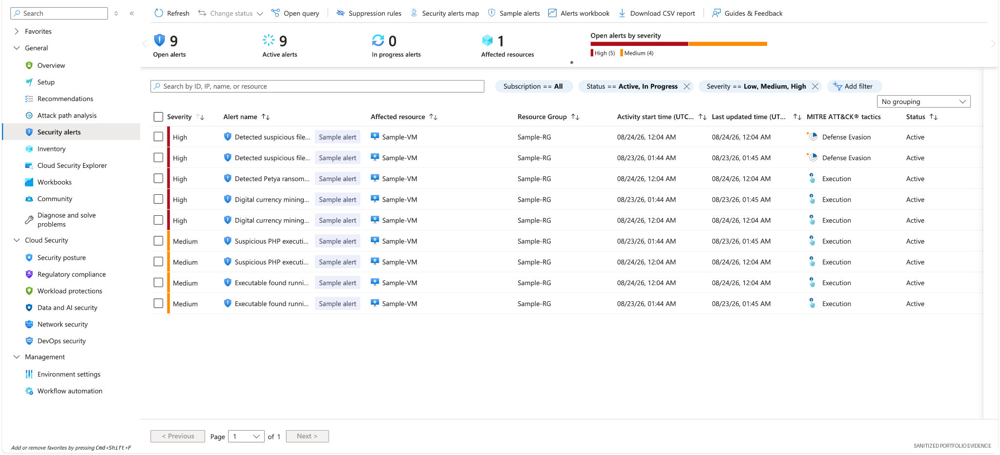
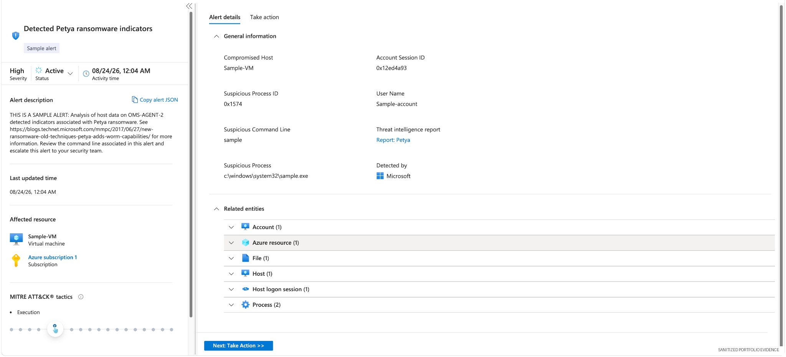
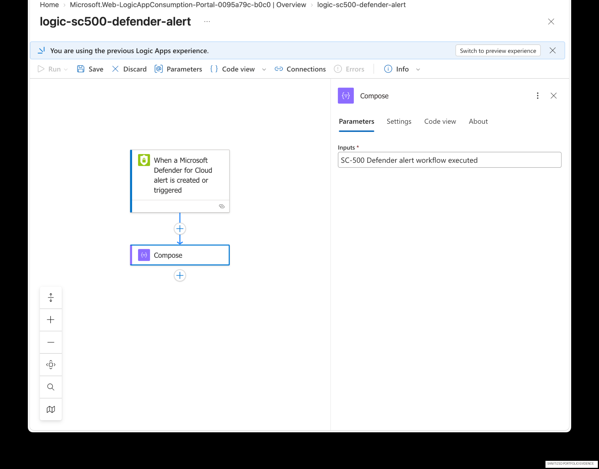
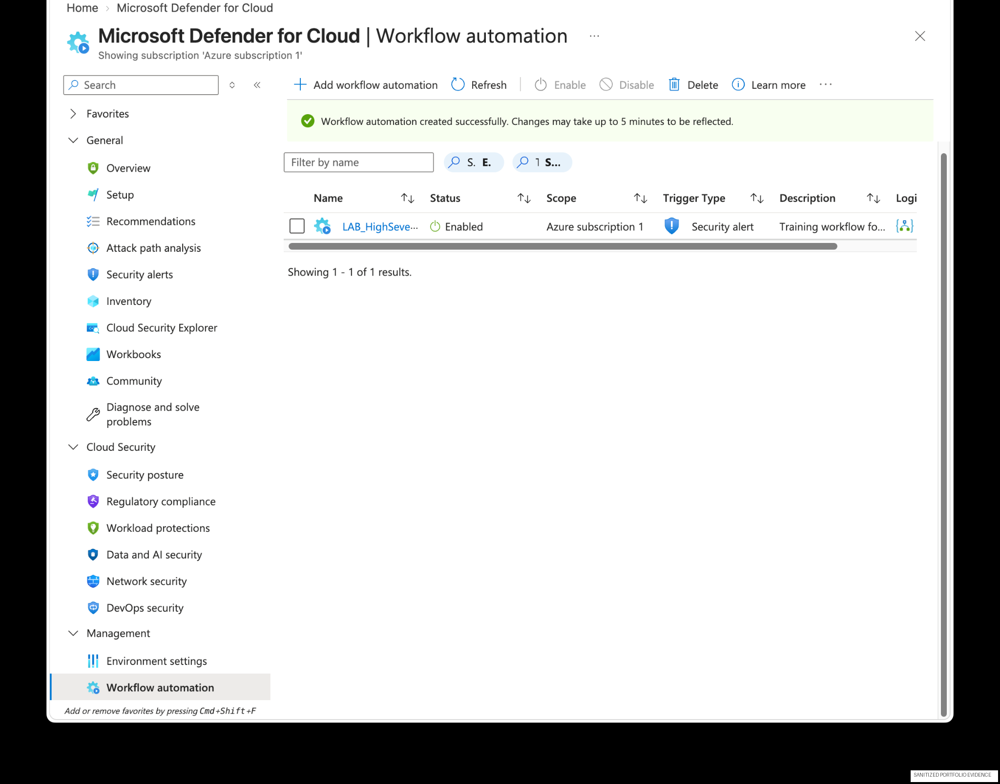
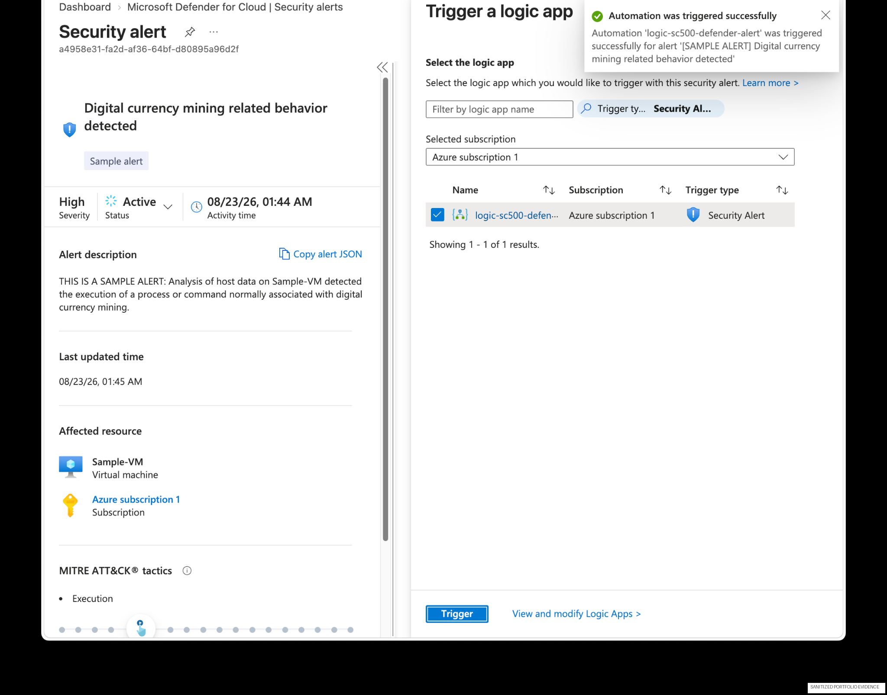
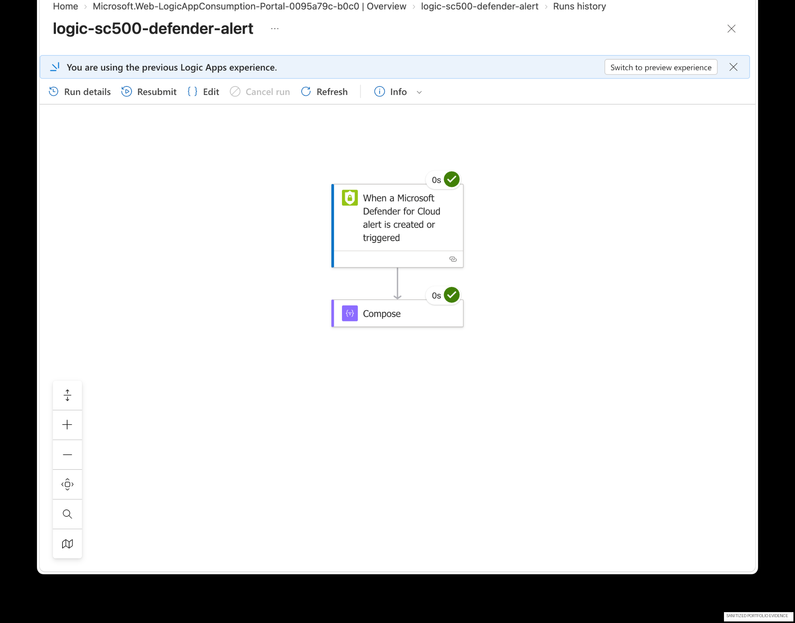

# 07 — Microsoft Defender for Cloud: Posture, Alerts & Workflow Automation

## Overview

This lab connects cloud-security posture management with an actual detection-and-response workflow.

The project covers:

- Defender for Cloud security posture
- security recommendations
- security alerts
- high-severity alert investigation
- Azure Logic Apps
- Defender workflow automation
- successful execution evidence


## Detailed labs retained

The original Defender exercises remain intact:

1. [Lab 24 — Secure Score, Recommendations, and Regulatory Compliance](lab24-secure-score-compliance.md)
2. [Lab 25 — Defender for Servers and Vulnerability Assessment](lab25-defender-for-servers-vulnerability-assessment.md)
3. [Lab 26 — Update Manager Remediation](lab26-update-manager-remediation.md)
4. [Lab 27 — Just-in-Time VM Access](lab27-jit-vm-access.md)
5. [Lab 28 — Security Alerts](lab28-security-alerts.md)
6. [Lab 29 — Workflow Automation](lab29-workflow-automation.md)

The newer screenshots in this README add a polished end-to-end Defender → Logic App automation validation. They supplement rather than replace Labs 24–29.

## Security objective

Create a repeatable path from **security finding → alert → automated response → run evidence**.

## 1. Review cloud security posture



Defender for Cloud provides a centralized view of posture and security recommendations.

## 2. Review recommendations



Recommendations help translate cloud configuration findings into prioritized remediation work.

## 3. Review security alerts



The alert view provides severity, affected resources, and investigation context.

## 4. Inspect a high-severity alert



A high-severity sample alert was used as a safe source event for the automation test.

## 5. Build the Logic App



The Logic App uses a **Microsoft Defender for Cloud alert** trigger and a simple **Compose** action. The action is intentionally non-destructive for safe portfolio testing.

## 6. Create workflow automation



Defender workflow automation was configured to route high-severity security alerts to the Logic App.

## 7. Trigger the automation



The Defender portal confirmed that the automation was triggered successfully.

## 8. Verify the run



The Logic App run details show successful execution of both the Defender trigger and the Compose action.

## Detection-to-response flow

```text
Cloud workload / resource
        |
        v
Microsoft Defender for Cloud
        |
        v
High-severity security alert
        |
        v
Workflow automation
        |
        v
Azure Logic App
        |
        v
Controlled response action
        |
        v
Run history / audit evidence
```

## Control mapping

| Control type | Evidence |
|---|---|
| Preventive | Defender recommendations and security hardening |
| Detective | Defender security alerts |
| Responsive | Workflow automation |
| Corrective | Logic App response workflow |
| Monitoring | Logic App run history |
| Evidence | Successful trigger + successful action |

## GRC relevance

This project demonstrates how an operational security control can be proven to work, rather than merely documented as configured.

It supports common control-testing questions:

- Is security monitoring enabled?
- Are findings prioritized?
- Can high-severity events trigger a defined response?
- Is execution evidence retained?
- Can the organization demonstrate that the control was tested?

## Skills demonstrated

Microsoft Defender for Cloud · CSPM · security recommendations · alert investigation · Azure Logic Apps · workflow automation · control testing · audit evidence
