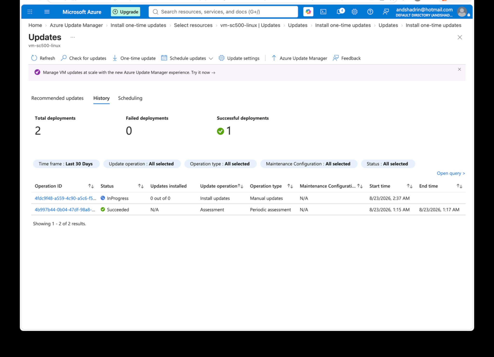

# Lab 26 - Azure Update Manager Vulnerability Remediation

## Objective

Use Azure Update Manager to remediate a Linux package vulnerability through the Azure portal instead of relying only on Bash.

## Configuration

Workflow used:

1. Defender for Cloud identified a vulnerable Linux package.
2. Azure Update Manager assessed the VM for available updates.
3. A one-time update was configured for a specific package.
4. The update was submitted through the Azure portal.
5. Update Manager reassessed the machine.
6. The targeted package disappeared from the pending update list after successful installation.

A separate command-line check was also used earlier in the lab to compare package versions, but the remediation workflow was completed through the Azure GUI.

## What I Learned

- Update Manager can assess and patch Azure VMs centrally.
- Portal-based patching is useful when an administrator does not remember exact package-manager commands.
- Update Manager supports targeted package selection and broader classification-based patching.
- Successful remediation should be followed by reassessment and verification.
- GUI and CLI skills complement each other; the important operational skill is understanding the patching lifecycle.

## Memory Aid

- Detect -> Assess -> Patch -> Reassess -> Verify

## Screenshots

## Interview Takeaway

I can patch a vulnerable Linux VM from Azure Update Manager by assessing available updates, selecting the required package, applying a one-time update, and verifying the result through update history and reassessment.

## Exam Notes

- Azure Update Manager provides centralized update assessment and deployment.
- One-time updates are useful for immediate remediation.
- Scheduled updates are used for recurring maintenance.
- Reboot behavior and maintenance windows are part of patch configuration.
