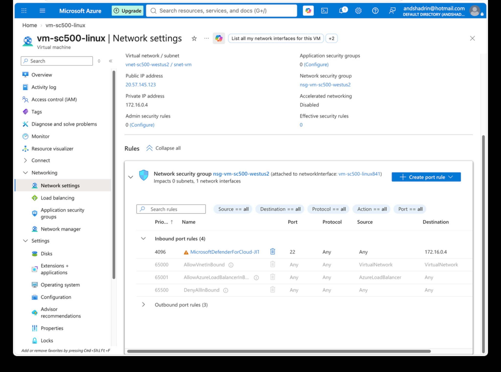

# Lab 27 - Just-in-Time VM Access

## Objective

Use Defender for Cloud Just-in-Time VM access to reduce exposure of administrative ports.

## Configuration

Configured Just-in-Time access for the Linux VM.

Observed that Defender for Cloud created a temporary NSG rule for SSH:

- Administrative port: 22
- Temporary access controlled through Defender for Cloud
- NSG rule created with a high-priority custom rule while access was active

## What I Learned

- JIT reduces the time administrative ports are exposed.
- It works with NSG rules to temporarily allow management access.
- JIT is different from Azure Bastion.
- Bastion provides a managed private administrative access path.
- JIT temporarily opens a management port only when authorized.

## Memory Aid

- Bastion = private doorway
- JIT = temporary key to the port

## Screenshots

## Interview Takeaway

I can reduce VM attack surface by keeping management ports closed by default and using Defender for Cloud Just-in-Time access to create temporary, controlled access when administration is required.

## Exam Notes

- JIT is designed to reduce exposure of RDP and SSH ports.
- JIT commonly works by modifying NSG or firewall rules for a limited period.
- JIT and Bastion solve different access-control problems.
