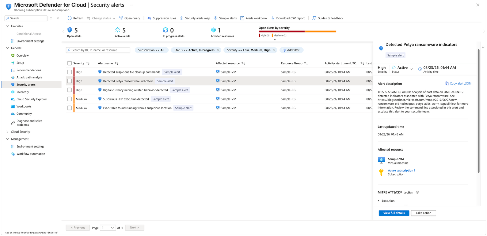

# Lab 28 - Security Alerts and Incident Triage

## Objective

Investigate Microsoft Defender for Cloud security alerts and practice the alert lifecycle.

## Configuration

Created Defender for Cloud sample alerts and reviewed:

- Severity
- Alert status
- Affected resource
- Alert description
- MITRE ATT&CK tactics
- Recommended mitigation actions
- Related entities

Practiced the alert status lifecycle:

- Active
- In Progress
- Resolved

A sample ransomware alert was moved to In Progress and then Resolved after reviewing the response guidance.

## What I Learned

- Security alerts represent detected suspicious activity, not posture recommendations.
- Severity helps prioritize triage.
- Alert details provide affected resources, entities, and threat context.
- MITRE ATT&CK mapping helps explain attacker behavior.
- Changing an alert to In Progress or Resolved records operational handling; it does not itself remediate the underlying threat.

## Memory Aid

- Recommendation = weakness
- Alert = suspicious activity
- Triage = investigate -> mitigate -> verify -> resolve

## Screenshots

## Interview Takeaway

I can triage a Defender for Cloud alert by reviewing severity, affected resources, entities, ATT&CK context, and recommended mitigation steps, then track the alert through an operational status lifecycle.

## Exam Notes

- Alerts and recommendations are different objects.
- High severity generally receives the highest response priority.
- Suppression rules reduce unwanted recurring alerts.
- Workflow automation can trigger automated response actions from alerts.
