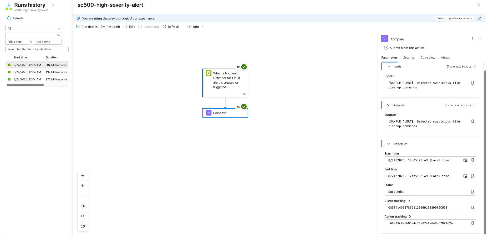
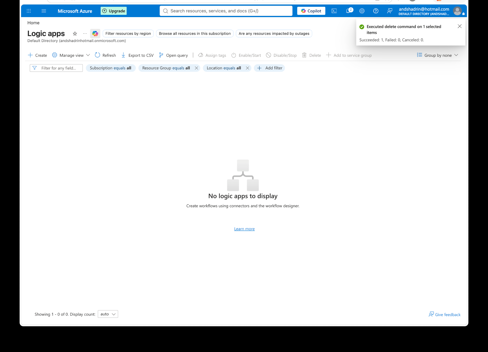

# Lab 29 - Workflow Automation with Logic Apps

## Objective

Create and validate an automated Defender for Cloud response workflow using a Consumption Logic App.

## Configuration

Created a Defender for Cloud workflow automation rule:

- Trigger type: Security alert
- Alert severity: High
- Logic App: Consumption / Multi-tenant
- Workflow type: Stateful

Logic App workflow:

1. Trigger: When a Microsoft Defender for Cloud alert is created or triggered.
2. Action: Data Operations - Compose.
3. Input: Dynamic `Alert Display Name` from the Defender alert payload.

Generated new High-severity sample alerts after enabling the workflow.

Verified:

- The Logic App triggered successfully.
- Run history showed successful executions.
- Compose input and output contained the actual Defender sample alert display name.

The workflow automation rule and Logic App were deleted after validation to keep the lab environment clean.

## What I Learned

- Defender workflow automation controls when a Logic App is triggered.
- The Logic App controls what action is performed.
- Dynamic content passes Defender alert data into downstream actions.
- Run history provides proof that the automation executed successfully.
- A simple Compose action is useful for testing without external connector dependencies.

## Memory Aid

- Detect -> Trigger -> Act -> Verify
- Workflow automation = WHEN
- Logic App = WHAT

## Screenshots

## Interview Takeaway

I built an end-to-end Defender for Cloud automation that triggered on High-severity alerts, passed the alert display name into a Logic App action, and verified successful execution through run history before cleaning up the resources.

## Exam Notes

- Workflow automation can trigger Logic Apps from Defender alerts and recommendations.
- Alert severity can be used as a workflow condition.
- Logic Apps perform the actual response action.
- Run history is useful for validating and troubleshooting automation.
