# Azure Key Vault Private Endpoint and Network Hardening

> **Portfolio note:** This is a standalone project/module. Its numbering is canonical and is not part of the historical Lab 1–29 sequence.
## Overview

This lab demonstrates how to harden Azure Key Vault network access by replacing public data-plane access with an Azure Private Endpoint.

The Key Vault is connected to the lab virtual network through Azure Private Link, integrated with Azure Private DNS, and then configured to block public network access. The final validation proves that the lab VM resolves and reaches the Key Vault through the private IP address.

The lab was completed primarily through the Azure portal using a GUI-first workflow, with two short VM-side validation commands executed through **Run command**.

## Security Objective

Build and validate a private network path to Azure Key Vault.

The lab verifies that:

- the Key Vault has an approved private endpoint;
- the endpoint receives a private IP address inside the lab VNet;
- Private DNS maps the normal Key Vault hostname to that private IP;
- the lab VM can reach the vault over TCP 443;
- public network access can be disabled;
- access from the local workstation is blocked after lockdown;
- the VM continues to resolve and connect to the vault through Private Link.

## Environment

- Microsoft Azure
- Azure Key Vault
- Azure Private Link
- Azure Private Endpoint
- Azure Private DNS
- Azure Virtual Network
- Linux virtual machine
- Azure Network Watcher / Connection Troubleshoot
- Azure RBAC

## Lab Resources

| Resource | Value |
|---|---|
| Key Vault | `kv-sc500-01` |
| Private Endpoint | `pe-kv-sc500-01` |
| Private Endpoint NIC | `pe-kv-sc500-01-nic` |
| Virtual Network | `vnet-sc500-westus2` |
| Subnet | `snet-vm` |
| Private IP | `172.16.0.5` |
| Private DNS zone | `privatelink.vaultcore.azure.net` |
| Validation VM | `vm-sc500-linux` |
| HTTPS port | `443` |

## Architecture

```text
vm-sc500-linux
      |
      | DNS: kv-sc500-01.vault.azure.net
      v
Azure Private DNS
privatelink.vaultcore.azure.net
      |
      | A record
      v
   172.16.0.5
      |
      v
pe-kv-sc500-01
Private Endpoint
      |
      v
kv-sc500-01
Azure Key Vault

Public network access: Disabled
```

---

## 1. Start Private Endpoint Creation

From the Key Vault:

**Networking → Private endpoint connections → Create**

The private endpoint was created in the existing SC-500 lab resource group.

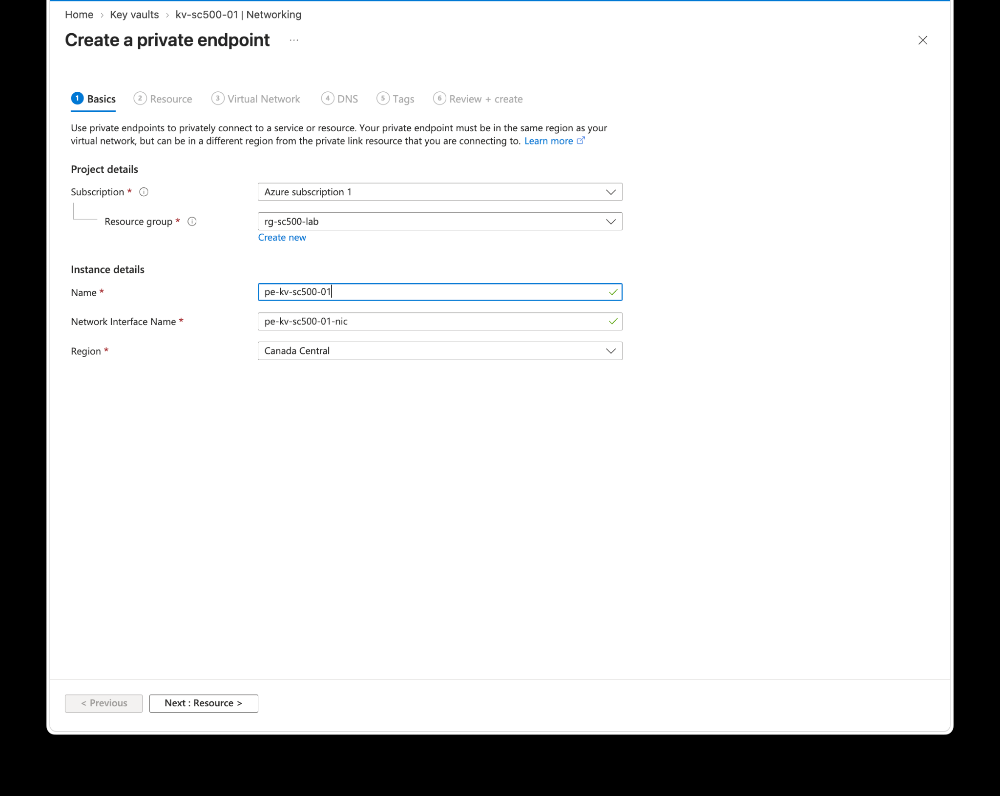

## 2. Select the Key Vault Resource

The endpoint target was configured as:

- Resource type: `Microsoft.KeyVault/vaults`
- Resource: `kv-sc500-01`
- Target sub-resource: `vault`

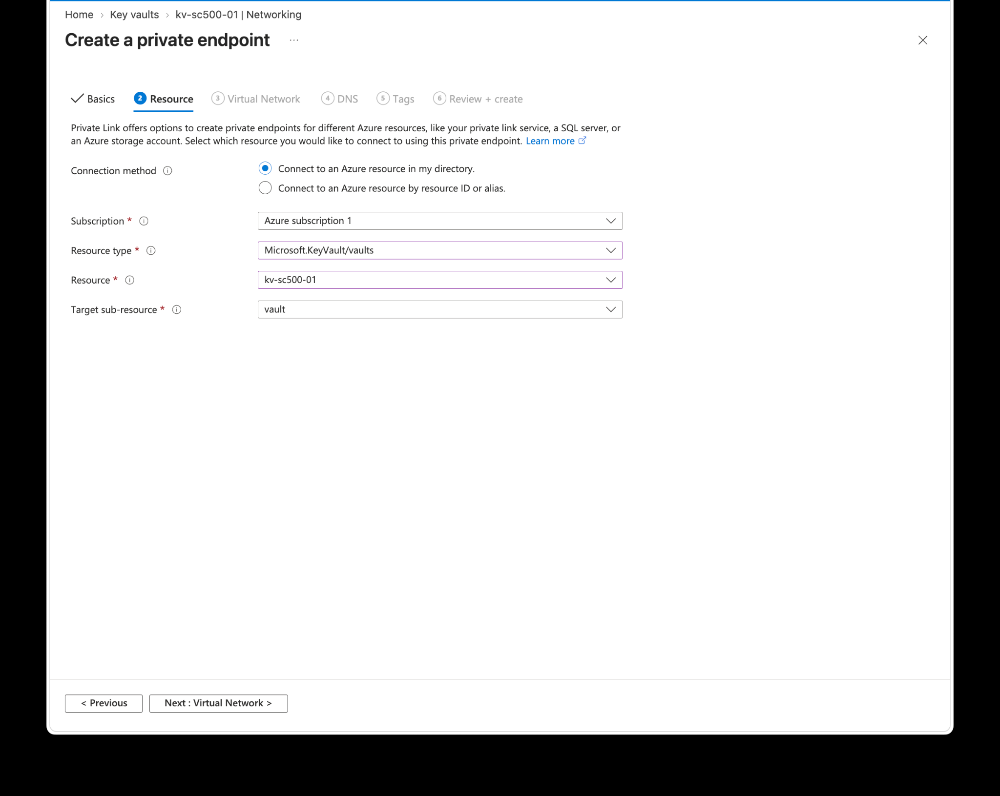

## 3. Attach the Endpoint to the Lab VNet

The endpoint was attached to:

- VNet: `vnet-sc500-westus2`
- Subnet: `snet-vm`
- Private IP allocation: Dynamic


## 4. Enable Private DNS Integration

Private DNS integration was enabled.

Azure created/used:

```text
privatelink.vaultcore.azure.net
```

This allows workloads in the VNet to continue using the normal Key Vault hostname while resolving it to the private endpoint.

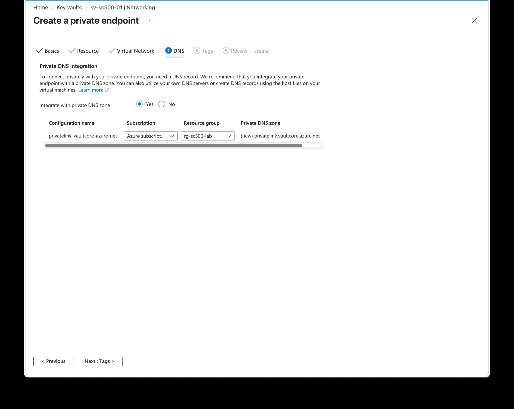

## 5. Review the Configuration

Before deployment, the portal validation passed and the endpoint configuration was reviewed.

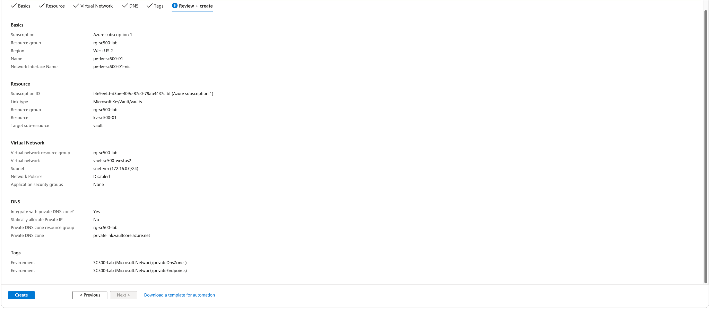

## 6. Confirm Successful Deployment

The deployment completed successfully and created the private endpoint and supporting Private DNS resources.

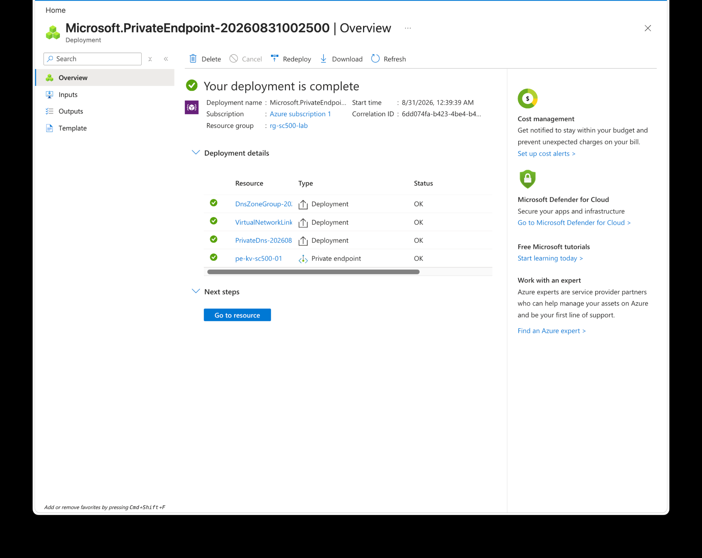

## 7. Confirm Private Endpoint Approval

The private endpoint showed:

- Provisioning state: `Succeeded`
- Connection status: `Approved`
- Target: `kv-sc500-01`
- Target sub-resource: `vault`

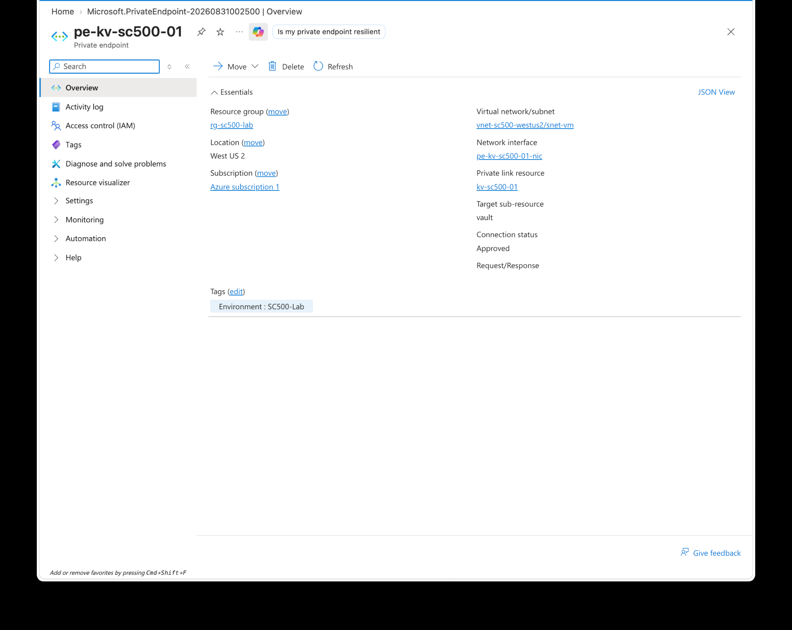

## 8. Verify the Private Endpoint NIC

The endpoint NIC was attached to the lab subnet and assigned:

```text
172.16.0.5
```

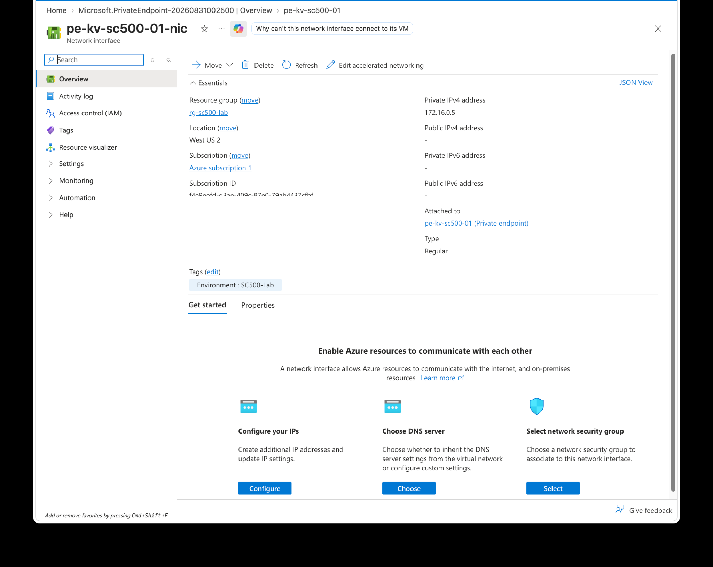

## 9. Verify the Private DNS A Record

The Private DNS zone contained an A record mapping:

```text
kv-sc500-01 -> 172.16.0.5
```

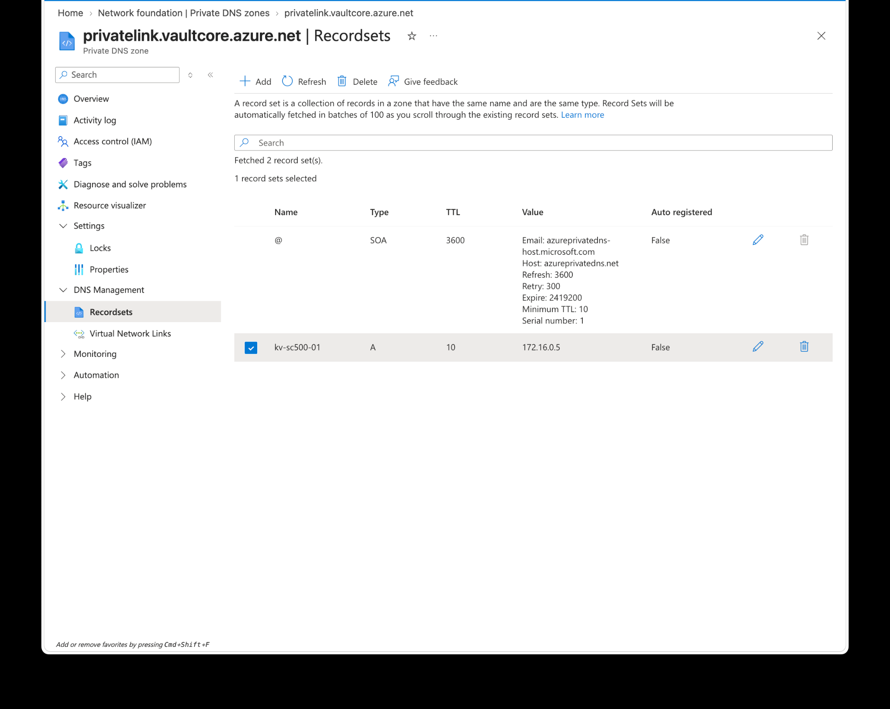

## 10. Verify the VNet Link

The Private DNS zone was linked to:

```text
vnet-sc500-westus2
```

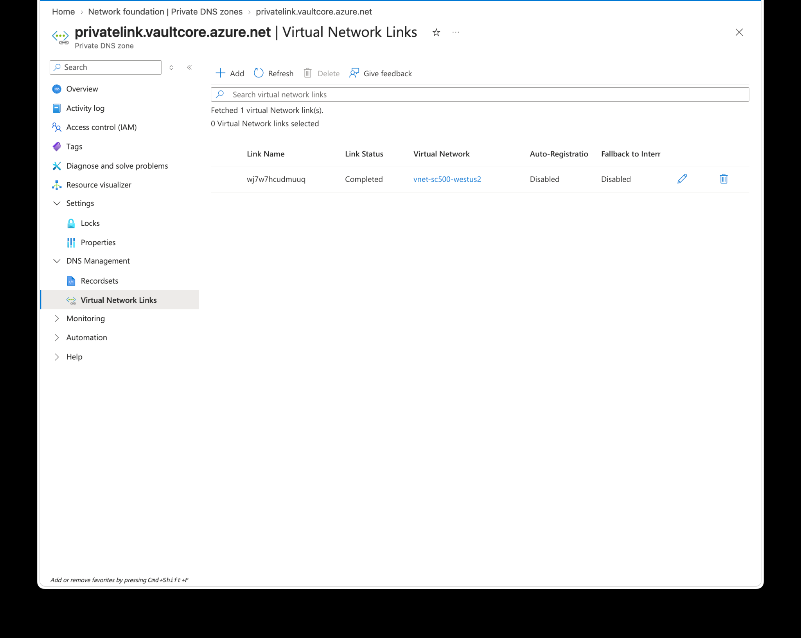

## 11. Validate TCP 443 Connectivity

Azure **Connection troubleshoot** was run from `vm-sc500-linux` to:

```text
kv-sc500-01.vault.azure.net
```

on:

```text
TCP 443
```

The result was:

```text
Reachable
```

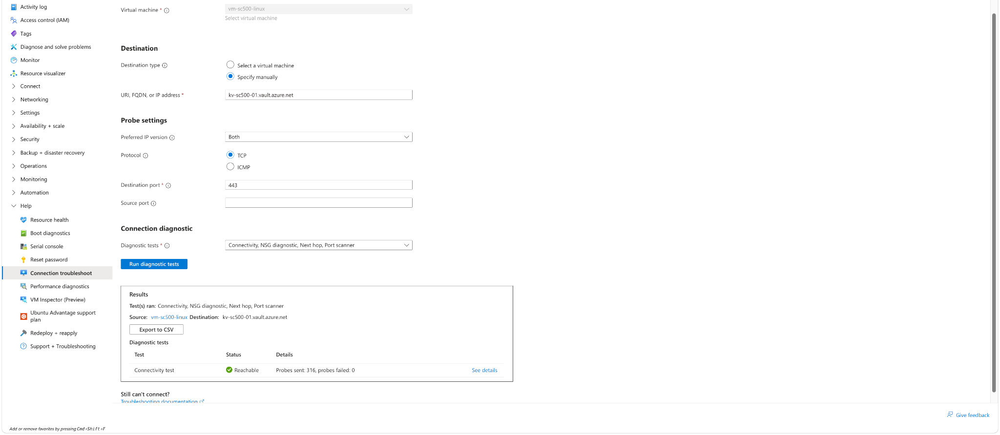

## 12. Disable Public Network Access

After the private path was confirmed, Key Vault networking was changed to:

```text
Disable public access
```

The portal confirmed that the Key Vault was successfully updated.

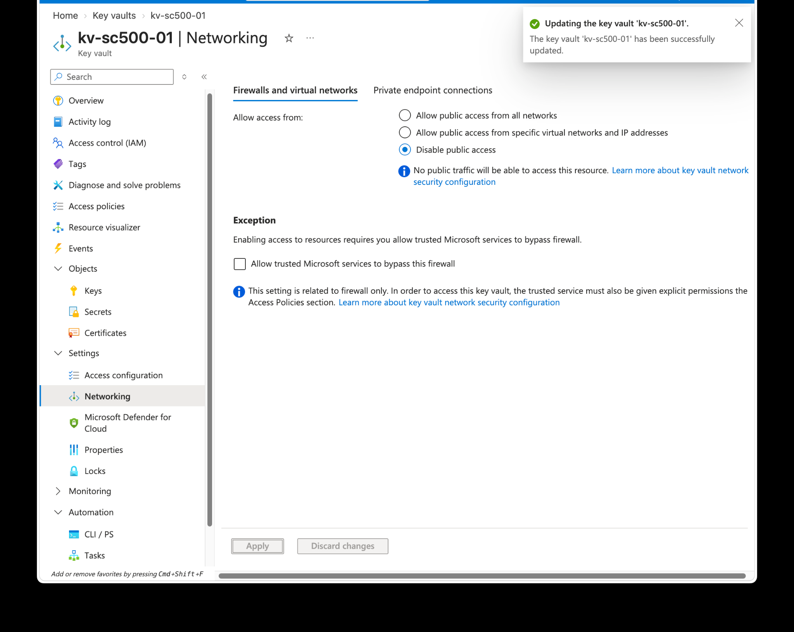

## 13. Re-Test Connectivity After Lockdown

The VM-to-Key-Vault connectivity test remained reachable after public network access was disabled.

This demonstrates that the private path continued to function after the public path was removed.

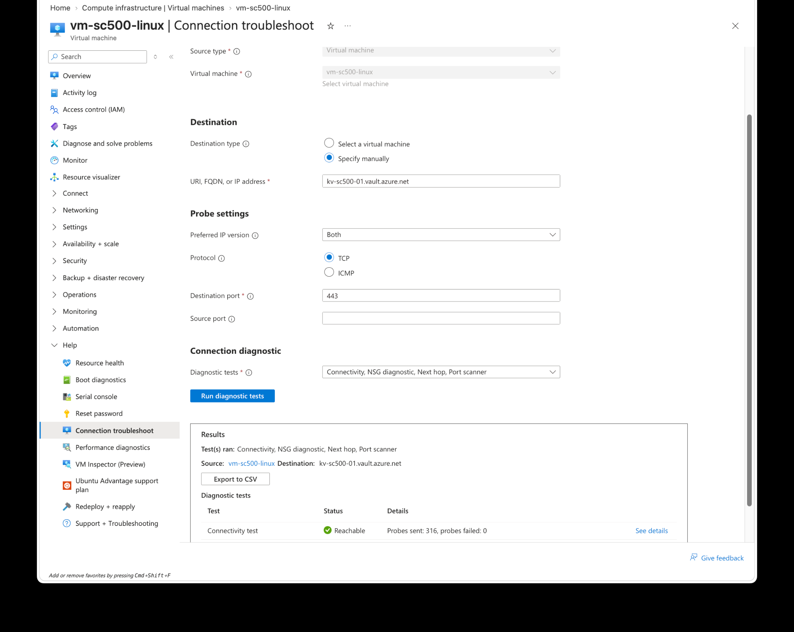

## 14. Negative Test from the Local Workstation

After disabling public access, attempting to browse Key Vault secrets from the local workstation was blocked.

The portal displayed the expected network restriction:

> Public network access is disabled and request is not from a trusted service nor via an approved private link.

This is an important negative test: the control is not only configured, it is visibly enforcing the intended restriction.

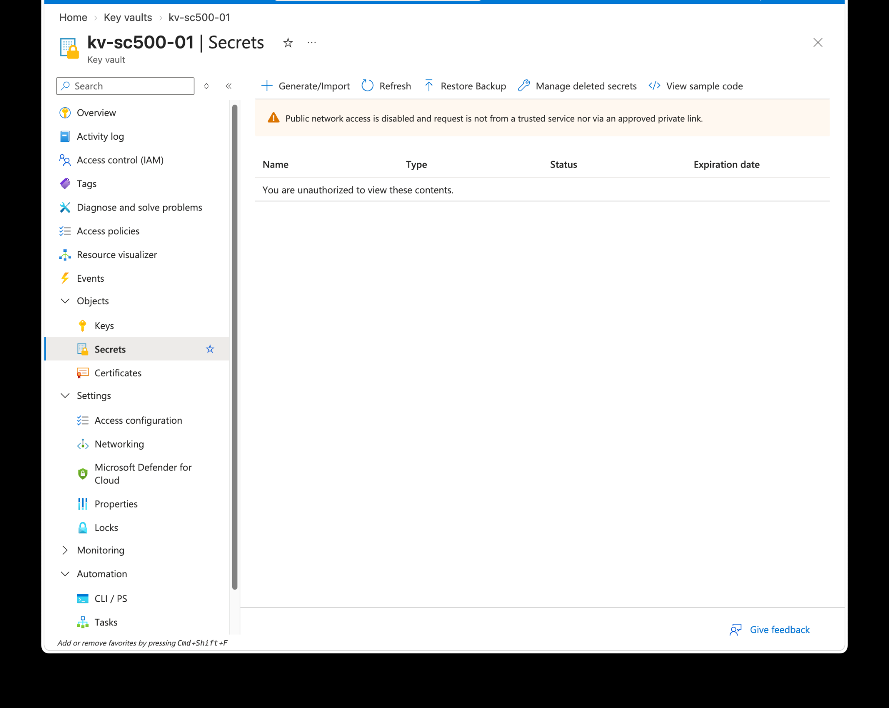

## 15. Validate DNS Resolution from the VM

Azure **Run command** was used on the Linux VM:

```bash
getent hosts kv-sc500-01.vault.azure.net
```

The result resolved the vault hostname through Private Link to:

```text
172.16.0.5
```

Example result:

```text
172.16.0.5  kv-sc500-01.privatelink.vaultcore.azure.net kv-sc500-01.vault.azure.net
```


## 16. Validate the HTTPS Connection Uses the Private IP

A second validation command was executed from the VM:

```bash
curl -sS -o /dev/null \
  -w "Connected IP: %{remote_ip}\nHTTP status: %{http_code}\n" \
  https://kv-sc500-01.vault.azure.net/
```

The result showed:

```text
Connected IP: 172.16.0.5
HTTP status: 404
```

The key result is:

```text
Connected IP: 172.16.0.5
```

This proves that the HTTPS connection was made to the Private Endpoint IP.

The `404` response is acceptable for this network validation because the request was sent to the Key Vault service root rather than to an authenticated Key Vault API operation. The purpose of the test was to validate DNS, routing, TLS reachability, and the actual destination IP.

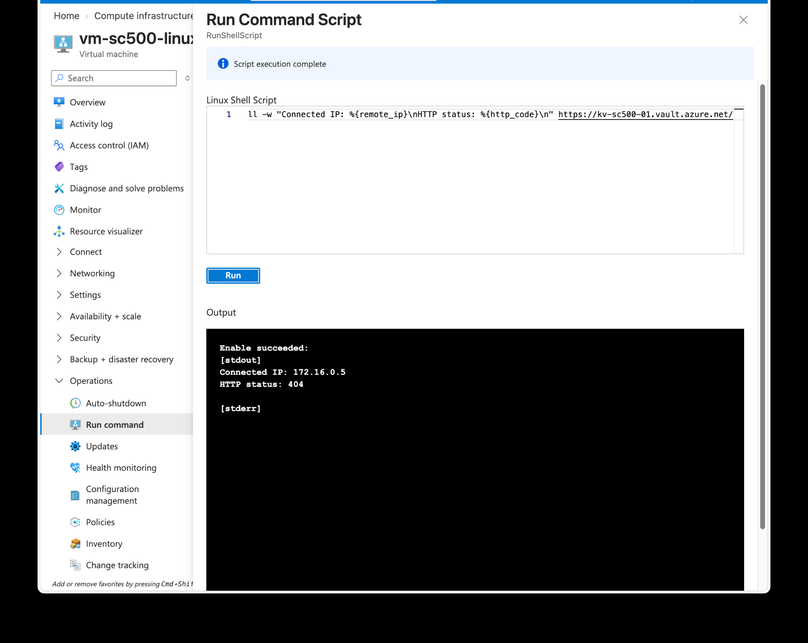

---

## Validation Summary

```text
Private Endpoint created
        ↓
Endpoint connection approved
        ↓
Private IP assigned: 172.16.0.5
        ↓
Private DNS A record created
        ↓
DNS zone linked to VNet
        ↓
VM reaches Key Vault on TCP 443
        ↓
Public Key Vault access disabled
        ↓
Public workstation access blocked
        ↓
VM hostname resolves to 172.16.0.5
        ↓
HTTPS connection uses 172.16.0.5
```

## Security Controls Demonstrated

### Preventive control

Public network access to the Key Vault was disabled.

### Network segmentation / isolation

Private Endpoint provides an internal VNet-based path to the Key Vault.

### DNS control

Private DNS directs the standard Key Vault hostname to the private endpoint.

### Positive control test

The VM successfully reached the Key Vault over TCP 443.

### Negative control test

The local public workstation was blocked after public access was disabled.

### Technical evidence

The VM resolved and connected to `172.16.0.5`, proving the traffic path used Private Link.

## GRC / Governance Relevance

This lab demonstrates a useful governance concept: a security setting should not be treated as effective merely because a configuration screen says it is enabled.

The control was tested from multiple angles:

1. **Configuration evidence** — Private Endpoint and Private DNS were created.
2. **Approval evidence** — the Private Endpoint connection was approved.
3. **Network evidence** — TCP 443 was reachable from the authorized VM.
4. **Negative evidence** — public workstation access was blocked.
5. **DNS evidence** — the service hostname resolved to the private address.
6. **Connection evidence** — the HTTPS session connected to the private endpoint IP.

This is the same logic used in real security assessments and control testing: define the expected security state, implement it, test it, and retain evidence.

## Skills Demonstrated

- Azure Key Vault
- Azure Private Link
- Private Endpoints
- Azure Private DNS
- Azure Virtual Networks
- Network isolation
- Public exposure reduction
- Azure Network Watcher
- Connectivity troubleshooting
- DNS validation
- HTTPS validation
- Security control testing
- Evidence collection
- Cloud governance
- Defense in depth

## Key Takeaways

- A Private Endpoint gives a supported Azure service a private IP inside a VNet.
- Private DNS allows applications to use the normal service hostname while routing to the private IP.
- Public access should be disabled only after the private path is confirmed.
- A green configuration screen is not sufficient evidence; the control should be tested.
- DNS validation and destination-IP validation provide stronger evidence than a basic connectivity test alone.
- Positive and negative testing together provide a clearer picture of whether the security control works as intended.

## Screenshot Index

| # | File | Evidence |
|---:|---|---|
| 1 | `01-private-endpoint-basics.png` | Private Endpoint creation basics |
| 2 | `02-private-endpoint-resource.png` | Key Vault target selection |
| 3 | `03-private-endpoint-vnet.png` | VNet and subnet selection |
| 4 | `04-private-dns-integration.png` | Private DNS integration |
| 5 | `05-private-endpoint-review.png` | Review and validation |
| 6 | `06-private-endpoint-deployment.png` | Successful deployment |
| 7 | `07-private-endpoint-overview.png` | Approved endpoint |
| 8 | `08-private-endpoint-nic.png` | Endpoint NIC and private IP |
| 9 | `09-private-dns-record.png` | Private DNS A record |
| 10 | `10-private-dns-vnet-link.png` | VNet link |
| 11 | `11-connectivity-test.png` | TCP 443 reachable |
| 12 | `12-public-access-disabled.png` | Public access disabled |
| 13 | `13-connectivity-after-lockdown.png` | Private path still reachable |
| 14 | `14-public-access-blocked.png` | Negative test from workstation |
| 15 | `15-private-dns-resolution.png` | DNS resolves to `172.16.0.5` |
| 16 | `16-private-https-validation.png` | HTTPS connects to `172.16.0.5` |

## Repository Safety

The screenshots in this folder were prepared for repository use by removing the browser/account header and redacting the Azure subscription ID where it was visible in the page body.

No production credentials or real production secrets are included in this lab.

---

Completed as part of hands-on Microsoft cloud security / SC-500 training.
