# Microsoft Entra Agent Identity and Risk-Based Conditional Access

> **Portfolio note:** This is a standalone project/module. Its numbering is canonical and is not part of the historical Lab 1–29 sequence.
## Overview

This lab demonstrates identity governance and Conditional Access controls for AI agent identities in Microsoft Entra.

An **agent identity blueprint** was created with defined ownership and sponsorship. The resulting agent identity was reviewed for access, roles, and audit activity. Agent 365 was then enabled for the lab tenant so Conditional Access could target agent identities directly.

A risk-based Conditional Access policy was created to evaluate **all agent identities**, across **all resources**, and **block access when Agent risk is High**. The policy was deliberately deployed in **Report-only** mode so the control could be validated safely before enforcement.

This lab was completed through the Microsoft Entra and Microsoft 365 admin portals using a GUI-first workflow.

## Security Objective

Build a governed identity and access-control path for AI agents.

The lab verifies that:

- an agent identity blueprint can be created and activated;
- ownership and sponsorship are explicitly assigned;
- the blueprint produces an agent identity;
- the agent identity begins without Entra role assignments;
- identity creation and governance actions are recorded in audit logs;
- Agent 365 licensing exposes Conditional Access targeting for agents;
- Conditional Access can target all agent identities separately from users;
- Agent risk can be used as a policy condition;
- high-risk agents can be configured for access blocking;
- the policy can be staged safely in Report-only mode;
- policy impact can be monitored without fabricating risky activity.

## Environment

- Microsoft Entra ID
- Microsoft Entra Agent identities
- Agent identity blueprints
- Microsoft Agent 365
- Microsoft Entra Conditional Access
- Agent risk (Preview)
- Entra audit logs
- Identity governance concepts
- Microsoft 365 admin center

## Lab Objects

| Object | Value |
|---|---|
| Agent blueprint | `SC500-Security-Agent-Blueprint` |
| Agent identity | Created from the blueprint |
| Owner | Lab administrator |
| Sponsor | Lab administrator |
| Conditional Access policy | `SC500-Agent-High-Risk-Block` |
| Agent scope | All agent identities |
| Resource scope | All resources |
| Risk condition | High |
| Grant control | Block access |
| Policy state | Report-only |

## Control Flow

```text
Agent Identity Blueprint
        |
        | owner + sponsor
        v
Entra Agent Identity
        |
        | audit + access review
        v
Conditional Access
        |
        | All agent identities
        | All resources
        | Agent risk = High
        v
Block access
        |
        v
Report-only evaluation
        |
        v
Policy impact / monitoring
```

---

## 1. Review the Agent Blueprint Configuration

The blueprint was prepared with the lab owner and sponsor assigned before creation.

The purpose of the blueprint is to provide a governed parent object for agent identities rather than treating agents as unmanaged application identities.

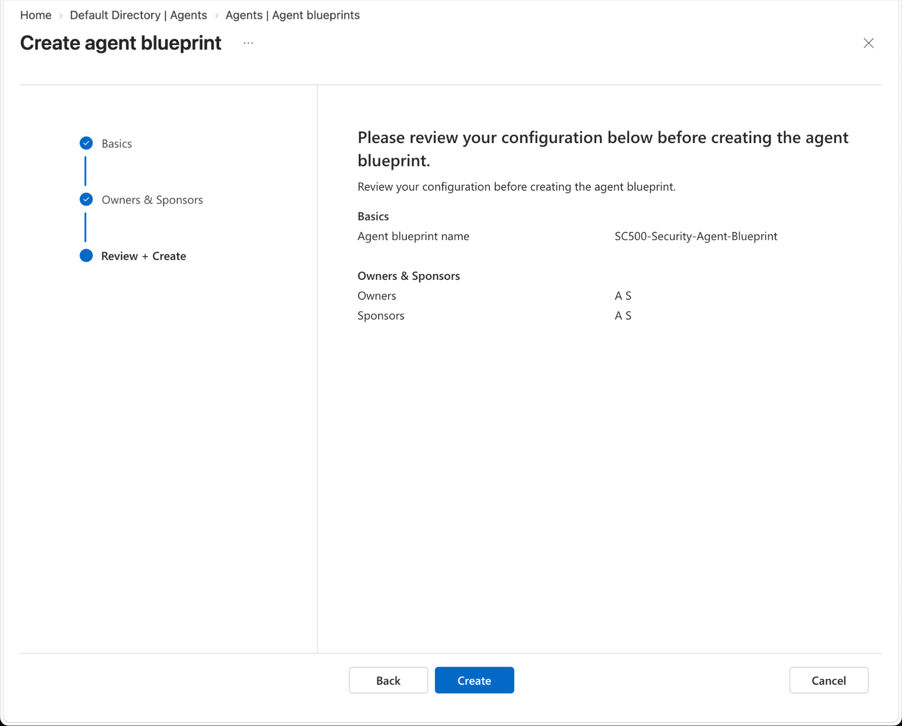

## 2. Create the Agent Blueprint

The portal confirmed creation of:

- the agent identity blueprint; and
- the agent blueprint principal.

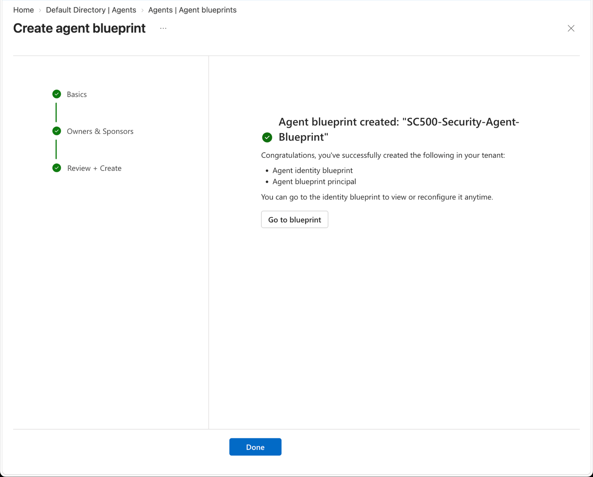

## 3. Verify the Active Blueprint

The blueprint overview showed:

- Status: `Active`
- Agent identities: `1`
- Owners: `1`
- Sponsors: `1`

Tenant-specific object identifiers are redacted in the repository screenshot.

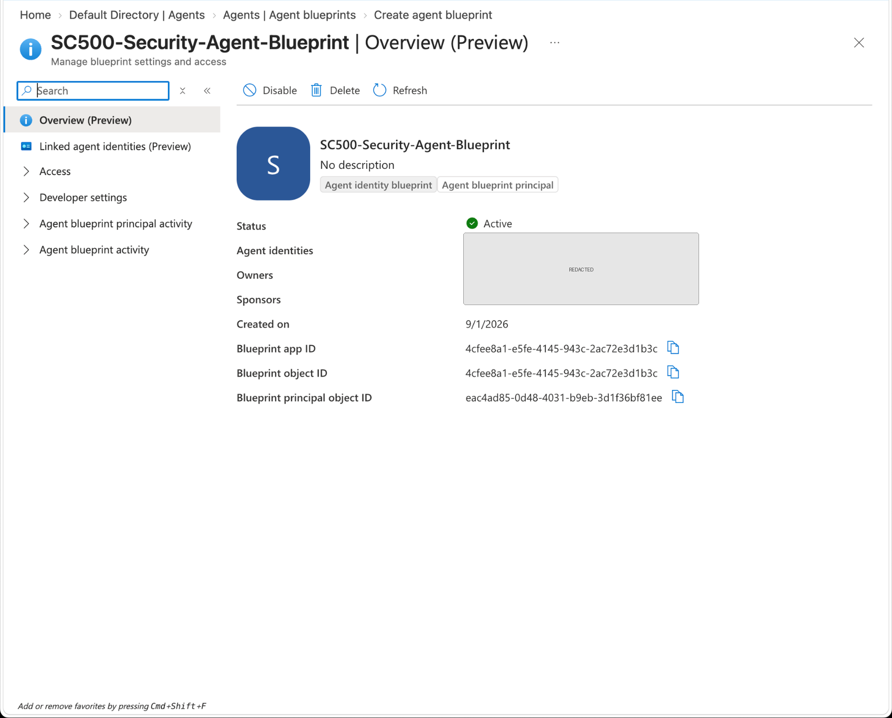

## 4. Review the Agent Identity

The linked agent identity was active and associated with the blueprint.

The access summary showed zero granted permissions and zero Entra roles at the time of validation.

This provides a useful least-privilege starting point before any application permissions or directory roles are intentionally granted.

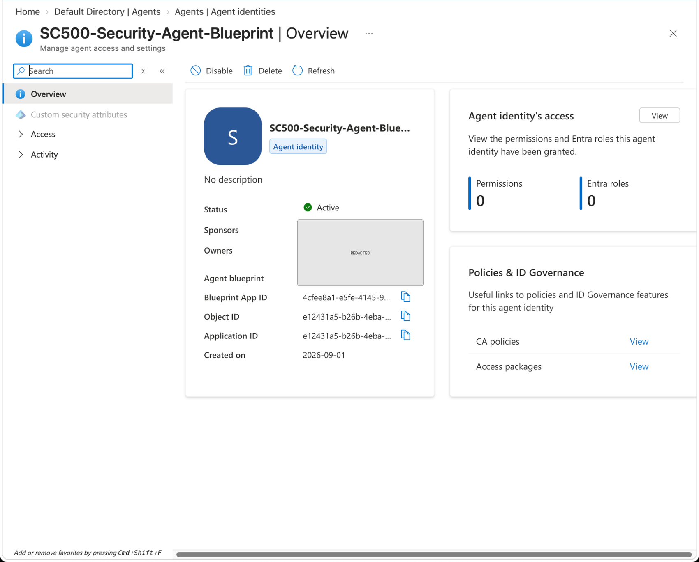

## 5. Verify Ownership and Sponsorship

The agent identity had both:

- a full owner; and
- a sponsor.

The email address is redacted in the public repository screenshot.

Ownership provides operational responsibility, while sponsorship provides lifecycle accountability and a contact point for governance reviews.

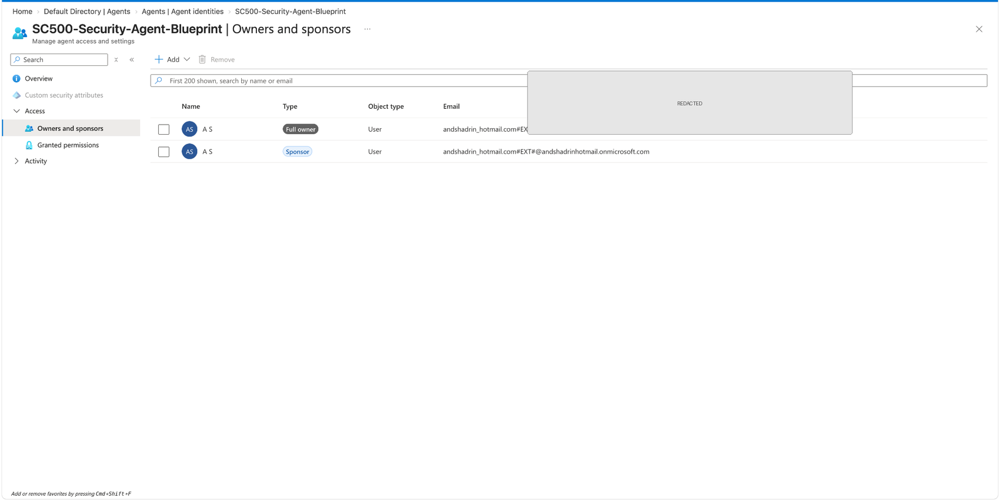

## 6. Verify No Entra Roles Were Assigned

The agent identity showed:

```text
No Entra roles assigned to the agent
```

This is important evidence for least privilege. The agent identity was created without immediately granting directory-wide administrative access.

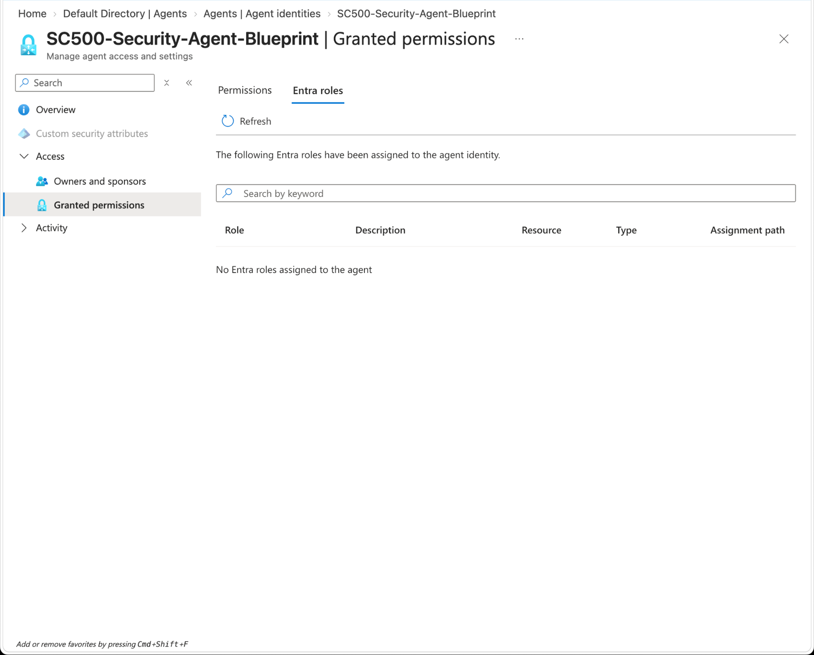

## 7. Review Agent Audit Activity

Audit logs recorded the identity-governance actions associated with creation, including:

- service principal creation;
- owner assignment; and
- sponsor assignment.

This demonstrates that the agent lifecycle is auditable.

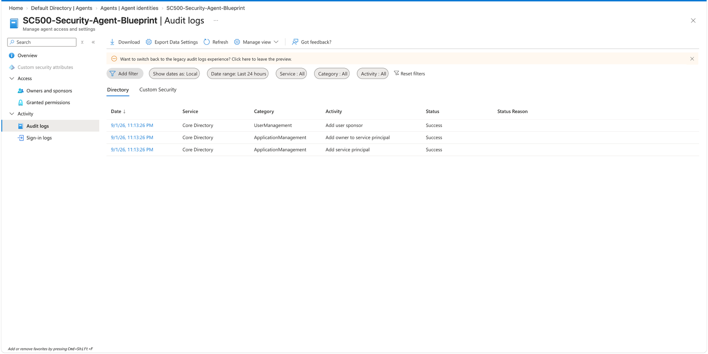

## 8. Enable Agent 365 for Conditional Access for Agents

Agent 365 was enabled in the lab tenant and one trial license was assigned to the lab administrator.

The repository screenshot confirms:

```text
1 / 25 assigned
```

The lab administrator email is redacted.

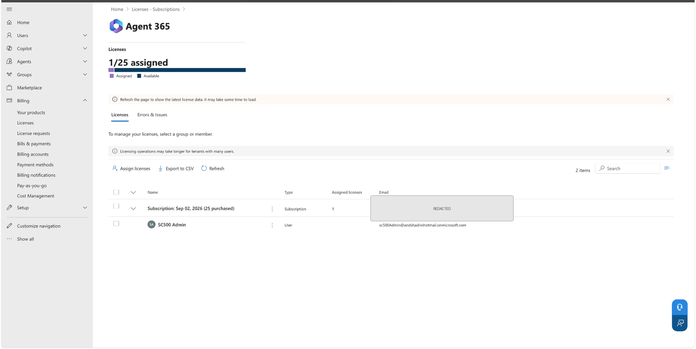

## 9. Target Agent Identities in Conditional Access

After Agent 365 provisioning, Conditional Access exposed **Agents** as a distinct policy target.

The policy was configured as:

```text
SC500-Agent-High-Risk-Block
```

with:

```text
Include: All agent identities
```

This is materially different from a traditional user Conditional Access policy: the control is applied to agent identities acting with their own identity.

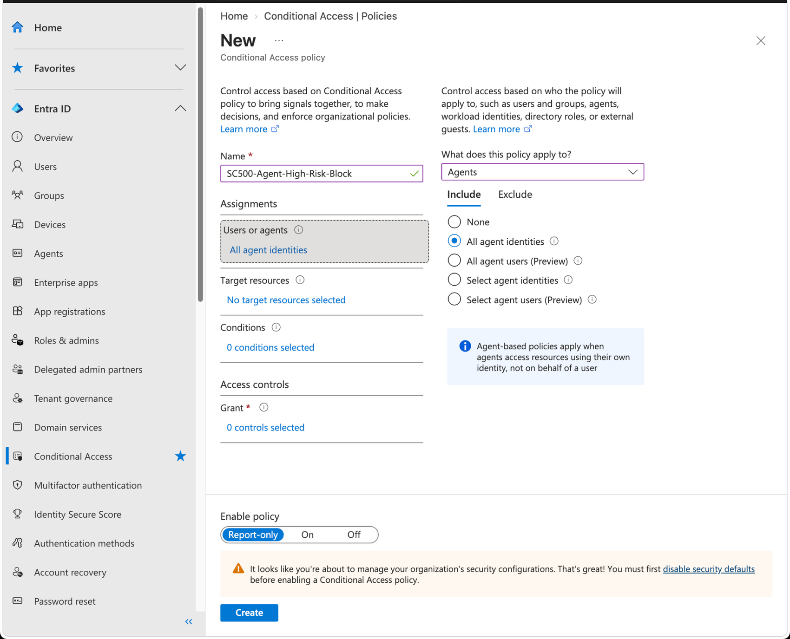

## 10. Configure High Agent Risk and Block Access

The final policy configuration was:

```text
Users or agents: All agent identities
Target resources: All resources
Agent risk: High
Grant: Block access
State: Report-only
```

Only the **High** Agent risk level was selected. Medium and Low were intentionally left unselected.

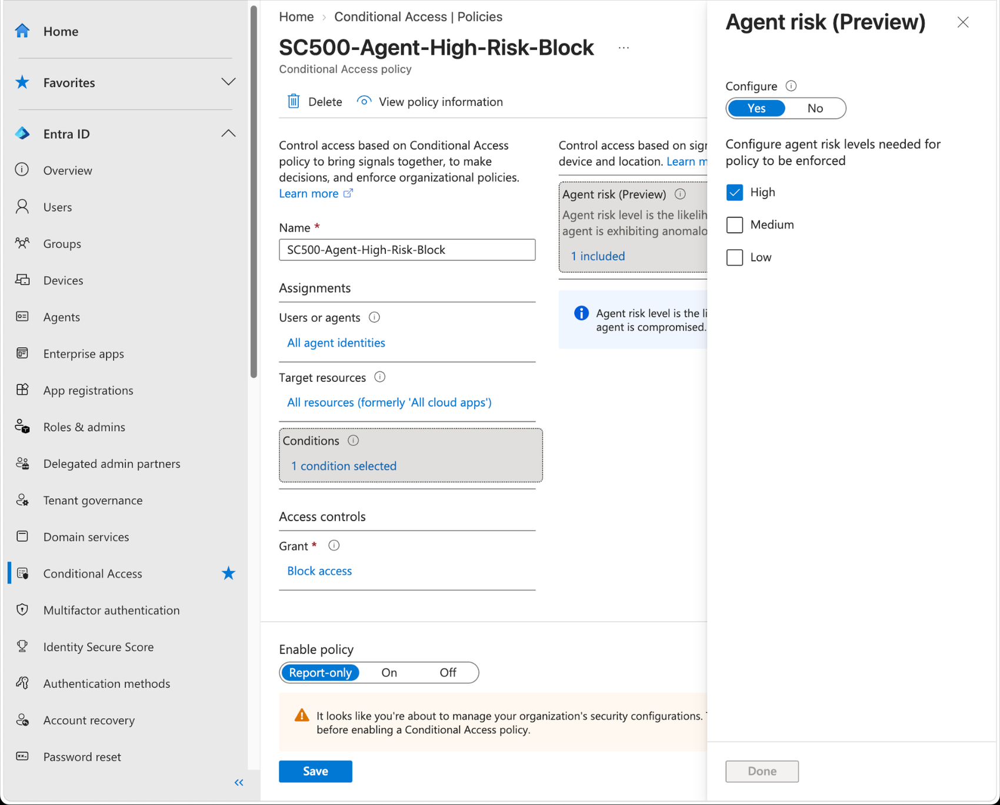

## 11. Confirm the Policy Exists in Report-Only Mode

The Conditional Access policy list showed:

```text
SC500-Agent-High-Risk-Block
```

with state:

```text
Report-only
```

Report-only is appropriate for a lab and for staged production rollout because it evaluates the policy without enforcing the block.

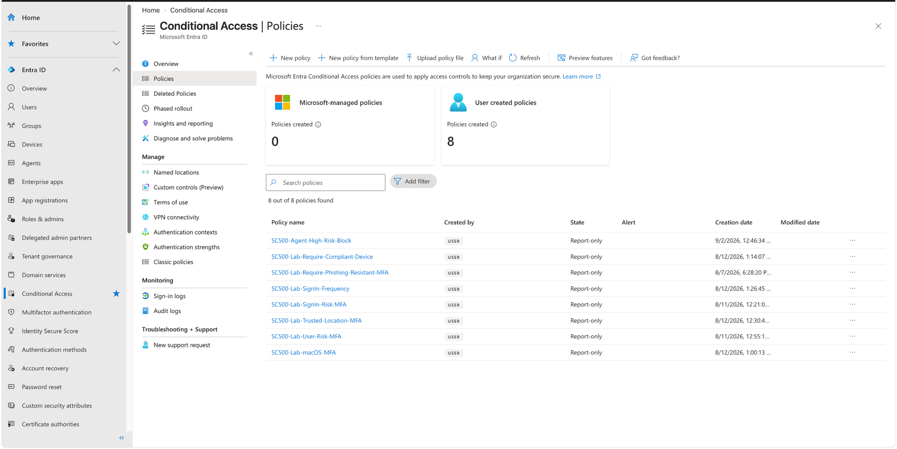

## 12. Verify the Policy Summary

The policy details page confirmed:

- State: Report-only
- Users, agents or workload identities: All agent identities
- Included resources: All resources
- Requirements for access: Block access
- Excluded identities: none

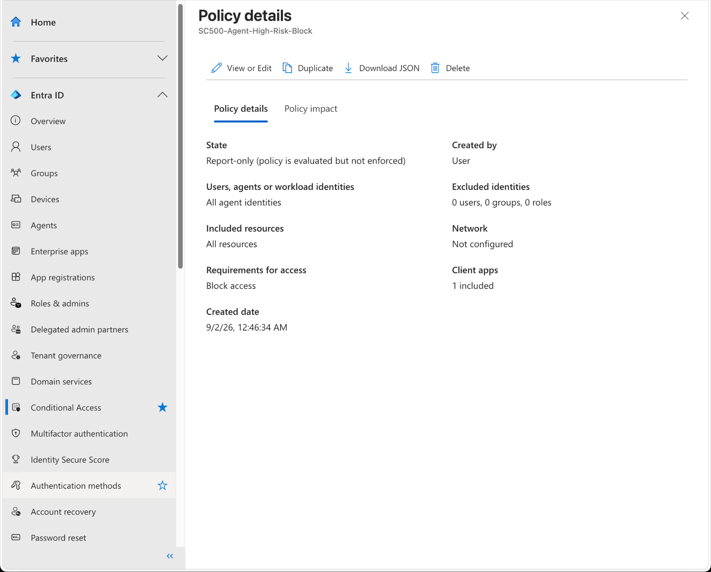

## 13. Review Policy Impact

The policy impact page displayed no sign-in activity at validation time.

This is an expected and valid result. The lab did **not** generate or fabricate a high-risk agent sign-in merely to populate the chart.

The absence of data therefore means:

- the policy was newly created;
- no matching high-risk agent activity had occurred in the available reporting window; and
- the control remained safely staged in Report-only mode.

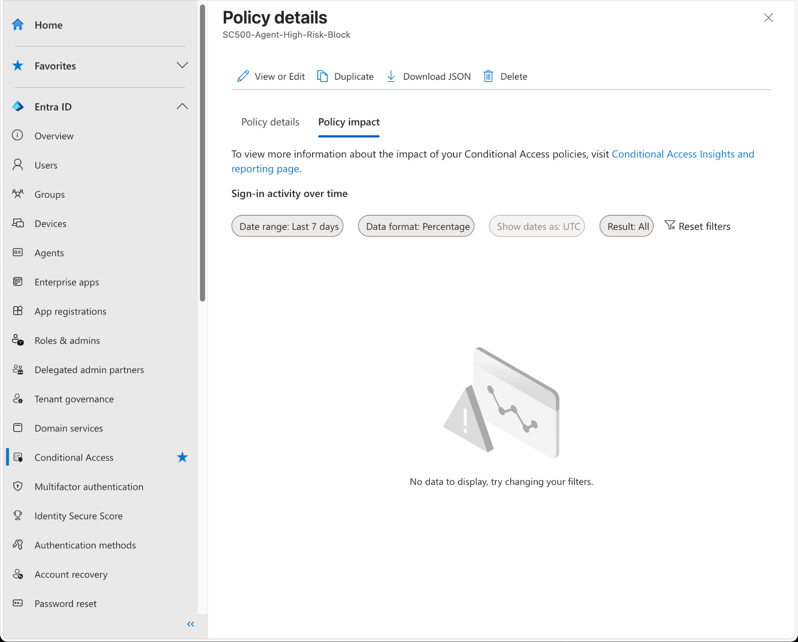

---

## Validation Summary

```text
Agent blueprint created
        ↓
Owner and sponsor assigned
        ↓
Agent identity created and active
        ↓
No Entra roles assigned
        ↓
Creation/governance activity audited
        ↓
Agent 365 enabled
        ↓
Conditional Access can target Agents
        ↓
All agent identities selected
        ↓
All resources selected
        ↓
Agent risk = High
        ↓
Block access
        ↓
Report-only evaluation
        ↓
Policy impact reviewed
```

## Security Controls Demonstrated

### Identity lifecycle governance

The agent is represented by a governed identity with a blueprint, owner, and sponsor.

### Least privilege

The agent identity was validated with no Entra role assignments at creation time.

### Auditability

Creation and governance events were visible in Entra audit logs.

### Risk-based access control

Conditional Access uses **Agent risk = High** as a signal rather than relying only on static identity membership.

### Preventive control

The configured grant control is **Block access** for matching high-risk agent activity.

### Safe policy rollout

The policy is in **Report-only** mode, allowing evaluation before enforcement.

### Evidence-based validation

Configuration, identity state, access state, audit records, policy settings, and policy impact were all retained as evidence.

## GRC / Governance Relevance

AI agents create a governance problem that is similar to—but not identical to—traditional service principals and workload identities.

A defensible control model should answer:

1. **Who owns the agent?**
2. **Who sponsors or approves its lifecycle?**
3. **What access has it been granted?**
4. **Does it hold privileged directory roles?**
5. **Can its activity be audited?**
6. **Can access be restricted dynamically when the agent becomes risky?**
7. **Was the control tested before enforcement?**

This lab addresses each of those questions.

The result is a compact example of how identity governance, least privilege, audit evidence, risk signals, and staged enforcement can be combined into a single control story.

## Skills Demonstrated

- Microsoft Entra ID
- Agent identities
- Agent identity blueprints
- Microsoft Agent 365
- Conditional Access
- Risk-based access control
- Agent risk
- Identity governance
- Ownership and sponsorship
- Least privilege
- Entra audit logs
- Report-only policy rollout
- Security control testing
- Evidence collection
- AI identity governance
- GRC control validation

## Key Takeaways

- AI agents should have explicit identity ownership and lifecycle accountability.
- Agent identities should not receive privileged roles by default.
- Audit evidence is part of the security control, not an afterthought.
- Conditional Access can apply controls specifically to agents rather than only to human users.
- Risk-based blocking is stronger than relying only on static allow/deny assignments.
- Report-only mode is useful for validating policy impact before enforcement.
- A lack of matching policy-impact data is not a failed test when no qualifying risky activity occurred.
- Good control evidence documents both what was configured and what was actually observed.

## Screenshot Index

| # | File | Evidence |
|---:|---|---|
| 1 | `01-agent-blueprint-review.png` | Blueprint name, owner, and sponsor before creation |
| 2 | `02-agent-blueprint-created.png` | Successful blueprint creation |
| 3 | `03-agent-blueprint-overview.png` | Active blueprint with one identity, owner, and sponsor |
| 4 | `04-agent-identity-overview.png` | Active agent identity and access summary |
| 5 | `05-owners-and-sponsors.png` | Explicit ownership and sponsorship |
| 6 | `06-no-entra-roles.png` | Least-privilege role validation |
| 7 | `07-agent-audit-logs.png` | Auditable creation and governance events |
| 8 | `08-agent365-license-assigned.png` | Agent 365 prerequisite enabled |
| 9 | `09-ca-agent-targeting.png` | Conditional Access targeting all agent identities |
| 10 | `10-agent-risk-high.png` | High-risk condition, block control, Report-only |
| 11 | `11-ca-policy-list.png` | Policy exists in Report-only state |
| 12 | `12-ca-policy-details.png` | Policy scope and block requirement |
| 13 | `13-policy-impact-no-data.png` | Policy-impact validation with no matching activity |

## Repository Safety

The screenshots in this folder were prepared for repository use by:

- removing browser/account headers where practical;
- redacting personal email addresses;
- redacting tenant-specific application/object identifiers where visible; and
- excluding payment and billing-method screenshots.

No production credentials, secrets, payment details, or real production data are included.

---

Completed as part of hands-on Microsoft cloud security / SC-500 training.
