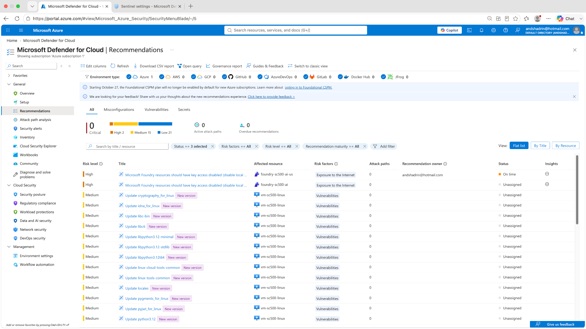
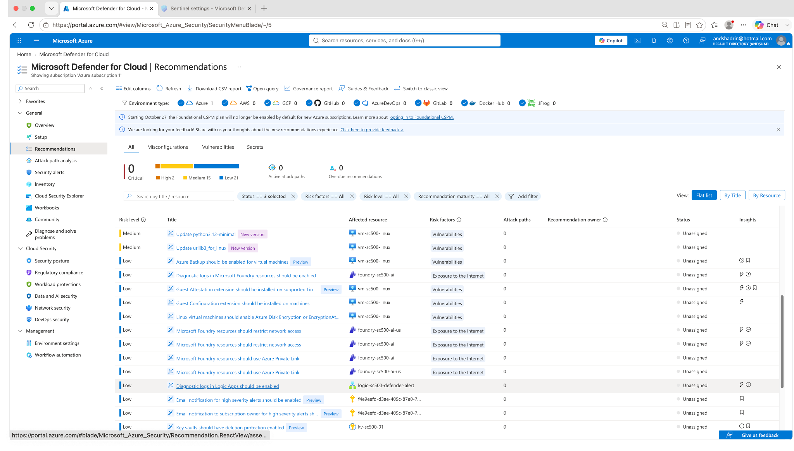
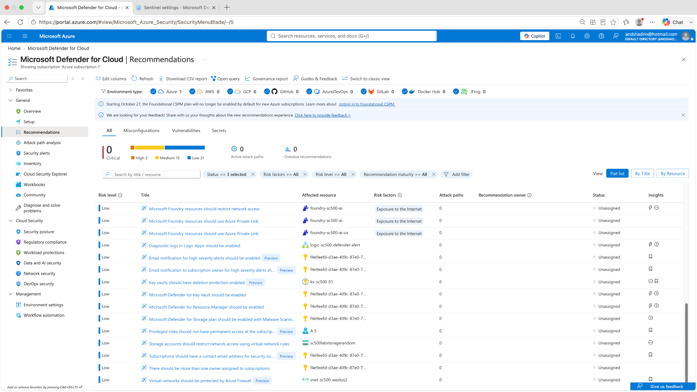

# Lab 11 — Defender for Cloud Security Posture & Recommendations

## Objective

Use **Microsoft Defender for Cloud** to review security posture findings across a mixed Azure lab environment, identify the risks behind the recommendations, and document a prioritized remediation approach.

This lab focuses on the **governance/CSPM workflow** rather than blindly applying every recommendation: identify risk, determine the relevant control, collect evidence, choose remediation, and verify the result.

## Environment

The reviewed environment included resources such as:

- `vm-sc500-linux`
- Microsoft Foundry / AI resources
- Azure Storage
- Azure Key Vault
- Azure Logic Apps
- Azure networking resources

## Risk → Control → Evidence → Remediation

| Risk | Control / security objective | Evidence collected | Remediation approach |
|---|---|---|---|
| Vulnerable Linux packages | Vulnerability management and patch hygiene | Defender recommendations for `vm-sc500-linux` | Patch affected packages, then re-evaluate findings |
| AI resources exposed through weaker access patterns | Reduce public exposure and remove unnecessary local/key authentication | Foundry recommendations and exposure risk factors | Prefer identity-based access, private connectivity, and least privilege |
| Missing or incomplete diagnostic logging | Preserve monitoring and audit evidence | Defender recommendation for diagnostic logging | Enable diagnostic logs and route to an approved Log Analytics workspace |
| Storage/network exposure | Limit unnecessary network reachability | Storage/network recommendations | Restrict public/network access and use private/network controls where appropriate |
| Missing workload protection features | Improve preventive/detective coverage | Defender plan recommendations | Enable the relevant Defender workload plan when justified by risk and cost |

## What I did

1. Opened **Microsoft Defender for Cloud → Recommendations**.
2. Reviewed recommendations across the Azure subscription rather than only a single resource.
3. Examined risk level, affected resource, risk factors, and recommendation status.
4. Identified repeated vulnerability findings affecting `vm-sc500-linux`.
5. Reviewed Foundry/AI security findings related to key-based access and internet exposure.
6. Reviewed broader recommendations affecting Logic Apps, Key Vault, storage, Defender plans, privileged access, and networking.
7. Converted the findings into a remediation backlog rather than treating every recommendation as equal priority.

## Validation evidence

### 1. VM and AI workload recommendations

The recommendation list shows:

- multiple Linux package update findings for `vm-sc500-linux`
- Microsoft Foundry findings related to access configuration
- risk-factor context such as **Vulnerabilities** and **Exposure to the Internet**

### 2. Cross-resource posture findings

This view demonstrates that posture management is subscription-wide and includes multiple resource types, not just virtual machines.

### 3. Storage, Key Vault, Logic App, and networking findings

Examples visible in the environment include recommendations for:

- Logic App diagnostic logging
- Key Vault protection
- Defender plans
- privileged access
- storage network restrictions
- Azure Firewall / network controls

## Governance interpretation

A recommendation is not automatically a change request. In a real environment, I would document:

- business/service owner
- affected asset
- severity and exploitability
- exposure path
- compensating controls
- remediation owner and due date
- exception/acceptance rationale if remediation is deferred
- evidence proving closure

This turns Defender for Cloud from a list of findings into a practical **GRC-aligned remediation workflow**.

## Troubleshooting / observations

- Defender recommendations may not appear immediately after a resource or Defender plan is created. Discovery and posture evaluation can be eventually consistent.
- A large number of package recommendations on a Linux VM does not necessarily mean the VM is compromised; it means patch/vulnerability debt is visible and should be prioritized.
- Recommendation severity alone is not enough. Exposure, resource criticality, attack path, and compensating controls also matter.

## Security lessons

- CSPM is most useful when recommendations are tied to ownership and remediation evidence.
- Vulnerability management is an ongoing process, not a one-time configuration task.
- Identity-based access and restricted network exposure reduce the attack surface for cloud and AI services.
- Security posture findings are valuable audit evidence when they are preserved together with remediation and validation records.
