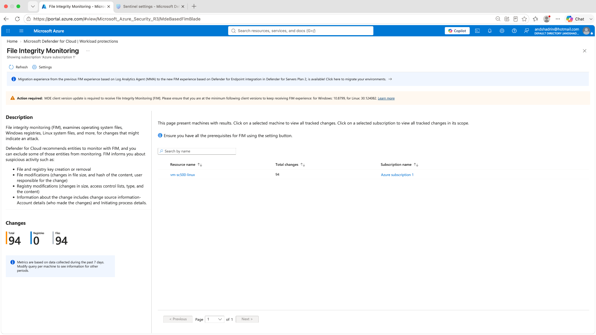
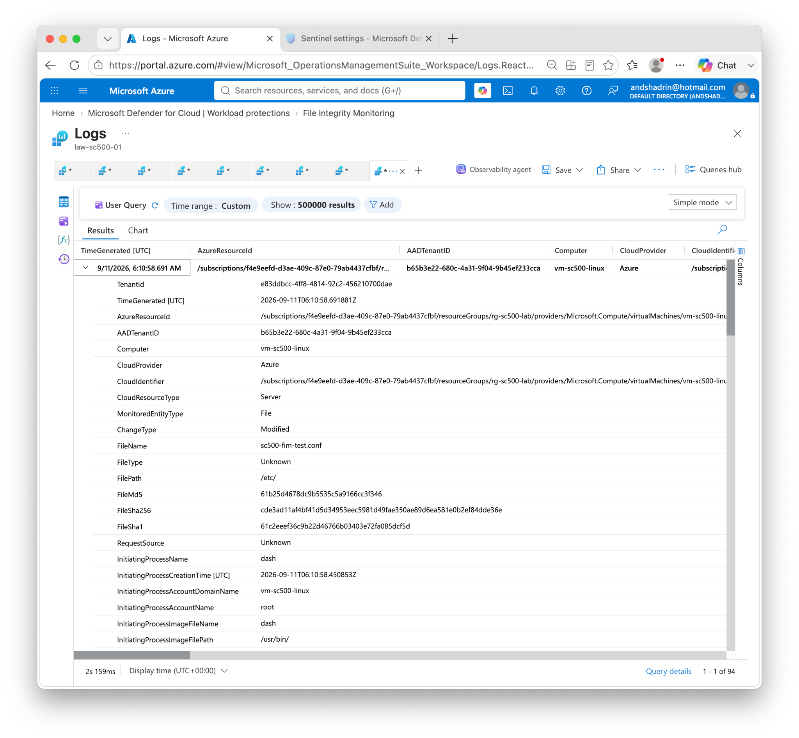
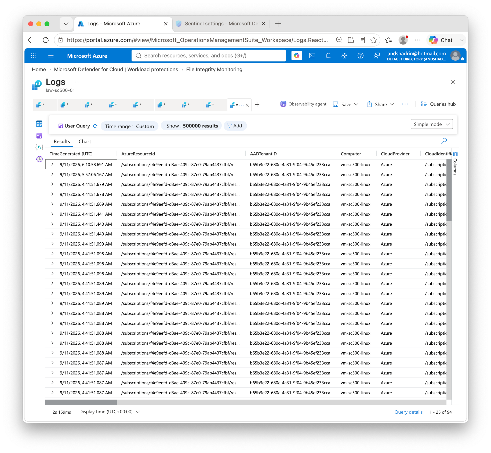

# Lab 12 — File Integrity Monitoring with Defender for Cloud

## Objective

Validate **File Integrity Monitoring (FIM)** on an Azure Linux VM and confirm that a controlled modification to a monitored file produces traceable security evidence.

The lab demonstrates the chain from a host-level file change to centralized evidence containing the affected file, change type, process, account, and cryptographic hashes.

## Environment

- VM: `vm-sc500-linux`
- Defender for Cloud File Integrity Monitoring
- Log Analytics workspace: `law-sc500-01`
- Test file: `sc500-fim-test.conf`
- Test path: `/etc/`

## Risk → Control → Evidence → Remediation

| Risk | Control | Evidence | Remediation / response |
|---|---|---|---|
| Unauthorized change to a security-sensitive file | File Integrity Monitoring | FIM event showing file, path and change type | Validate change authorization; restore approved configuration if unauthorized |
| Malicious persistence/configuration tampering | Change attribution and host telemetry | initiating process and account fields | Investigate process/user context and related host activity |
| Loss of forensic integrity | Hash-based evidence | SHA/MD5/SHA1 values recorded by FIM | Compare against approved baseline or known-good artifact |

## What I did

1. Enabled/validated File Integrity Monitoring for the Linux VM.
2. Used a controlled test file under `/etc/` to generate a detectable modification.
3. Opened **Defender for Cloud → Workload protections → File Integrity Monitoring**.
4. Confirmed the monitored VM was reporting changes.
5. Opened the related Log Analytics data and inspected the detailed FIM event.
6. Verified file name, file path, change type, initiating process, initiating account, and hashes.

## Validation evidence

### 1. FIM dashboard

The dashboard shows `vm-sc500-linux` with **94 total changes**, all represented as file changes in the captured view.

### 2. Detailed controlled test event

The detailed event provides strong evidence for the controlled test:

- **Computer:** `vm-sc500-linux`
- **Monitored entity type:** File
- **Change type:** Modified
- **File name:** `sc500-fim-test.conf`
- **File path:** `/etc/`
- **Initiating process:** `dash`
- **Initiating account:** `root`
- file hash values captured for integrity comparison

### 3. Multiple collected FIM events

The result list confirms that FIM is continuously collecting file-change events rather than recording only the single test artifact.

## Detection / investigation workflow

A production investigation would ask:

1. Was the file change expected and approved?
2. Who or what process initiated it?
3. Did the same host show other suspicious changes around the same time?
4. Do file hashes match a known-good baseline?
5. Should the change be reverted, contained, or escalated?

## Troubleshooting / observations

- FIM data can take time to appear after enrollment or a file modification.
- Many normal OS/package operations can generate legitimate file changes; context is essential before treating a change as malicious.
- Filtering on the test file or path is useful when validating that the pipeline is functioning.

## Security lessons

- FIM provides **detective evidence** for integrity violations and configuration tampering.
- Process/account attribution makes the evidence more useful than a simple “file changed” alert.
- FIM evidence supports both security operations and compliance controls requiring monitoring of critical system changes.
