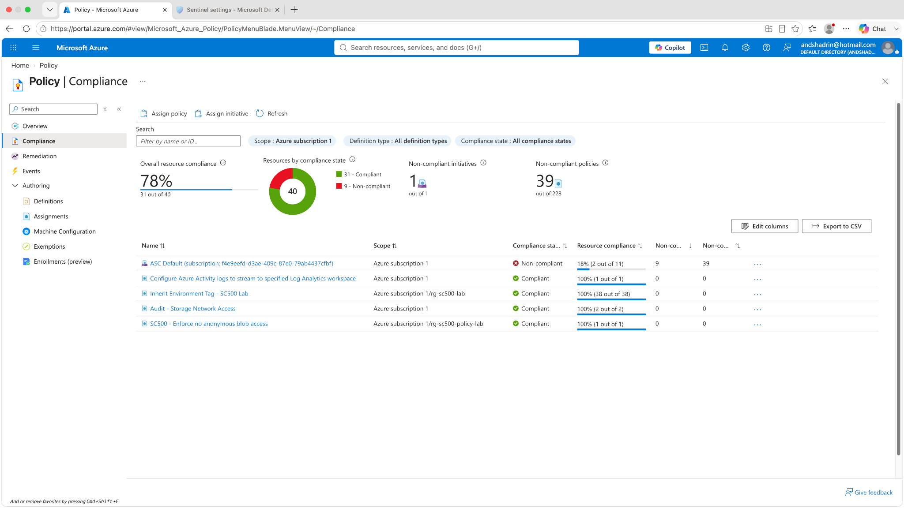
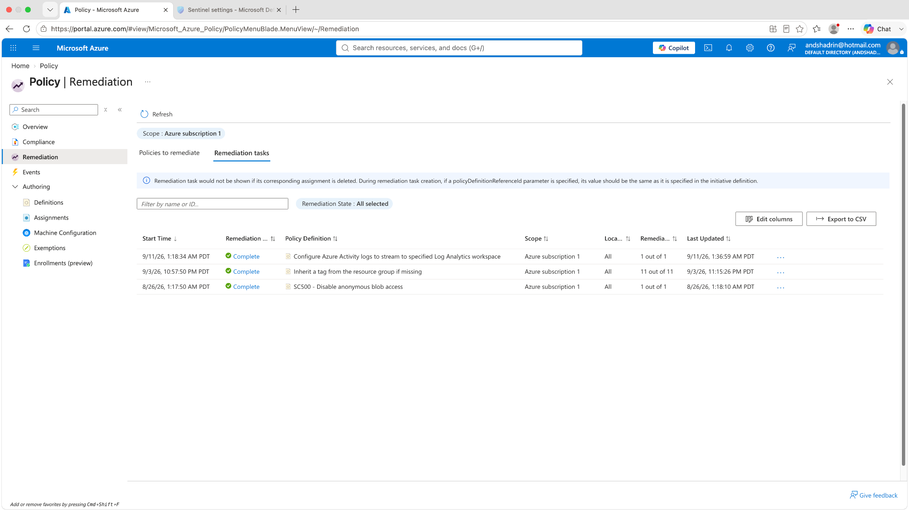
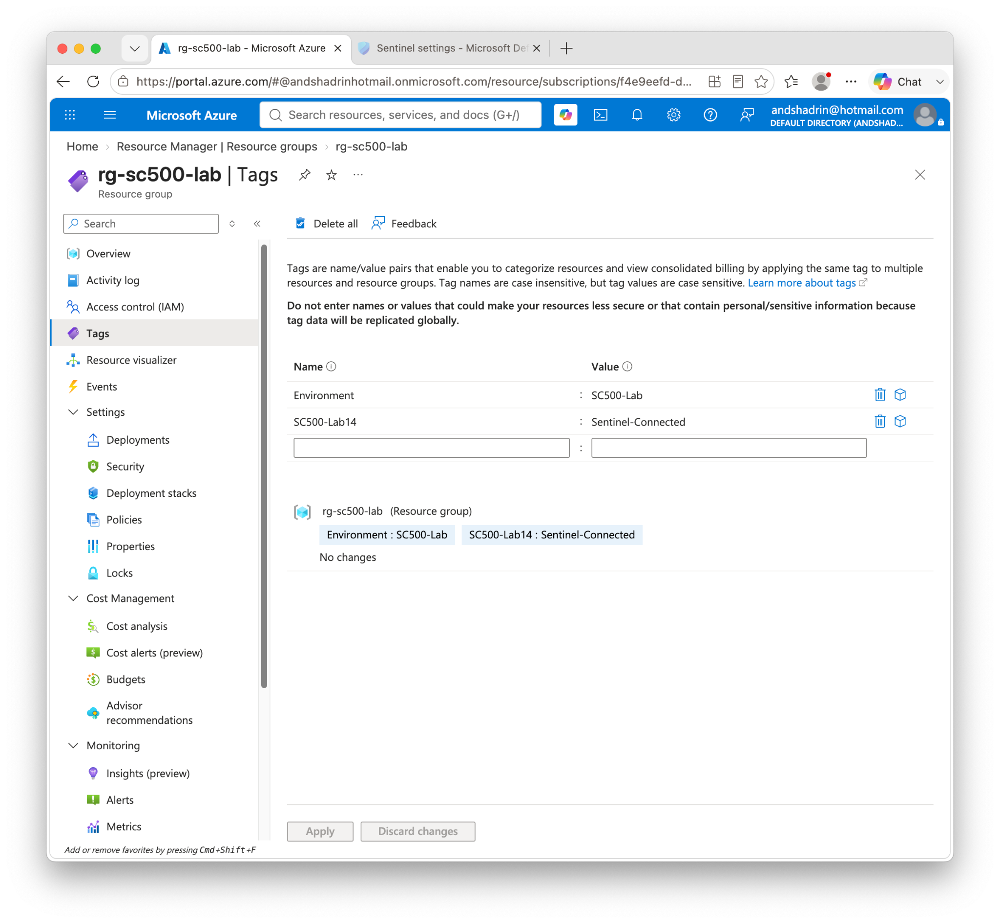
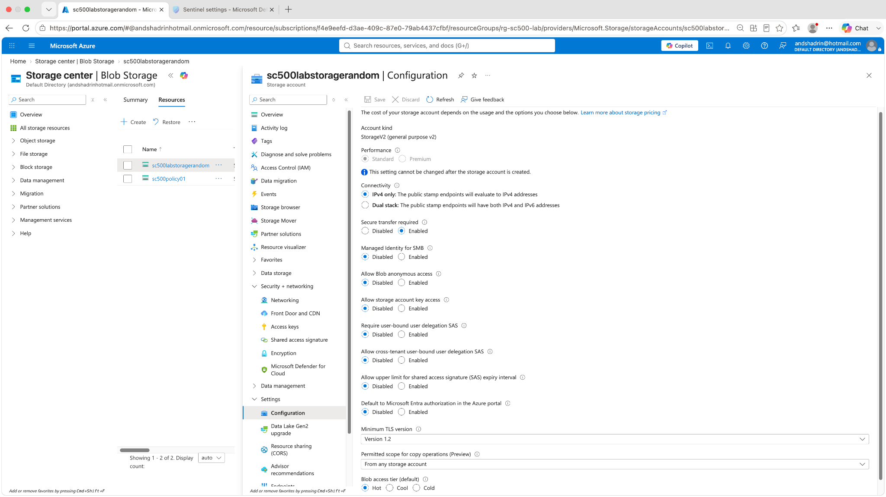

# Lab 13 — Azure Policy Governance, Compliance & Remediation

## Objective

Use **Azure Policy** to implement preventive, detective, and corrective governance controls and produce evidence showing policy compliance and successful remediation.

This lab is structured around a GRC-style workflow: **risk → control → evidence → remediation → re-validation**.

## Controls validated

The captured environment shows the following custom governance controls in a compliant state:

- **Configure Azure Activity logs to stream to specified Log Analytics workspace** — 100% compliant
- **Inherit Environment Tag - SC500 Lab** — 100% compliant
- **Audit - Storage Network Access** — 100% compliant
- **SC500 - Enforce no anonymous blob access** — 100% compliant

The portal also showed an overall subscription compliance score of **78%** because broader built-in/ASC policy content still had unrelated non-compliant findings. That distinction is useful: the lab controls can be fully compliant while the subscription as a whole still contains other findings.

## Risk → Control → Evidence → Remediation

| Risk | Azure Policy control | Evidence | Remediation |
|---|---|---|---|
| Missing centralized Azure Activity logs | Deploy/configure diagnostic settings to approved Log Analytics workspace | Policy shows 100% compliant; remediation task complete | Deploy missing diagnostic setting automatically |
| Inconsistent resource tagging | Inherit required `Environment` tag | Policy shows 100% compliance | Modify/inherit tag through policy remediation |
| Storage exposed through unsafe network configuration | Audit storage network access | Audit policy compliance | Review and restrict unsafe storage network paths |
| Anonymous/public blob access | Enforce no anonymous blob access | Policy compliant plus storage configuration evidence | Deny/modify unsafe setting and validate disabled state |

## What I did

1. Reviewed **Azure Policy → Compliance** at subscription scope.
2. Verified the custom governance assignments and their current compliance state.
3. Opened **Azure Policy → Remediation** to confirm corrective tasks completed successfully.
4. Verified resource-group tagging evidence.
5. Opened the storage account configuration to confirm **Allow Blob anonymous access = Disabled**.
6. Captured the final control/evidence state for the portfolio.

## Validation evidence

### 1. Policy compliance

The custom assignments are shown as compliant, including the logging, tag inheritance, storage audit, and anonymous blob-access controls.

### 2. Completed remediation tasks

The remediation view shows successful completion for:

- Azure Activity log diagnostic configuration — **1 of 1**
- tag inheritance — **11 of 11**
- anonymous blob-access control — **1 of 1**

This is particularly important GRC evidence because it demonstrates that identified control gaps were not merely documented; corrective actions were actually executed.

### 3. Tag governance evidence

The resource group shows the expected `Environment : SC500-Lab` tag, providing visible evidence that the environment-tagging governance control is in effect.

### 4. Storage control validation

The storage account configuration shows **Allow Blob anonymous access = Disabled**, validating the technical state behind the policy result.

## Governance interpretation

The strongest evidence package contains both:

- **control-plane evidence** — the policy assignment/compliance/remediation state
- **resource-state evidence** — the actual setting on the affected resource

This is more defensible than relying on a single dashboard percentage.

## Troubleshooting / observations

- Azure Policy compliance is eventually consistent; a newly assigned or remediated policy may take time to recalculate.
- A remediation task can complete before the compliance dashboard refreshes.
- Overall subscription compliance includes many policies unrelated to the specific lab. A lower overall percentage does not invalidate a custom control that is independently 100% compliant.

## Security lessons

- **Preventive:** deny/modify controls can block or correct risky configurations.
- **Detective:** audit policies identify deviations without necessarily changing resources.
- **Corrective:** remediation tasks can bring existing resources into compliance.
- Evidence should prove both policy state and actual resource configuration whenever possible.
