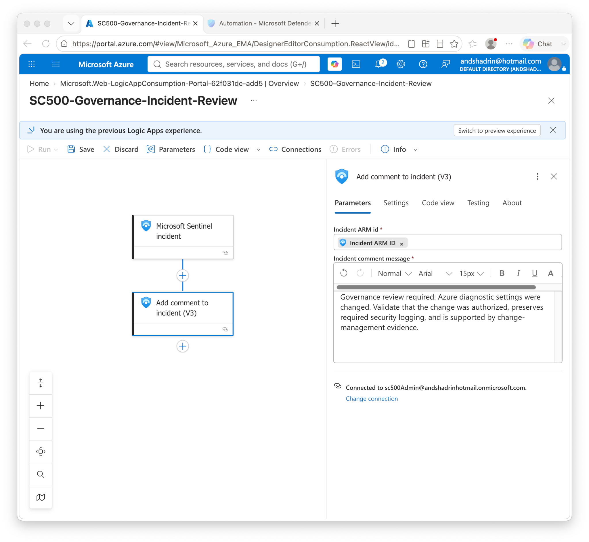
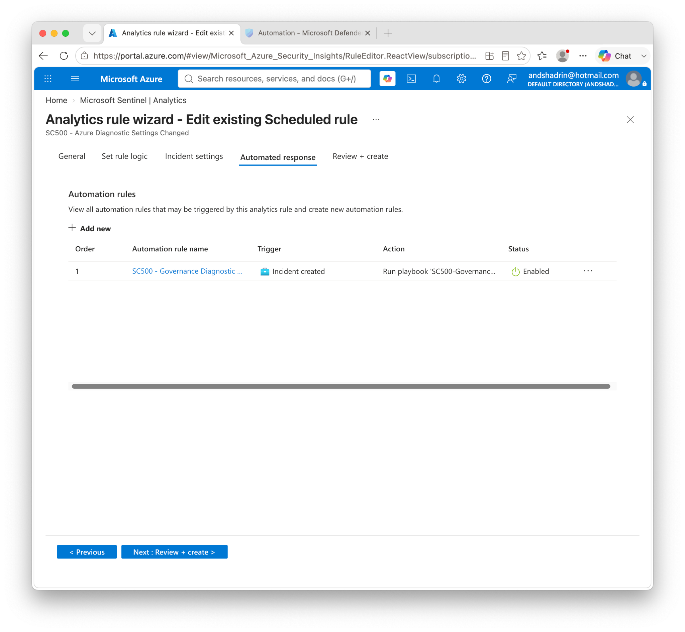
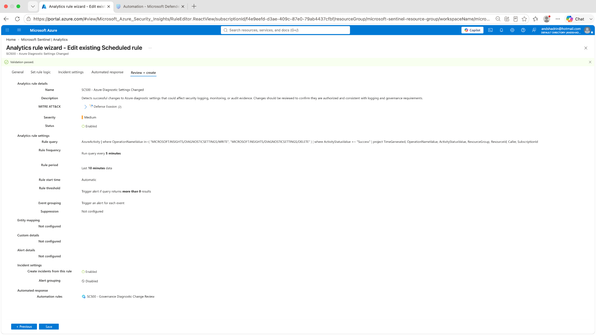
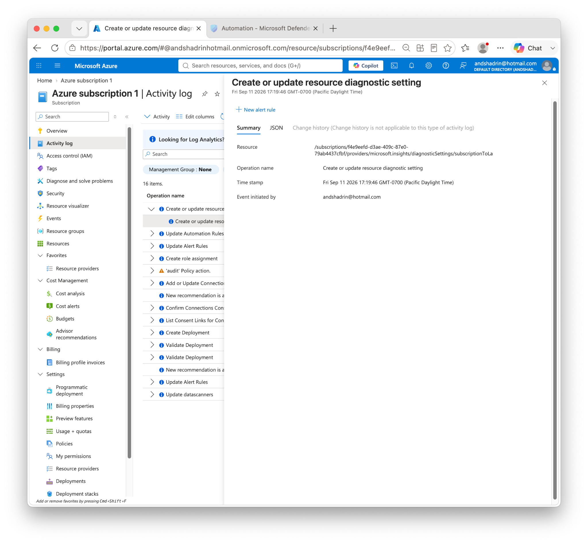
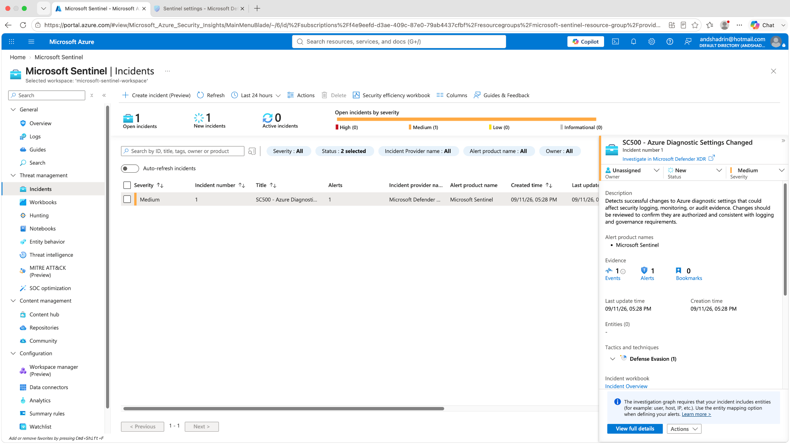
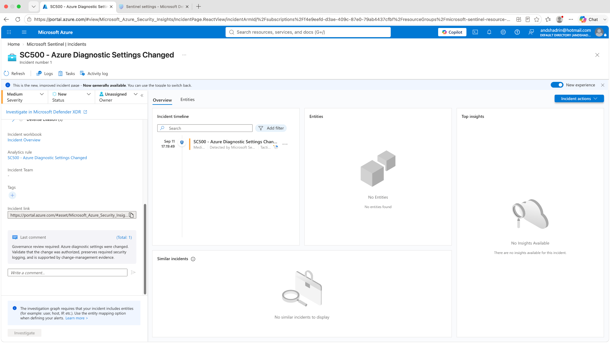

# Lab 14 — Microsoft Sentinel Governance Detection & Automated Incident Review

## Objective

Build an end-to-end **governance detection and response workflow** in Microsoft Sentinel that detects successful changes to Azure diagnostic settings, creates a Sentinel incident, and automatically adds a governance-review comment through a Logic App playbook.

The lab is intentionally GRC-oriented: a logging configuration change is not automatically malicious, but it should be **detected, attributable, reviewed, and supported by change-management evidence**.

## Architecture

```text
Azure diagnostic setting change
        ↓
Azure Activity Log
        ↓
Log Analytics / AzureActivity
        ↓
Microsoft Sentinel scheduled analytics rule
        ↓
Sentinel alert + incident
        ↓
Automation rule
        ↓
Logic App playbook
        ↓
Governance review comment added to incident
```

## Risk → Control → Evidence → Remediation

| Risk | Control | Evidence | Response |
|---|---|---|---|
| Diagnostic logging is modified or deleted | Sentinel detection on diagnostic-settings WRITE/DELETE | Azure Activity + Sentinel analytics evidence | Create incident for review |
| Logging tampering reduces audit visibility | MITRE ATT&CK mapping to cloud-log impairment | Rule mapped to Defense Evasion / T1562.008 | Validate authorization and logging continuity |
| Security event is detected but not operationalized | Automation rule + Logic App playbook | Incident receives automated governance comment | Require change-management validation and escalation if unauthorized |

## Detection query

```kusto
AzureActivity
| where OperationNameValue in~ (
    "MICROSOFT.INSIGHTS/DIAGNOSTICSETTINGS/WRITE",
    "MICROSOFT.INSIGHTS/DIAGNOSTICSETTINGS/DELETE"
)
| where ActivityStatusValue =~ "Success"
| project TimeGenerated,
          OperationNameValue,
          ActivityStatusValue,
          ResourceGroup,
          ResourceId,
          Caller,
          SubscriptionId
```

## Analytics rule configuration

- **Name:** `SC500 - Azure Diagnostic Settings Changed`
- **Severity:** Medium
- **Status:** Enabled
- **MITRE ATT&CK:** Defense Evasion
- **Technique:** T1562 — Impair Defenses
- **Sub-technique:** T1562.008 — Disable or Modify Cloud Logs
- **Run query every:** 5 minutes
- **Lookup data from:** last 10 minutes
- **Threshold:** greater than 0 results
- **Event grouping:** trigger an alert for each event
- **Create incidents:** Enabled

## Automation configuration

Automation rule:

- **Name:** `SC500 - Governance Diagnostic Change Review`
- **Trigger:** when incident is created
- **Condition:** current analytics rule / diagnostic-settings detection
- **Action:** Run playbook
- **Playbook:** `SC500-Governance-Incident-Review`

The Sentinel workspace was granted explicit permission to run the playbook's resource group before the playbook became selectable.

## Logic App playbook

The playbook uses:

1. **Microsoft Sentinel incident** trigger
2. **Add comment to incident (V3)** action
3. Dynamic **Incident ARM ID** from the Sentinel trigger

Automated comment:

> Governance review required: Azure diagnostic settings were changed. Validate that the change was authorized, preserves required security logging, and is supported by change-management evidence.

## Validation evidence

### 1. Playbook workflow



The Logic App receives a Sentinel incident and adds the governance-review comment to the same incident.

### 2. Automation rule linked to playbook



The analytics rule shows the incident-created automation path enabled and linked to the governance playbook.

### 3. Final analytics-rule configuration



The final rule evidence shows the query, 5-minute frequency, 10-minute lookback, incident creation, ATT&CK mapping, and automation rule.

### 4. Real diagnostic-setting change



A controlled change to the subscription diagnostic setting produced a real **Create or update resource diagnostic setting** event in Azure Activity Log.

### 5. Sentinel incident creation



Sentinel created a Medium-severity incident named **SC500 - Azure Diagnostic Settings Changed**.

### 6. Automated governance comment



The incident contains the playbook-generated governance review comment, proving the end-to-end workflow executed successfully.

## Controlled test procedure

To validate the detection safely:

1. Opened the subscription diagnostic setting that streams Azure Activity logs to the Sentinel workspace.
2. Made a harmless temporary change by disabling one log category.
3. Saved the diagnostic setting.
4. Verified the diagnostic-settings WRITE operation in Azure Activity Log / `AzureActivity`.
5. Waited for the 5-minute Sentinel analytics schedule.
6. Verified the new Sentinel incident.
7. Verified the automated governance-review comment.
8. Restored the desired logging configuration after testing.

## Troubleshooting / lessons learned

Several platform issues were encountered and resolved during this lab:

- Sentinel analytics/automation management is split between the Azure portal and the newer Microsoft Defender portal experience.
- The playbook initially did not appear as selectable because Sentinel did not yet have explicit permission to run Logic Apps in the playbook resource group.
- Granting the required playbook permissions made `SC500-Governance-Incident-Review` available to the automation rule.
- Diagnostic/Activity Log data can be delayed, so validation required distinguishing portal Activity Log visibility from Log Analytics ingestion and the analytics-rule schedule.
- Testing the KQL directly before relying on the scheduled rule reduced troubleshooting ambiguity.

## Security and governance lessons

- Changes to security logging are high-value governance events even when they are legitimate.
- Detection should include attribution (`Caller`, resource and subscription context) so the reviewer can validate authorization.
- Automated response does not need to be destructive. A governance workflow can add structured review instructions while preserving human approval.
- The strongest evidence chain is: **change → log → query → alert → incident → automation → review evidence**.
