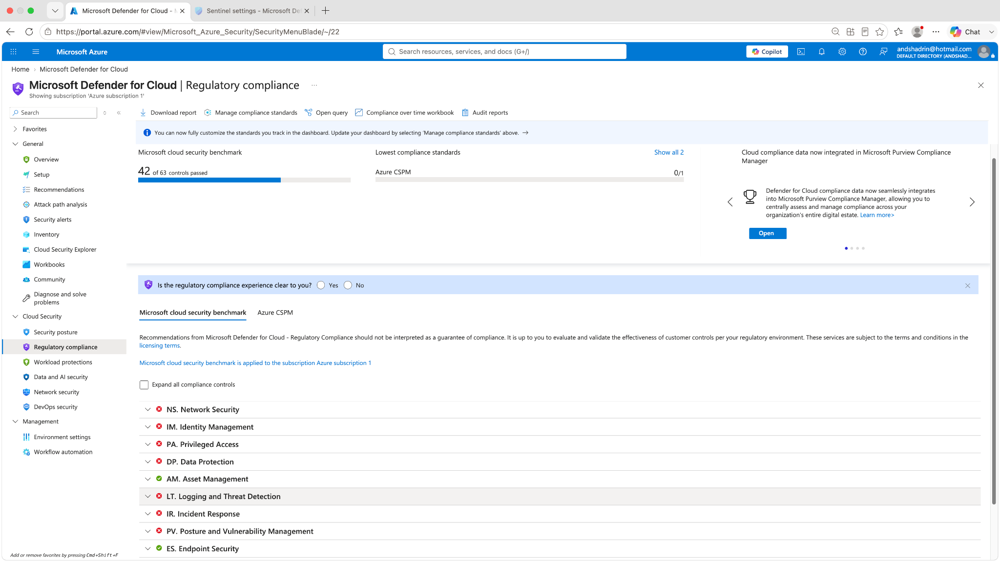
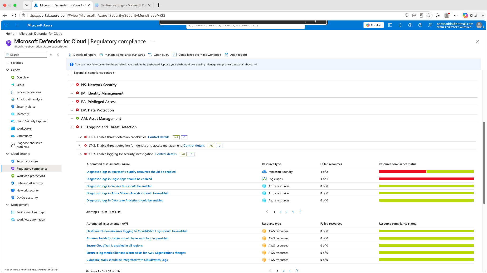
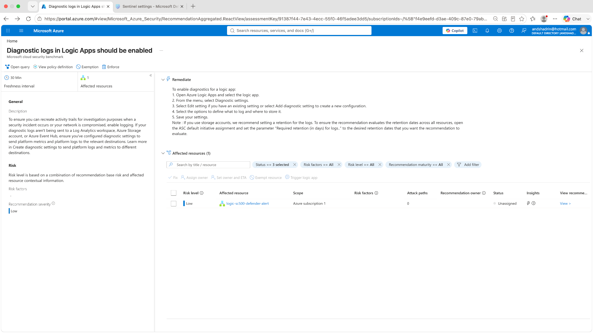
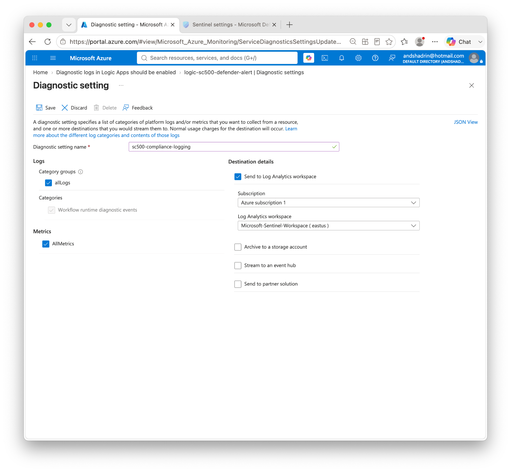
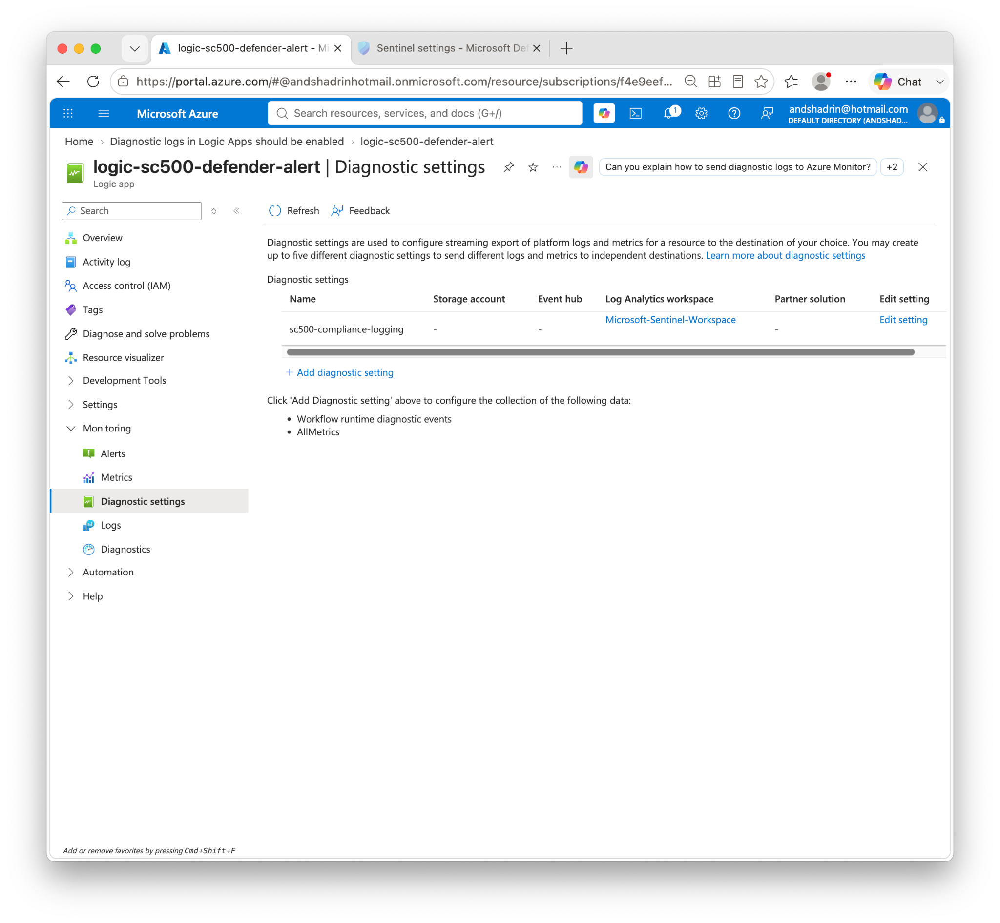
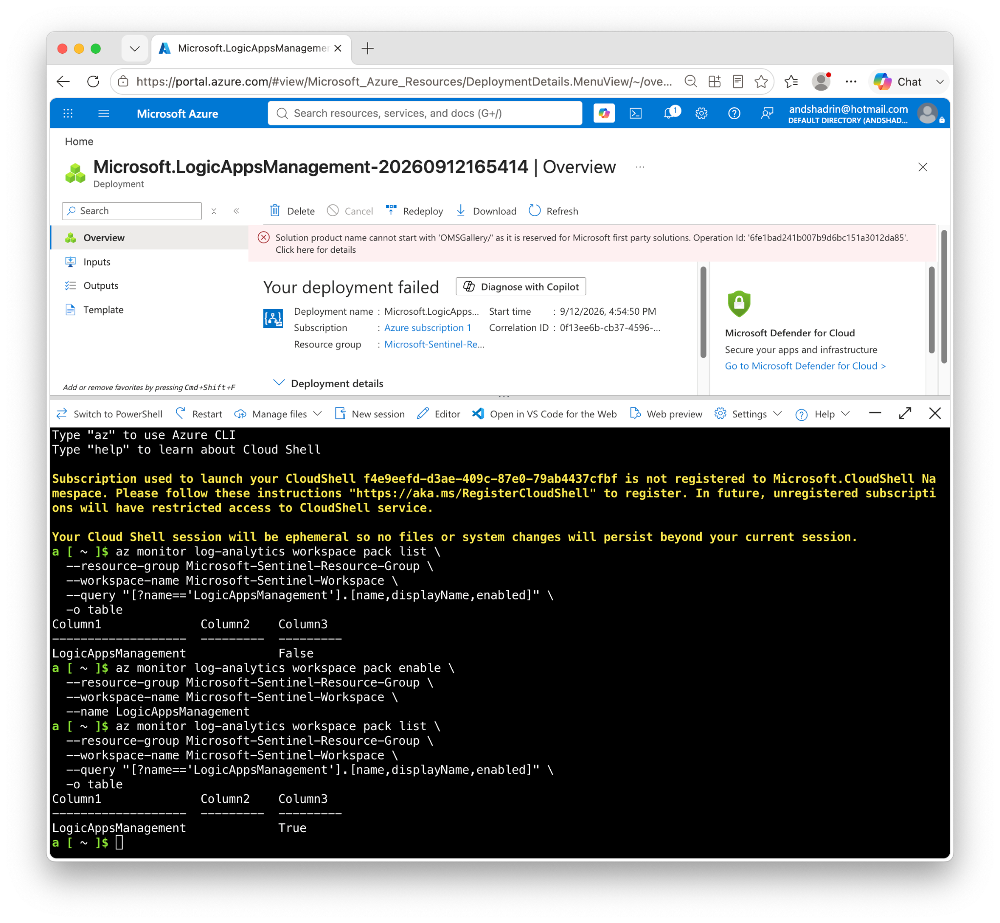
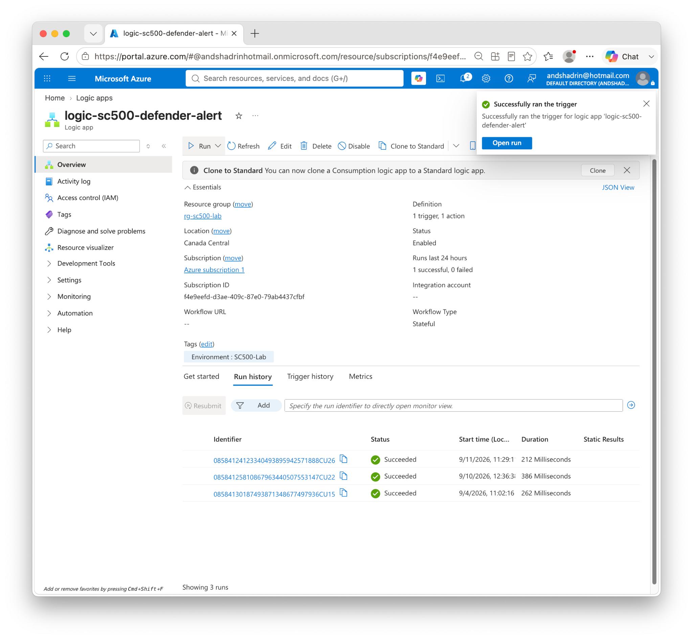
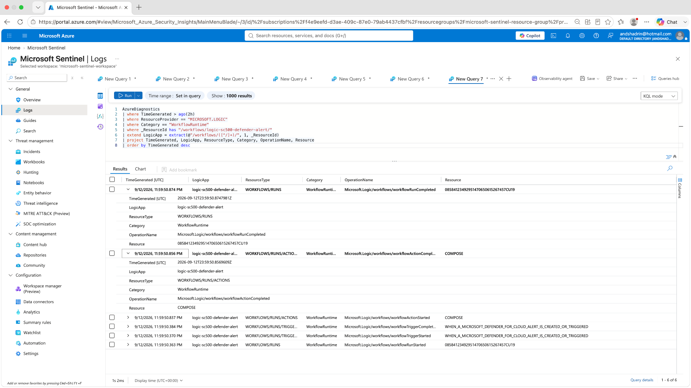
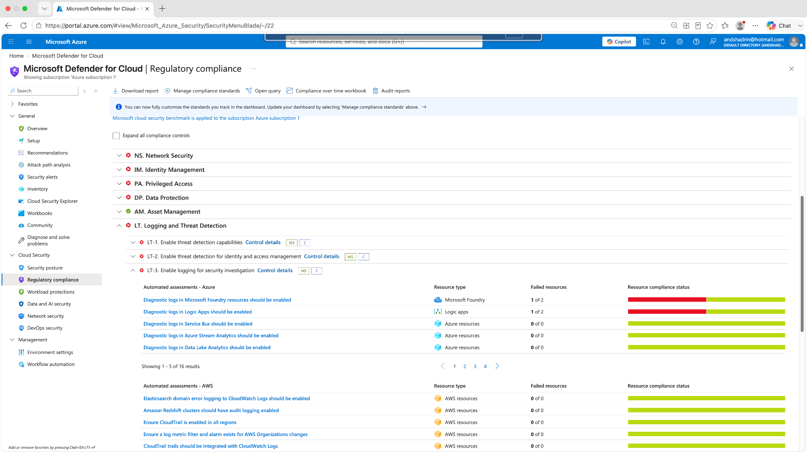
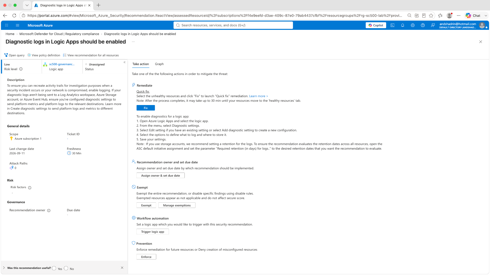

# Lab 15 — Regulatory Compliance Remediation & GRC Evidence Validation

## Objective

Use **Microsoft Defender for Cloud Regulatory Compliance** to identify a failed Microsoft Cloud Security Benchmark control, remediate the underlying technical issue, validate that the control implementation is producing evidence in Log Analytics / Microsoft Sentinel, and document the remaining compliance state.

This lab is structured as a practical GRC workflow:

```text
Risk / failed control
        ↓
Affected resource identified
        ↓
Technical remediation implemented
        ↓
Centralized logging validated
        ↓
Compliance state reassessed
        ↓
Residual finding documented
```

## Control selected

**Microsoft Cloud Security Benchmark — LT-3: Enable logging for security investigation**

The Defender for Cloud assessment identified a failed recommendation:

> **Diagnostic logs in Logic Apps should be enabled**

The initial affected resource was the Consumption Logic App:

`logic-sc500-defender-alert`

## Risk → Control → Evidence → Remediation

| GRC element | Lab implementation |
|---|---|
| **Risk** | Logic App workflow activity may not be centrally retained for investigation, monitoring, or audit evidence. |
| **Control** | MCSB LT-3 — Enable logging for security investigation. |
| **Finding** | Defender for Cloud reported diagnostic logging disabled for `logic-sc500-defender-alert`. |
| **Remediation** | Enabled Workflow runtime diagnostic events and AllMetrics and sent them to `Microsoft-Sentinel-Workspace`. |
| **Supporting configuration** | Enabled the `LogicAppsManagement` Log Analytics intelligence pack after validating it was disabled. |
| **Technical validation** | Generated a successful Logic App run and confirmed six `WorkflowRuntime` events in `AzureDiagnostics`. |
| **Compliance reassessment** | Recommendation changed from **1 of 1 failed** to **1 of 2 failed**. The original target resource was no longer the remaining unhealthy Logic App; a separate Logic App remained outstanding. |

## Remediation configuration

Diagnostic setting created on `logic-sc500-defender-alert`:

- **Diagnostic setting:** `sc500-compliance-logging`
- **Logs:** allLogs / Workflow runtime diagnostic events
- **Metrics:** AllMetrics
- **Destination:** Log Analytics workspace
- **Workspace:** `Microsoft-Sentinel-Workspace`

Because the Consumption Logic App did not initially produce runtime records, the Log Analytics **LogicAppsManagement** intelligence pack was checked with Azure CLI and found disabled. It was then enabled and verified as `True`.

## Runtime validation

After enabling the workspace pack, the Logic App was triggered successfully. Runtime events then appeared in `AzureDiagnostics` with:

- `ResourceProvider = MICROSOFT.LOGIC`
- `Category = WorkflowRuntime`
- `LogicApp = logic-sc500-defender-alert`
- workflow run, trigger, and action lifecycle operations

Validation query:

```kusto
AzureDiagnostics
| where TimeGenerated > ago(2h)
| where ResourceProvider == "MICROSOFT.LOGIC"
| where Category == "WorkflowRuntime"
| where _ResourceId has "/workflows/logic-sc500-defender-alert/"
| extend LogicApp = extract(@"/workflows/([^/]+)/", 1, _ResourceId)
| project TimeGenerated, LogicApp, ResourceType, Category, OperationName, Resource
| order by TimeGenerated desc
```

Observed operations included:

- `Microsoft.Logic/workflows/workflowRunStarted`
- `Microsoft.Logic/workflows/workflowTriggerStarted`
- `Microsoft.Logic/workflows/workflowTriggerCompleted`
- `Microsoft.Logic/workflows/workflowActionStarted`
- `Microsoft.Logic/workflows/workflowActionCompleted`
- `Microsoft.Logic/workflows/workflowRunCompleted`

This proves the remediated workflow is now producing centrally searchable investigation evidence.

## Validation evidence

### 1. Regulatory compliance overview



The Microsoft Cloud Security Benchmark dashboard provides the control-level compliance context for the lab.

### 2. LT-3 logging control failure



LT-3 was expanded to show the failed Logic Apps diagnostic-logging assessment.

### 3. Original Logic App finding



Defender for Cloud identified `logic-sc500-defender-alert` as the affected resource requiring diagnostic logging.

### 4. Diagnostic logging configuration



Workflow runtime logs and metrics were configured to stream to `Microsoft-Sentinel-Workspace`.

### 5. Diagnostic setting saved



The `sc500-compliance-logging` diagnostic setting is shown attached to the Logic App.

### 6. Logic Apps Management enabled



Azure CLI verification shows `LogicAppsManagement` changing from `False` to `True` for the Log Analytics workspace.

### 7. Successful Logic App run



A controlled post-remediation run completed successfully and generated runtime activity for validation.

### 8. Log Analytics / Sentinel validation



The filtered query returns six `WorkflowRuntime` records for `logic-sc500-defender-alert`, proving centralized logging is operational.

### 9. Post-remediation compliance state



The Logic Apps assessment changed from **1 of 1 failed** to **1 of 2 failed**, showing that one of the two evaluated Logic Apps is now compliant.

### 10. Residual finding documented



The remaining unhealthy recommendation is shown against a different Logic App (`sc500-governanc...` in the portal view). The original target `logic-sc500-defender-alert` is no longer the unhealthy resource displayed by the assessment.

## Troubleshooting / lessons learned

- A saved Azure diagnostic setting does not by itself prove that usable runtime evidence is reaching the central workspace.
- The initial `LogicAppWorkflowRuntime` and `AzureDiagnostics` queries returned no records even after the diagnostic setting was configured.
- The target Log Analytics workspace had the `LogicAppsManagement` intelligence pack disabled.
- Marketplace deployment of the Logic Apps Management solution failed with an `OMSGallery/` reserved-product-name error.
- The issue was bypassed with Azure CLI by enabling the `LogicAppsManagement` workspace pack directly.
- After the pack was enabled and the Logic App was triggered again, six workflow runtime events appeared in `AzureDiagnostics`.
- Aggregate compliance can remain red even after the targeted resource is fixed because the recommendation evaluates multiple resources. GRC validation therefore needs both **resource-level evidence** and **control-level context**.

## Governance conclusion

This lab demonstrates a complete **finding → control implementation → evidence collection → technical validation → compliance reassessment** workflow.

The most important result is not simply making a dashboard green. The lab shows how to establish defensible evidence that a specific failed resource was remediated, verify the resulting telemetry independently, and document residual risk when another resource remains non-compliant.
